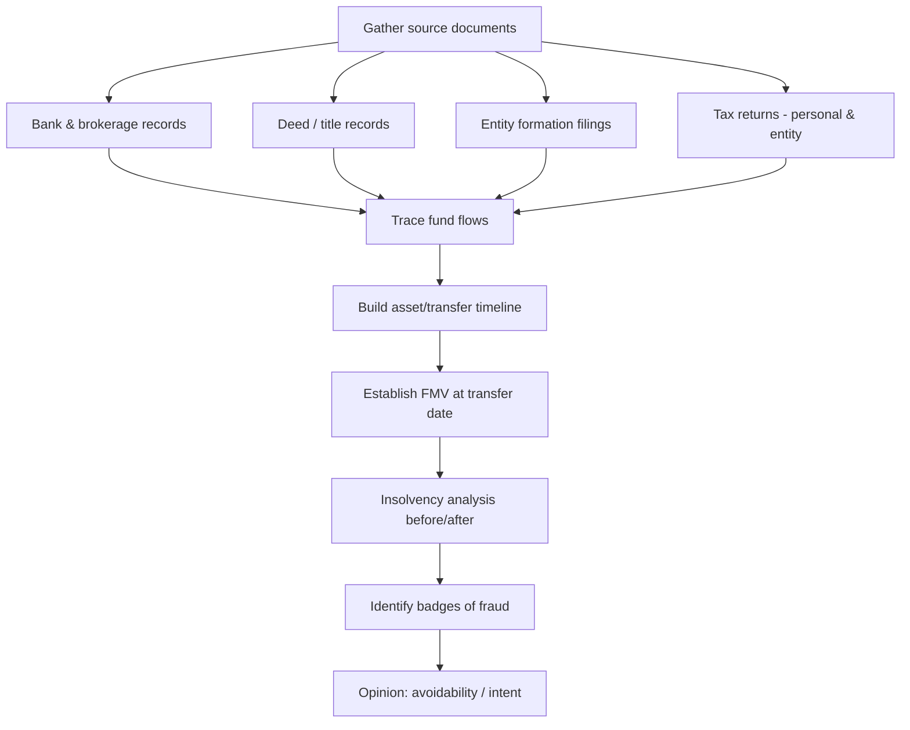

## Fraudulent Transfers and Concealment of Assets

### Overview

Fraudulent transfer and asset concealment schemes involve the intentional movement, hiding, or disguising of assets to place them beyond the reach of creditors, a bankruptcy trustee, taxing authorities, or civil/criminal judgment holders. These schemes sit at the intersection of bankruptcy law, tax law, and forensic accounting, and they frequently accompany tax evasion and bankruptcy fraud charges. The forensic accountant's role is to reconstruct the flow of assets, establish the debtor's financial position before and after the transfer, and demonstrate intent or the badges of fraud that support a legal finding of fraudulent conveyance.

### Legal Framework

**Uniform Voidable Transactions Act (UVTA) / Uniform Fraudulent Transfer Act (UFTA)**

Most U.S. states have adopted the UVTA (formerly UFTA), which allows creditors to void transfers made with intent to hinder, delay, or defraud creditors, or transfers made without receiving "reasonably equivalent value" while the debtor was insolvent or became insolvent as a result.

**Bankruptcy Code § 548 — Fraudulent Transfers**

Under 11 U.S.C. § 548, a bankruptcy trustee may avoid transfers made within two years before the bankruptcy filing if:

- Actual intent to hinder, delay, or defraud creditors existed ("actual fraud"), or
- The debtor received less than reasonably equivalent value in exchange, and was insolvent or rendered insolvent, undercapitalized, or unable to pay debts as they matured ("constructive fraud")

**Bankruptcy Code § 727(a)(2) — Denial of Discharge**

Concealment or transfer of property with intent to hinder, delay, or defraud a creditor or trustee, occurring within one year before filing (or after filing), can result in denial of the debtor's discharge entirely.

**18 U.S.C. § 152 — Bankruptcy Fraud (Concealment of Assets)**

Criminal statute making it a felony to knowingly and fraudulently conceal property of the estate from creditors or the trustee.

**26 U.S.C. § 7201 / § 7206 — Tax Evasion and False Statements**

Where asset transfers are used to evade tax assessment or collection, these can independently trigger criminal tax evasion or attempt-to-evade charges.

### Actual Fraud vs. Constructive Fraud

**Key Points**

- **Actual fraud**: Requires proof of subjective intent to hinder, delay, or defraud creditors. Courts rarely have direct evidence of intent, so they rely on circumstantial evidence — the "badges of fraud."
- **Constructive fraud**: Does not require intent. It focuses on the objective financial reality: (1) the debtor received less than reasonably equivalent value, and (2) the debtor was insolvent at the time of, or as a result of, the transfer.

### Badges of Fraud

Courts and forensic examiners look for a constellation of indicators, drawn largely from UVTA §4(b) and common law, to infer fraudulent intent circumstantially.

| Badge of Fraud | Forensic Indicator |
| --- | --- |
| Transfer to insider | Family member, related entity, controlled trust |
| Debtor retained possession/control | Continued use of asset after "transfer" |
| Transfer concealed | Unrecorded, undisclosed, or disguised transaction |
| Suit or threat of suit pending | Timing correlates with litigation/assessment |
| Transfer of substantially all assets | Asset stripping of the debtor entity |
| Debtor absconded | Relocation, disappearance of records/principal |
| Removal or concealment of assets | Assets moved offshore or into exempt form |
| Value received not reasonably equivalent | Below-market sale, sham consideration |
| Debtor insolvent at/after transfer | Balance sheet or cash flow insolvency |
| Transfer occurred shortly before/after debt incurred | Timing proximity to liability accrual |
| Transfer to lienholder of substantially all assets | Preference-like self-dealing |

**Example**

A business owner facing an IRS jeopardy assessment transfers a commercial property to a newly formed LLC owned by his spouse for $1, records the deed but not the LLC's operating agreement, and continues collecting rental income personally. This exhibits at least five badges: insider transfer, inadequate consideration, retained control/benefit, timing proximity to the tax liability, and concealment of the true beneficial owner.

### Common Concealment Techniques

**Layering Through Entities**

Interposing shell companies, trusts, or nominees between the debtor and the asset to obscure beneficial ownership. Often uses multiple jurisdictions or successive transfers ("layering") to break the audit trail.

**Nominee Ownership**

Placing legal title in the name of a relative, friend, or controlled entity while the debtor retains beneficial use and control (the "badge" of retained possession).

**Offshore Transfers**

Moving funds to foreign bank accounts, international business companies (IBCs), or foreign trusts in low-disclosure jurisdictions.

**Conversion of Non-Exempt to Exempt Assets**

Converting cash or liquid assets into homestead equity, retirement accounts, or other statutorily protected/exempt property shortly before filing (a legal gray area unless done with provable fraudulent intent).

**Undervaluation / Sham Sales**

Selling assets to insiders at below fair market value, or structuring a transfer disguised as a loan, lease, or consulting arrangement.

**Structuring Cash Transactions**

Breaking cash deposits/withdrawals below the $10,000 Currency Transaction Report (CTR) threshold to avoid detection (18 U.S.C. § 5324).

**Destruction or Falsification of Records**

Failing to maintain, or deliberately destroying, books and records that would reveal the transfer — itself an independent basis for denial of discharge under § 727(a)(3).

### The Insolvency Analysis

Forensic accountants must establish insolvency under one or more of three tests:

$$\text{Balance Sheet Test: } \text{Insolvent if } \sum \text{Assets (FMV)} < \sum \text{Liabilities}$$

$$\text{Cash Flow Test: } \text{Insolvent if debtor cannot pay debts as they mature}$$

$$\text{Capital Adequacy Test: } \text{Insolvent if remaining capital is unreasonably small for the business}$$

**Key Points**

- Assets are valued at fair market value, not book value; contingent liabilities must be estimated and included.
- A solvency analysis is typically performed "before and after" the challenged transfer, using contemporaneous financial statements, appraisals, and tax filings.
- Reconstructed balance sheets (via the net worth or expenditure methods discussed elsewhere in this chapter) are often necessary when books are incomplete or falsified.

### Forensic Reconstruction Methodology

### Tracing Techniques

**Follow-the-Money Analysis**

Chronological reconstruction of every deposit, withdrawal, and wire transfer connecting the debtor to the transferred asset, often using bank subpoenas and Suspicious Activity Reports (SARs) obtained through law enforcement channels.

**Lifestyle / Net Worth Method**

Comparing known income to sources and uses of funds to identify unexplained increases in net worth that correlate with concealed assets (cross-referenced with the net worth method used in tax evasion analysis).

**Entity Mapping**

Constructing organizational charts of shell entities, trusts, and nominees to identify the ultimate beneficial owner, often using public records, UCC filings, and registered agent data.

**Example**

A trustee's forensic accountant traces $450,000 withdrawn from a business operating account in the six months before filing. Bank records show sequential wires to three LLCs, each formed within days of the prior transfer and sharing a common registered agent address. The final LLC purchased a vacation property titled in the debtor's adult child's name. The reconstruction establishes both the badges of fraud (insider transfer, layering, timing) and the debtor's retained economic benefit (continued vacation use documented via utility records).

### Fraudulent Transfer vs. Preferential Transfer

| Feature | Fraudulent Transfer (§548) | Preferential Transfer (§547) |
| --- | --- | --- |
| Intent required | Actual OR constructive fraud | None (strict liability elements) |
| Lookback period | 2 years (federal); longer under state law adopting UVTA (often 4 years) | 1 year for insiders; 90 days for non-insiders |
| Recipient | Any transferee | Existing creditor |
| Purpose | Hides/removes assets from estate | Favors one creditor over others |
| Value exchanged | Typically none or inadequate | Antecedent debt satisfied |

### Remedies and Recovery

**Avoidance Actions**

The trustee or creditor files an adversary proceeding to void the transfer and recover the asset or its value from the transferee under § 550, including from subsequent transferees who did not take in good faith and for value.

**Good Faith Transferee Defense**

A transferee who took the asset for value and in good faith, without knowledge of the fraud, may retain a lien to the extent of value given (§ 548(c)).

**Constructive Trust and Equitable Remedies**

Courts may impose a constructive trust over traceable proceeds or order disgorgement, particularly where funds have been commingled.

**Civil and Criminal Exposure**

Concealment findings can trigger denial of discharge (civil), nondischargeability of specific debts (§523), criminal bankruptcy fraud (18 U.S.C. §152, §157), money laundering charges (18 U.S.C. §1956) if proceeds were disguised, and tax evasion charges where the concealed assets relate to unpaid tax liabilities.

### Illustrative Transfer Timeline (SVG)

<svg xmlns="http://www.w3.org/2000/svg" viewBox="0 0 800 260">
<text x="400" y="24" text-anchor="middle" font-size="16" font-weight="bold" fill="#1a1a1a">Fraudulent Transfer Timeline (svg_diagram)</text>
<line x1="60" y1="130" x2="740" y2="130" stroke="#333" stroke-width="2" />
<line x1="60" y1="120" x2="60" y2="140" stroke="#333" stroke-width="2" />
<line x1="740" y1="120" x2="740" y2="140" stroke="#333" stroke-width="2" />
<circle cx="150" cy="130" r="7" fill="#c0392b" />
<text x="150" y="105" text-anchor="middle" font-size="12" fill="#1a1a1a">Tax assessment</text>
<text x="150" y="118" text-anchor="middle" font-size="12" fill="#1a1a1a">notice issued</text>
<circle cx="310" cy="130" r="7" fill="#c0392b" />
<text x="310" y="160" text-anchor="middle" font-size="12" fill="#1a1a1a">LLC formed</text>
<text x="310" y="173" text-anchor="middle" font-size="12" fill="#1a1a1a">(spouse as member)</text>
<circle cx="470" cy="130" r="7" fill="#c0392b" />
<text x="470" y="105" text-anchor="middle" font-size="12" fill="#1a1a1a">Property deeded</text>
<text x="470" y="118" text-anchor="middle" font-size="12" fill="#1a1a1a">for \$1 consideration</text>
<circle cx="630" cy="130" r="7" fill="#c0392b" />
<text x="630" y="160" text-anchor="middle" font-size="12" fill="#1a1a1a">Bankruptcy</text>
<text x="630" y="173" text-anchor="middle" font-size="12" fill="#1a1a1a">petition filed</text>

<text x="60" y="220" font-size="12" fill="`#1a1a1a`">2-year §548 lookback window shown left-to-right; badges cluster near assessment and filing dates.</text>

</svg>

### Documentary Evidence Checklist

- Deeds, title transfers, and UCC-1 filings
- Bank and brokerage statements (debtor, transferee, and intermediary entities)
- Wire transfer confirmations and SWIFT records
- Entity formation documents, operating agreements, cap tables
- Contemporaneous financial statements and tax returns (personal and entity)
- Appraisals or valuation reports at time of transfer
- Correspondence (email, text) evidencing intent or awareness of pending claims
- Loan documents purporting to justify a transfer as debt repayment

### Practical Red Flags for the Examiner

**Key Points**

- Transfers timed closely after a lawsuit is filed, a tax audit begins, or a judgment is entered
- Consideration paid is nominal or disproportionate to fair market value
- Transferee is a family member, close associate, or newly formed entity with no independent business purpose
- Debtor continues to exercise control, use, or receive benefit from the "transferred" asset
- Repeated small transfers below reporting thresholds (structuring)
- Missing or backdated documentation

### Related Topics

- Net worth and expenditure methods for reconstructing unreported income
- Badges of fraud in civil tax fraud (26 U.S.C. § 6663)
- Preferential transfers and the 90-day/1-year lookback (11 U.S.C. § 547)
- Piercing the corporate veil and alter ego analysis
- Offshore financial structures and FATCA/FBAR compliance failures
- Money laundering typologies (placement, layering, integration)
- Trustee avoidance powers and the "strong-arm" clause (11 U.S.C. § 544)
- Valuation methodologies for closely held businesses and real property in litigation contexts