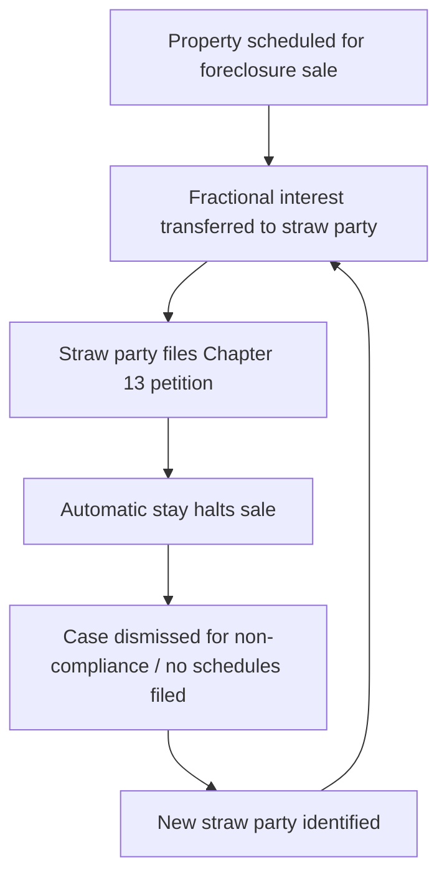

## Bankruptcy Fraud and Abuse of the Bankruptcy Process

### Overview

Bankruptcy fraud encompasses a range of criminal and civil violations committed in connection with a bankruptcy filing, including concealment of assets, false statements under oath, multiple/serial filings to abuse the automatic stay, bribery of trustees or creditors, and petition mills that exploit debtors. Abuse of process refers more broadly to filings made in bad faith or for an improper purpose (e.g., to delay foreclosure, frustrate a single creditor, or shield assets), which may not always rise to criminal fraud but can still result in dismissal, sanctions, or denial of discharge. Forensic accountants support trustees, the U.S. Trustee Program, and prosecutors in detecting, quantifying, and proving these schemes.

### Statutory Framework

**18 U.S.C. § 151 — Definitions**

Defines "debtor" for purposes of the bankruptcy fraud statutes.

**18 U.S.C. § 152 — Concealment of Assets, False Oaths, and Claims**

The core bankruptcy fraud statute. Covers nine distinct offenses, including:

- Knowingly and fraudulently concealing property from the trustee/creditors
- Making a false oath or account in a bankruptcy case
- Making a false claim against the estate
- Receiving property from a debtor with intent to defeat the Bankruptcy Code
- Extorting money from a debtor via threats
- Fraudulently transferring property in contemplation of bankruptcy
- Concealing, destroying, or falsifying books and records
- Withholding books and records from the trustee

**18 U.S.C. § 153 — Embezzlement Against the Estate**

Applies to trustees, custodians, or other officers who embezzle estate property.

**18 U.S.C. § 154 — Adverse Interest and Conduct of Officers**

Prohibits trustees or officers from purchasing estate property or profiting from the administration of the estate.

**18 U.S.C. § 155 — Fee Agreements in Chapter 7/11 Cases**

Criminalizes undisclosed or excessive attorney fee arrangements.

**18 U.S.C. § 156 — Bankruptcy Petition Preparer Fraud**

Targets non-attorney petition preparers who defraud debtors or violate preparer rules.

**18 U.S.C. § 157 — Bankruptcy Fraud (Scheme Statute)**

Criminalizes devising or executing a scheme to defraud in connection with a bankruptcy filing itself — filing a petition as part of, or in furtherance of, a fraudulent scheme.

**11 U.S.C. § 727(a) — Denial of Discharge**

Civil (non-criminal) remedy denying the debtor's discharge for reasons including false statements, concealment, failure to keep records, or a prior discharge within the applicable look-back period.

**11 U.S.C. § 707(b) — Dismissal for Abuse (Means Testing)**

Allows dismissal or conversion of a Chapter 7 case where granting relief would constitute an "abuse" of the provisions of the chapter, primarily assessed through the means test.

**28 U.S.C. § 586 — U.S. Trustee Program**

Establishes the U.S. Trustee's oversight role, including referral of suspected fraud to the FBI, IRS-CI, and DOJ.

### Categories of Bankruptcy Fraud

**Key Points**

- **Concealment fraud**: Hiding assets, income, or transfers from the bankruptcy estate (see prior chapter item on fraudulent transfers for mechanics).
- **Petition mills / multi-filing schemes**: Filing serial or fraudulent petitions — often using stolen identities, fabricated Social Security numbers, or "straw" debtors — solely to trigger the automatic stay under 11 U.S.C. § 362 and delay eviction or foreclosure.
- **Bust-out schemes**: Building up credit and inventory obligations, liquidating assets for cash, then filing bankruptcy to discharge the resulting debt (a bankruptcy-specific variant of the "bustout" fraud pattern seen in commercial lending fraud).
- **Bribery/kickback schemes**: Trustee, creditor, or committee member accepting payment to influence administration of the case.
- **Bankruptcy petition preparer fraud**: Non-attorney preparers overcharging, giving unauthorized legal advice, or filing petitions without client knowledge/consent.
- **Credit card/loan bust-outs immediately pre-petition**: Cash advances or luxury purchases shortly before filing, presumptively nondischargeable under § 523(a)(2)(C).

### The Means Test (§707(b)) and Abuse Determination

The means test compares the debtor's "current monthly income" (CMI, a defined statutory term based on a six-month lookback) against state median income and allowed expenses (IRS National and Local Standards) to determine Chapter 7 eligibility.

$$\text{CMI} = \frac{\text{Total income received in the 6 months prepetition}}{6}$$

$$\text{Disposable Income} = \text{CMI} - \text{Allowed Expenses (IRS Standards + actual secured/priority debt)}$$

If disposable income exceeds statutory thresholds over a 60-month period, a presumption of abuse arises, and the case may be dismissed or converted to Chapter 13.

**Key Points**

- Forensic accountants recompute CMI from payroll records, bank deposits, and 1099/W-2 data to test the debtor's self-reported figures on Official Form 122.
- Common manipulation: timing income (e.g., deferring bonuses, requesting reduced hours) around the six-month lookback window, or mischaracterizing income as loans from family.
- Expense manipulation: inflating claimed secured debt payments (e.g., listing intent to surrender a vehicle while continuing to claim the payment as an expense — the "ride-through" abuse pattern).

### Serial and Bad-Faith Filing Schemes

**Automatic Stay Abuse**

The automatic stay (11 U.S.C. §362) halts foreclosure and eviction actions immediately upon filing. Fraud rings exploit this by:

- Filing petitions in the name of individuals with no real connection to the property (unauthorized filings)
- Transferring a fractional interest in real property to a new "straw" debtor just before a scheduled foreclosure sale, then having that debtor file
- Repeating this cycle across multiple properties and multiple debtors to generate serial stays

**In Rem Relief**

Because of this pattern, 11 U.S.C. §362(d)(4) allows a court to grant relief that binds the property itself for two years against future filings, if the court finds the filing was part of a scheme to delay, hinder, or defraud creditors involving unauthorized transfers or filings.

### Indicators of Petition Mill / Serial Filing Fraud

| Red Flag | Forensic Indicator |
| --- | --- |
| Multiple dismissed cases on same property | PACER case history search across debtors |
| Debtors share address, phone, or filer | Common attorney/preparer, shared contact info |
| Fractional interest transfers just before filing | Deed timing vs. petition date |
| No genuine reorganization intent | No plan filed, no schedules, missing 341 meeting appearance |
| Same handwriting/formatting across petitions | Document forensic comparison |
| Debtor unaware of filing | Identity theft indicators, undeliverable mail |

### False Oaths and Schedule Misrepresentation

Debtors sign bankruptcy schedules and the Statement of Financial Affairs (SOFA) under penalty of perjury. Common false statement patterns include:

- Omitting bank accounts, cryptocurrency wallets, or business interests from Schedule A/B
- Undervaluing assets (e.g., reporting a vehicle at salvage value when it is in excellent condition)
- Failing to disclose prepetition transfers to insiders (SOFA Question 4/13 disclosures)
- Denying pending or contemplated litigation, inheritances, or lawsuit proceeds
- Omitting rental income or side-business income from Schedule I

**Example**

A debtor's Schedule B lists no interest in any business entity. A forensic accountant cross-references the debtor's tax returns (Schedule C and K-1s), state corporate registries, and bank account signatory records, and discovers the debtor is the sole owner of an LLC generating $180,000 in annual gross receipts, deposited into an account never disclosed to the trustee. This supports both a §727(a)(4) false oath objection to discharge and a referral for criminal prosecution under §152(3).

### Forensic Accountant's Role in Bankruptcy Fraud Investigations

**Reconciliation of Schedules to Source Documents**

Cross-check every disclosed asset, liability, and income figure against tax returns, bank/brokerage statements, payroll records, title records, and business financials.

**Lifestyle Analysis**

Compare disclosed income/expenses on Schedules I and J against actual spending patterns (credit card statements, luxury purchases, travel) to identify unreported income sources.

**341 Meeting Support**

Prepare questions and documentary exhibits for the trustee's examination of the debtor at the meeting of creditors (11 U.S.C. §341).

**Preference and Fraudulent Transfer Analysis**

Identify avoidable transfers under §547 (preferences) and §548 (fraudulent transfers) as covered in the prior chapter item, often overlapping with concealment fraud.

**Valuation Disputes**

Provide independent valuation of closely held businesses, real property, or intangible assets where debtor-reported values are suspect.

**Expert Testimony**

Present findings at §727 discharge objection trials, §523 nondischargeability adversary proceedings, or criminal trials under §152/§157, often reconciling using net worth or bank deposit methods (see tax fraud reconstruction methodologies).

### Civil vs. Criminal Consequences

| Aspect | Civil (§727 / §523) | Criminal (§152 / §157) |
| --- | --- | --- |
| Burden of proof | Preponderance of the evidence | Beyond a reasonable doubt |
| Who brings action | Trustee, U.S. Trustee, or creditor | DOJ / U.S. Attorney |
| Intent standard | Fraudulent intent (can be inferred) | Knowing and fraudulent intent |
| Outcome | Denial of discharge (entire case or specific debt) | Fines, imprisonment (up to 5 years per count) |
| Referral trigger | U.S. Trustee refers suspected criminal conduct to DOJ/FBI per 18 U.S.C. §3057 | N/A |

**Key Points**

- 18 U.S.C. §3057 requires bankruptcy judges, trustees, and clerks to report suspected fraud to the U.S. Attorney.
- A single scheme frequently generates parallel civil (discharge denial) and criminal (fraud prosecution) proceedings simultaneously.
- Criminal referral does not require that the civil discharge objection succeed first, and vice versa.

### Interaction with Tax Fraud

Bankruptcy fraud and tax fraud frequently overlap:

- Debtors may conceal assets from both the IRS and the bankruptcy trustee using the same shell entities or nominees
- Unpaid tax liabilities are often a major driver of the bankruptcy filing itself, and debtors may misrepresent the priority or dischargeability of tax debt (most tax debts are non-dischargeable unless specific timing tests under §523(a)(1) and §507(a)(8) are met)
- IRS Insolvency units coordinate with bankruptcy trustees to identify concealed assets that also evidence unreported income

### Discharge Exceptions Relevant to Fraud (§523(a))

- §523(a)(2): Debts obtained by false pretenses, false representation, or actual fraud (including the "luxury goods/cash advance" presumption for purchases shortly before filing)
- §523(a)(4): Debts for fraud or defalcation while acting in a fiduciary capacity, embezzlement, or larceny
- §523(a)(6): Debts for willful and malicious injury
- §523(a)(1) / §507(a)(8): Certain tax debts excepted from discharge

### Practical Red Flags Checklist

**Key Points**

- Petition filed on eve of foreclosure/eviction sale with incomplete or missing schedules
- Repeated case filings and dismissals involving the same real property
- Debtor's disclosed net worth inconsistent with lifestyle, credit applications, or loan files
- Large cash withdrawals or asset liquidations in the months before filing
- Missing or "lost" business/financial records
- Discrepancies between tax returns and bankruptcy schedules for the same period
- Insider transfers not disclosed on SOFA
- Debtor uncooperative or evasive at the §341 meeting

### Related Topics

- Fraudulent transfers and concealment of assets (preceding item — mechanics and badges of fraud)
- Preferential transfer avoidance under 11 U.S.C. §547
- Net worth and bank deposit methods for income reconstruction
- Automatic stay litigation and in rem relief under §362(d)(4)
- Trustee's avoidance powers and the strong-arm clause (§544)
- Means testing mechanics and IRS Collection Financial Standards
- Money laundering typologies intersecting with bust-out schemes
- Expert witness qualification and Daubert standards in bankruptcy litigation