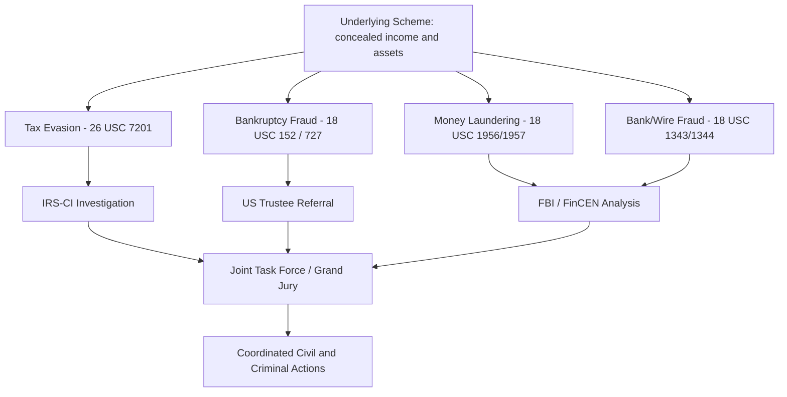

## Coordination Between Tax and Fraud Investigations

### Overview

Tax fraud, bankruptcy fraud, money laundering, and general financial fraud investigations rarely occur in isolation — the same underlying conduct (concealed income, hidden assets, falsified records) frequently violates multiple statutes enforced by different agencies. Effective enforcement depends on structured coordination among IRS Criminal Investigation (IRS-CI), the U.S. Trustee Program, the FBI, the Department of Justice Tax Division, state attorneys general, and civil regulators (SEC, state insurance/banking regulators). Forensic accountants operate at the center of this coordination, since a single set of reconstructed financials often supports parallel civil and criminal proceedings across agencies.

### Key Agencies and Their Jurisdictions

| Agency | Primary Jurisdiction | Typical Trigger |
| --- | --- | --- |
| IRS Criminal Investigation (IRS-CI) | Title 26 tax crimes, Title 31 (BSA/money laundering support) | Revenue agent referral, SAR review, whistleblower claim |
| U.S. Trustee Program | Bankruptcy fraud, discharge abuse | Trustee referral under 18 U.S.C. §3057 |
| FBI | Bank fraud, wire fraud, bankruptcy fraud, money laundering | Financial institution referral, joint task force |
| DOJ Tax Division | Federal tax prosecutions | Grand jury referral from IRS-CI |
| FinCEN | BSA administration, SAR/CTR repository | Pattern analysis across filings |
| SEC | Securities fraud, issuer disclosure fraud | Whistleblower tips, market surveillance |
| State Attorneys General | State tax, consumer, and insurance fraud | Parallel state-level referral |

### Legal Bases for Interagency Coordination

**26 U.S.C. § 6103 — Confidentiality and Disclosure of Tax Returns**

Tax return information is generally confidential, but §6103 authorizes disclosure to other federal agencies and to the Department of Justice for use in non-tax criminal proceedings under specific ex parte court order procedures (§6103(i)), and to bankruptcy trustees/courts in limited circumstances.

**18 U.S.C. § 3057 — Bankruptcy Referral to U.S. Attorney**

Bankruptcy judges, clerks, and trustees who become aware of facts suggesting a violation of bankruptcy fraud statutes must report the matter to the appropriate U.S. Attorney.

**31 U.S.C. § 5311 et seq. — Bank Secrecy Act (BSA)**

Requires financial institutions to file Currency Transaction Reports (CTRs) and Suspicious Activity Reports (SARs) with FinCEN, which are accessible to IRS-CI, FBI, and other law enforcement for cross-referencing against tax and bankruptcy filings.

**Parallel Proceedings Doctrine**

Courts permit simultaneous civil and criminal proceedings arising from the same conduct, provided the government does not use civil discovery in bad faith solely to build a criminal case (a defense frequently litigated as a due process or Fifth Amendment issue).

### Why Coordination Matters: Overlapping Conduct

**Key Points**

- A debtor who conceals income from the IRS often conceals the same assets from a bankruptcy trustee using identical shell entities or nominee structures.
- SAR filings triggered by unusual banking activity frequently predate both an IRS audit and a bankruptcy trustee's discovery of undisclosed transfers.
- A single forensic net worth or bank deposit reconstruction can support an IRS civil fraud penalty (26 U.S.C. §6663), a criminal tax evasion charge, a §727 discharge objection, and an FBI wire fraud case — provided the accountant maintains work papers admissible and defensible across all four proceedings.

### Referral Triggers and Information Flow

**From Bankruptcy to Tax/Criminal**

- Trustee identifies undisclosed assets, unreported income, or falsified schedules during the §341 meeting or document review
- Trustee refers findings to the U.S. Trustee Program, which may refer to DOJ/FBI under §3057
- IRS Insolvency function (a specialized unit) monitors bankruptcy filings for unassessed tax liabilities and potential fraud indicators, coordinating with IRS-CI when badges of fraud appear

**From Tax Examination to Bankruptcy/Criminal**

- Revenue agent identifies firm indicators of fraud (the "badges of fraud" under Spies v. United States and IRM 25.1) during a civil audit
- Case is referred internally to IRS-CI via a fraud referral (Form 2797 or successor process)
- If the taxpayer subsequently files bankruptcy, IRS-CI coordinates with the U.S. Trustee to ensure concealed assets are not further hidden through the bankruptcy process
- IRS files proof of claim in the bankruptcy case; priority and dischargeability of the tax debt is litigated per §507(a)(8) and §523(a)(1)

**From Financial Institution to All Agencies**

- SAR filed by bank due to structuring, unusual wire activity, or account behavior inconsistent with stated business purpose
- FinCEN database is queried by IRS-CI, FBI, and other agencies during parallel investigations
- CTRs aggregated to detect structuring patterns (deposits/withdrawals kept below $10,000 to avoid reporting)

### Multi-Agency Task Force Structures

**Key Points**

- **Organized Crime Drug Enforcement Task Forces (OCDETF)** and regional **Financial Crimes Task Forces** often combine IRS-CI, FBI, and U.S. Attorney resources for complex schemes involving both tax evasion and asset concealment.
- **Bankruptcy Fraud Working Groups**, coordinated by the U.S. Trustee Program in many districts, bring together the U.S. Trustee, FBI, IRS-CI, and postal inspectors to address petition mill and serial filing schemes.
- Information-sharing MOUs govern how grand jury material (protected by Federal Rule of Criminal Procedure 6(e)) can or cannot be shared with civil examiners, a critical procedural boundary forensic accountants must respect when engaged by different agencies at different stages.

### The Forensic Accountant's Coordination Role

**Engagement Across Parallel Proceedings**

A forensic accountant may be retained sequentially or simultaneously by: (1) a bankruptcy trustee to trace concealed assets, (2) IRS-CI or a testifying IRS agent to establish unreported income, and (3) the U.S. Attorney's office to prepare summary exhibits for trial. Maintaining consistent methodology and clearly documented work papers across these engagements is essential to withstand cross-examination and Daubert challenges.

**Evidentiary Consistency**

- Reconstructed financial figures (net worth, bank deposits, expenditures) should reconcile across every agency's use of the analysis; inconsistent numbers presented in different proceedings can be exploited by defense counsel to impeach credibility.
- Work papers must clearly distinguish facts, assumptions, and inferences (see accuracy standards), since the same analysis may be scrutinized under different evidentiary standards (preponderance in civil/bankruptcy proceedings vs. beyond a reasonable doubt in criminal proceedings).

**Chain of Custody**

Documents obtained via bankruptcy subpoena, IRS summons (26 U.S.C. §7602), or grand jury subpoena carry different disclosure restrictions; the forensic accountant must track the source and permissible use of each document to avoid taint issues that could suppress evidence in a later proceeding.

### Sequencing Considerations

| Consideration | Civil Tax / Bankruptcy Track | Criminal Track |
| --- | --- | --- |
| Typical initiation | Audit or trustee review | Grand jury investigation |
| Discovery tools | Summons, subpoena, deposition | Grand jury subpoena, search warrant |
| Common strategic issue | Parallel proceedings may be stayed pending criminal resolution | Prosecutors often prefer criminal case to conclude first to avoid discovery leakage |
| Practical effect | Civil/bankruptcy case may be administratively stayed | Criminal restitution can affect civil tax assessment amounts |

**Example**

An IRS revenue agent auditing a restaurant owner's Schedule C identifies a consistent pattern of cash skimming using the bank deposits method, showing reported gross receipts understated by 40% over three years. The case is referred to IRS-CI, which opens a grand jury investigation. During the pendency of the criminal investigation, the owner files Chapter 7 bankruptcy. The bankruptcy trustee, alerted by the IRS's proof of claim reflecting an unassessed tax deficiency plus fraud penalty exposure, requests the forensic accountant's underlying bank deposit analysis (to the extent not grand-jury protected) to support a §727(a)(4) objection to discharge based on the same unreported income pattern found on the debtor's bankruptcy schedules. The forensic accountant testifies in both the criminal trial and the bankruptcy adversary proceeding, using the same underlying bank records but tailoring the analysis to each burden of proof.

### Confidentiality and Disclosure Limits

**Key Points**

- Grand jury materials under Fed. R. Crim. P. 6(e) generally cannot be disclosed to civil examiners without a court order, even where the same forensic accountant is involved in both tracks.
- Tax return information under §6103 has its own separate disclosure gate; a forensic accountant working a bankruptcy case cannot simply obtain IRS transcripts without the taxpayer's consent, a proper summons, or an applicable statutory exception.
- SAR information is confidential under 31 U.S.C. §5318(g) and cannot be disclosed to the subject of the SAR or referenced directly in public filings; forensic accountants receiving SAR-derived leads through law enforcement must be careful not to inadvertently disclose SAR existence in reports or testimony.

### Red Flags That Trigger Multi-Agency Interest

- Bankruptcy filing shortly after receipt of an IRS audit notice or Notice of Deficiency
- SAR activity involving structuring immediately preceding a bankruptcy filing
- Discrepancies between amounts reported on tax returns and amounts disclosed on bankruptcy schedules for the same tax years
- Use of the same shell entities or nominees across both a tax shelter/evasion scheme and a bankruptcy asset-concealment scheme
- Debtor's bankruptcy proof of claim disputes reveal previously unreported income streams

### Related Topics

- Badges of fraud and the Spies doctrine in tax evasion cases
- Net worth and bank deposit reconstruction methods
- Fraudulent transfers and concealment of assets
- Bankruptcy fraud and abuse of the bankruptcy process
- Bank Secrecy Act reporting: CTRs, SARs, and structuring enforcement
- Grand jury secrecy under Federal Rule of Criminal Procedure 6(e)
- Priority and dischargeability of tax debts under §507(a)(8) and §523(a)(1)
- Expert witness testimony across civil and criminal forums