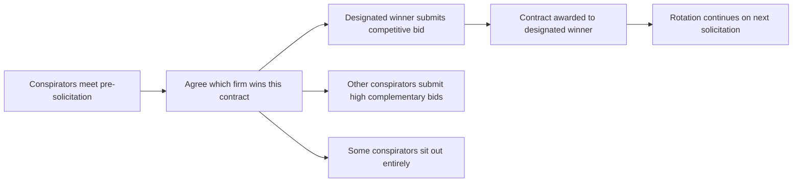
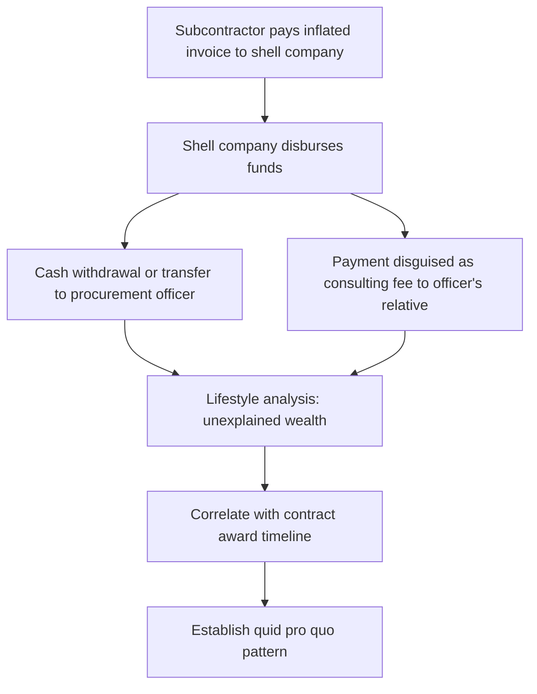

## Procurement and Contract Fraud Schemes

### Overview

Procurement and contract fraud encompasses schemes that corrupt the competitive bidding, contract award, performance, or billing phases of government (or large private) purchasing processes. These schemes cause direct financial loss through inflated prices, substandard goods/services, and diverted funds, and they undermine the integrity of the competitive process itself. Forensic accountants support investigations and litigation under the False Claims Act, procurement fraud statutes, and related anti-corruption laws by reconstructing bid data, tracing kickbacks, and quantifying damages.

### Legal Framework

**False Claims Act (31 U.S.C. §§ 3729–3733)**

The primary civil enforcement tool for procurement fraud against the federal government. Imposes liability for knowingly presenting a false claim for payment, using a false record material to a claim, or conspiring to defraud the government. Includes qui tam provisions allowing private whistleblowers ("relators") to sue on the government's behalf and share in recovery (typically 15–30%). Treble damages plus per-claim penalties apply.

**Anti-Kickback Act of 1986 (41 U.S.C. §§ 8701–8707)**

Prohibits kickbacks (money, fees, gifts) paid to prime contractors, subcontractors, or their employees to improperly obtain or reward favorable treatment in connection with a government contract or subcontract.

**Procurement Integrity Act (41 U.S.C. § 2101 et seq.)**

Restricts disclosure of source selection and contractor bid/proposal information, and restricts post-government employment activities of former procurement officials ("revolving door" restrictions).

**Sherman Act § 1 (15 U.S.C. § 1) — Bid Rigging**

Criminalizes agreements among competitors to rig bids, allocate customers/territories, or fix prices — a per se antitrust violation prosecuted criminally by the DOJ Antitrust Division.

**18 U.S.C. § 201 — Bribery of Public Officials**

Criminalizes bribery and illegal gratuities to federal officials, including procurement officers.

**18 U.S.C. § 1001 — False Statements**

Covers false statements made to federal agencies in connection with bids, certifications, or contract performance reports.

**FAR (Federal Acquisition Regulation)**

Governs federal procurement processes; violations of FAR certification requirements (e.g., cost/pricing data certifications under the Truthful Cost or Pricing Data Act, formerly Truth in Negotiations Act) often underlie False Claims Act theories.

### Categories of Procurement Fraud Schemes

**Key Points**

- **Pre-award schemes**: Bid rigging, bid rotation, complementary/cover bidding, bribery for insider information, conflicts of interest in source selection
- **Award schemes**: Split purchases to stay below competitive bidding thresholds, sole-source justification abuse, unbalanced bidding
- **Performance schemes**: Product substitution, cost mischarging, defective pricing, false certifications of compliance (small business, testing, labor standards)
- **Billing schemes**: Duplicate billing, phantom deliveries, mischarging labor categories, change order abuse

### Bid Rigging Schemes

**Bid Rotation**

Conspirators take turns being the low bidder on a series of contracts, ensuring each member wins a roughly equal share over time while submitting deliberately high or non-competitive "complementary" bids on contracts not designated as theirs to win.

**Complementary (Cover) Bidding**

Conspirators submit bids they know are too high or that contain terms unacceptable to the buyer, creating the appearance of competition while ensuring a predetermined bidder wins.

**Bid Suppression**

Competitors agree that one or more companies will refrain from bidding, or will withdraw a previously submitted bid, to allow a designated bidder to win.

**Market/Customer Allocation**

Competitors divide customers, contracts, or geographic territories among themselves, agreeing not to compete for business assigned to another conspirator.

**Statistical Indicators of Bid Rigging**

| Indicator | Forensic Test |
| --- | --- |
| High bid-price correlation across "competitors" | Regression/correlation analysis of bid amounts over time |
| Identical or suspiciously similar bid documents | Document metadata and formatting comparison |
| Rotating winners over time | Win-pattern analysis across multiple solicitations |
| Large, unexplained gaps between low and second bids | Bid spread/dispersion analysis |
| Losing bidders later become subcontractors to winner | Subcontract award cross-referencing |
| Withdrawal of a previously "low" bidder | Bid submission and withdrawal timeline review |
| Price increases coincide with new entrant exit | Market structure/entry-exit analysis |

### Kickback and Bribery Schemes

**Key Points**

- Kickbacks typically flow from a subcontractor to a prime contractor's purchasing agent, or from a vendor to a government procurement/contracting officer, in exchange for contract award, favorable specifications, inflated pricing approval, or lenient inspection/acceptance.
- Payments are often disguised as consulting fees, "marketing" or "referral" fees, inflated invoices for unrelated goods/services, or funneled through shell companies and family members.
- Non-cash kickbacks (travel, gifts, employment for relatives, equity stakes) are common and require lifestyle/relationship analysis to detect.

**Tracing Methodology**

**Example**

A forensic accountant reviewing a prime contractor's subcontractor payments identifies a consulting firm receiving $15,000 monthly "market research" fees. The consulting firm has no employees, is registered at a residential address, and its sole owner is the sister-in-law of the agency's contracting officer. Bank tracing shows funds flowing from the consulting firm's account to a joint account held by the contracting officer, with transfer timing correlated to contract modification approvals that increased the contractor's billing rates by 22% without competitive justification.

### Cost/Pricing Fraud

**Defective Pricing**

Under the Truthful Cost or Pricing Data Act, contractors negotiating certain contracts must certify that cost/pricing data furnished to the government is current, accurate, and complete. Defective pricing occurs when a contractor knowingly withholds more favorable cost data (e.g., a lower subcontractor quote already obtained) to negotiate a higher contract price.

$$\text{Defective Pricing Damages} = \text{Negotiated Price} - \text{Price That Would Have Resulted from Accurate Data}$$

**Cost Mischarging**

Charging costs to the wrong contract (e.g., shifting commercial or overrun costs onto a cost-reimbursement government contract), mischarging labor hours to higher-billing contract line items, or charging unallowable costs (entertainment, lobbying, fines) as allowable per FAR Part 31.

**Cross-Charging**

Deliberately shifting costs between a fixed-price and a cost-reimbursement contract to avoid a loss on the fixed-price contract, effectively having the government subsidize the fixed-price work.

**Product Substitution**

Delivering goods that do not meet contract specifications (lower-grade materials, counterfeit parts, non-conforming components) while certifying compliance and billing at the specified-quality price.

### Forensic Analytical Techniques

**Benford's Law / Digit Analysis**

Applied to large populations of invoice amounts or unit prices to flag anomalous clustering suggestive of manipulated figures.

**Bid Spread and Regression Analysis**

$$\text{Bid Spread} = \frac{\text{Second Lowest Bid} - \text{Lowest Bid}}{\text{Lowest Bid}} \times 100\%$$

Abnormally narrow or abnormally wide, systematically patterned spreads across multiple solicitations can indicate coordination.

**Relationship / Network Analysis**

Mapping ownership, family, and employment relationships between bidders, subcontractors, and procurement officials using entity registries, LinkedIn/public records, and vendor master file cross-referencing.

**Price/Quantity Reconciliation**

Matching purchase orders, receiving reports, and invoices to detect phantom deliveries (billed but never received) or quantity padding.

**Change Order Analysis**

Reviewing the frequency, size, and justification of contract modifications, since change orders (often awarded without competition) are a common vehicle for post-award kickback schemes and scope creep.

### False Claims Act Damages Framework

| Element | Description |
| --- | --- |
| Actual damages | Difference between amount paid and value of what government actually received |
| Treble damages | Actual damages multiplied by three (31 U.S.C. §3729(a)(1)) |
| Civil penalties | Per-claim penalty (statutory amount adjusted periodically for inflation) in addition to treble damages |
| Materiality | Must show the false statement/certification was material to the government's payment decision (Escobar standard) |
| Knowledge (scienter) | Actual knowledge, deliberate ignorance, or reckless disregard of falsity — ordinary negligence is insufficient |

**Key Points**

- Under the "implied certification" theory recognized in *Universal Health Services v. United States ex rel. Escobar*, a contractor's claim for payment can be false where it fails to disclose noncompliance with a material statutory, regulatory, or contractual requirement, even without an express false certification.
- Damages calculations must distinguish between the contract price paid and the fair market value of goods/services actually delivered, often requiring a benefit-of-the-bargain or diminished-value analysis.

### Small Business and Set-Aside Fraud

**Key Points**

- **Front companies / pass-through schemes**: A certified small, disadvantaged, veteran-owned, or minority/woman-owned business is used nominally to win a set-aside contract while a larger, ineligible company actually performs the work and receives the economic benefit.
- **Affiliation violations**: Failure to disclose common ownership, shared management, or economic dependence between the "small" business and a larger affiliated entity that would breach SBA size standards.
- Forensic indicators include: minimal or no employees at the certified firm, shared office space/equipment/personnel with the affiliated firm, subcontracting nearly all contract value back to the ineligible entity, and financial dependence evidenced by intercompany loans or guarantees.

### Grant Fraud (Related Public-Sector Pattern)

Similar schemes occur in the administration of government grants: falsified cost-share documentation, charging unallowable or unrelated costs to a grant, double-billing the same costs to multiple funding sources, and fabricated performance/outcome reporting to retain funding — often analyzed using the same cost allowability and mischarging techniques used in contract fraud.

### Red Flags Checklist

**Key Points**

- Unusual bid patterns: consistent winners, suspiciously round bid amounts, or bids clustered just under a competitive-threshold dollar amount
- Contracting officer or evaluator with undisclosed financial or personal relationship to a bidder
- Sole-source justifications used repeatedly for goods/services generally available competitively
- Contract awarded to the only bidder despite multiple firms attending a pre-bid conference
- Split purchase orders just below micro-purchase or simplified acquisition thresholds
- Excessive, frequently unjustified change orders after award
- Subcontractor invoices lacking supporting detail or delivered through intermediary shell entities
- Set-aside awardee with no independent operational capacity

### Related Topics

- False Claims Act qui tam litigation and relator damages theories
- Bid rigging detection using statistical and screening methods (DOJ Antitrust Division screens)
- Grant fraud and cost allowability under 2 C.F.R. Part 200 (Uniform Guidance)
- Foreign Corrupt Practices Act and cross-border procurement corruption
- Conflict of interest and revolving-door restrictions in government contracting
- Benford's Law and digital forensic accounting techniques
- Damages methodologies under the False Claims Act (benefit-of-the-bargain vs. diminished value)
- Whistleblower protections and qui tam relator procedures