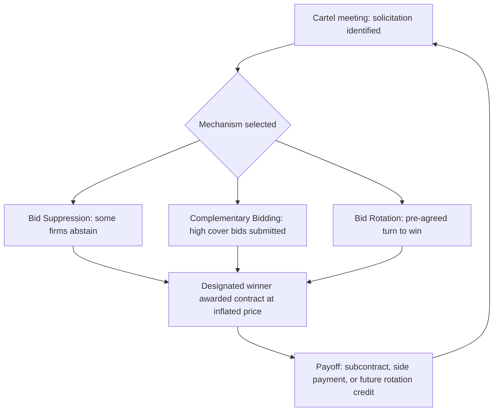
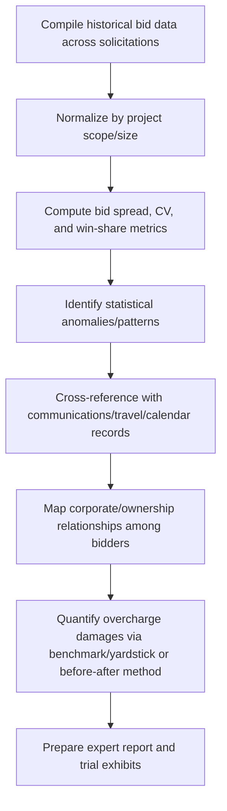

## Bid-Rigging in Government Contracting

### Overview

Bid-rigging is a collusive agreement among competitors to subvert the competitive procurement process by predetermining which firm will win a contract, effectively eliminating genuine price competition. It is treated as a per se violation of antitrust law — meaning no showing of actual anticompetitive market effect is required, since the conduct is conclusively presumed unreasonable. Bid-rigging in government contracting overlaps with, but is analytically distinct from, the broader procurement fraud schemes covered in the previous item, warranting focused treatment of its mechanics, detection methodology, and enforcement framework.

### Legal Framework

**Sherman Antitrust Act § 1 (15 U.S.C. § 1)**

Criminalizes "every contract, combination... or conspiracy in restraint of trade." Bid rigging is one of a small category of offenses (along with price fixing and market allocation) treated as a per se violation — courts do not weigh procompetitive justifications or actual market impact once the agreement is proven.

**Penalties**: Individuals face up to 10 years imprisonment and fines up to $1 million per Sherman Act violation (18 U.S.C. §3571 allows alternative fines up to twice the gain or loss); corporations face fines up to $100 million or twice the gross gain/loss, whichever is greater.

**False Claims Act (31 U.S.C. §§ 3729–3733)**

Bid-rigging schemes frequently support parallel civil FCA liability, since a rigged bid resulting in an inflated contract price constitutes a false claim when payment is sought under that contract.

**18 U.S.C. § 371 — Conspiracy**

Used where Sherman Act elements are not fully met, or as an additional charge alongside antitrust and fraud counts.

**DOJ Antitrust Division Leniency Program**

Provides amnesty from criminal prosecution to the first conspirator to self-report a bid-rigging conspiracy and cooperate fully, a critical enforcement tool that frequently generates the evidentiary foundation (insider testimony, documents) for prosecuting remaining conspirators.

### The Economics of Bid-Rigging

In a competitive market, bid price approximates:

$$P_{competitive} = MC + \text{normal profit margin}$$

Under a rigging conspiracy, the designated winner's bid rises toward:

$$P_{rigged} = P_{competitive} + \text{cartel overcharge}$$

**Key Points**

- Empirical cartel studies commonly find overcharges in the range of 10–20% above the competitive price, though this varies significantly by industry and conspiracy duration/scope; any specific overcharge percentage cited in a given engagement should be treated as [Unverified] absent case-specific empirical analysis.
- The overcharge is typically distributed among conspirators through side payments, subcontracts to losing bidders, or future rotation of winning contracts — the compensation mechanism that sustains cartel discipline.

### Mechanisms of Bid-Rigging

**Bid Suppression**

One or more competitors who would otherwise bid, or who have already submitted a bid, agree to refrain from bidding or withdraw a submitted bid, allowing a designated conspirator's bid to be accepted.

**Complementary Bidding (Cover Bidding)**

Competitors submit bids that are deliberately too high, or that contain terms known to be unacceptable to the buyer, creating an appearance of genuine competition while ensuring the designated firm wins.

**Bid Rotation**

Conspirators take turns being the designated low bidder across a series of contracts, coordinating so that each firm wins an agreed share of contracts over time.

**Subcontracting as Payoff**

Losing conspirators are compensated by receiving subcontracts or supply agreements from the designated winner, converting non-winning bids into compensated participation rather than pure loss.

**Market and Customer Allocation**

Conspirators divide contracts by customer, geography, or product line, agreeing not to compete for business assigned to another member — a structural variant that produces rigged outcomes without contract-by-contract coordination.

### Detection: Screening and Statistical Methods

**Bid Spread (Cover Bid) Screen**

$$\text{Spread} = \frac{P_{2nd\ lowest} - P_{lowest}}{P_{lowest}} \times 100\%$$

Persistently large or unusually patterned spreads between the winning bid and the next-lowest bid across multiple solicitations can indicate the second bidder submitted a deliberately uncompetitive cover bid.

**Coefficient of Variation (CV) Screen**

$$CV = \frac{\sigma_{bids}}{\mu_{bids}}$$

A markedly lower CV among a subset of bidders across solicitations (i.e., their bids move together more tightly than expected under independent competition) can suggest coordination.

**Relative Bid Spread Over Time**

Tracking whether the *identity* of the low bidder rotates in a statistically improbable regular pattern (bid rotation), or whether bid spreads collapse sharply after a new, non-conspiring entrant appears in the market (evidence the entrant disrupted a prior cartel).

**Win-Share Analysis**

$$\text{Win Share}_i = \frac{\text{Contracts won by firm } i}{\text{Total contracts in market}}$$

Compared against each firm's bid participation rate — a firm that bids frequently but never wins, or wins at suspiciously regular intervals, may be a suppressed or rotating bidder.

**Market Structure Indicators**

| Indicator | Interpretation |
| --- | --- |
| High market concentration (few qualified bidders) | Facilitates coordination and monitoring |
| Homogeneous product/service specifications | Easier to agree on allocation without ambiguity |
| Frequent, repeated procurement of same item | Enables long-run rotation schemes |
| Industry trade associations with frequent bidder meetings | Provides coordination venue |
| Stable market shares over long periods despite "competitive" bidding | Consistent with allocation agreement |
| Sharp price drop when new entrant appears | Evidence prior prices were supra-competitive |

### Documentary and Behavioral Red Flags

**Key Points**

- Identical or near-identical bid documents (formatting, typographical errors, pricing structure) across nominally competing firms
- Bid or cover-letter language referencing a competitor's pricing, or apologizing for a "high" bid
- Communications (calls, meetings, emails) between competing bidders shortly before a bid deadline
- A bidder's proposal is submitted using another bidder's letterhead, stationery, or calculation errors
- Handwritten notes, spreadsheets, or "master lists" found in a firm's possession identifying which competitor is scheduled to win upcoming contracts
- Losing bidders subsequently appear as subcontractors on the winning bid
- Bid withdrawal shortly before opening, particularly by a historically competitive bidder

**Example**

An analysis of forty highway resurfacing contracts awarded by a state DOT over six years shows that four paving companies won nearly all contracts, with each firm's win share (24–27%) remarkably stable year over year despite differing project locations and sizes. Regression analysis of submitted bids shows the losing bids from the other three firms cluster tightly between 8–12% above the winner's bid in each solicitation — a pattern inconsistent with independent estimation given each firm's differing cost structures and equipment fleets. Subpoenaed phone records show clusters of calls among the four firms' estimators in the 48 hours before each bid deadline. Combined, the statistical pattern and communications evidence support a bid-rotation conspiracy theory.

### Forensic Accountant's Analytical Workflow

### Damages Quantification Methods

**Before-and-After Method**

Compares prices charged during the conspiracy period to prices charged by the same or similar suppliers before the conspiracy began or after it ended (e.g., following a leniency application or law enforcement intervention).

$$\text{Overcharge} = P_{during\ conspiracy} - P_{benchmark\ (before/after)}$$

**Yardstick (Benchmark) Method**

Compares prices in the affected (cartelized) market to prices for comparable goods/services in a geographically or structurally similar but non-cartelized market.

**Cost-Based Method**

Estimates a competitive price by starting from the seller's cost structure and applying an industry-standard normal profit margin, then compares to actual prices paid.

**Regression (Econometric) Method**

Uses multiple regression to control for cost drivers (materials, labor, project complexity, fuel prices) and isolates a "conspiracy" dummy variable coefficient representing the estimated overcharge, net of legitimate cost variation. [Inference: the reliability of this method depends heavily on model specification and the availability of sufficient non-conspiracy comparison data, and is frequently contested via competing expert reports.]

### Civil and Criminal Enforcement Interaction

| Aspect | Criminal (Sherman Act §1) | Civil (Antitrust Damages / FCA) |
| --- | --- | --- |
| Prosecuting party | DOJ Antitrust Division | DOJ Civil Division, state AGs, qui tam relators, injured purchasers |
| Burden of proof | Beyond a reasonable doubt | Preponderance of the evidence |
| Per se treatment | Yes — no rule-of-reason defense | Same per se treatment typically carries over |
| Remedy | Imprisonment, criminal fines | Treble damages (private antitrust suits), FCA treble damages/penalties |
| Leniency impact | Full amnesty for first cooperating reporter | Leniency applicant still faces civil treble damages exposure (though Antitrust Criminal Penalty Enhancement and Reform Act limits it to single/actual damages for the leniency applicant if cooperation continues) |

### Interaction with Broader Procurement Fraud

**Key Points**

- Bid-rigging is frequently accompanied by bribery of the procurement official who helps identify the rotation schedule, adjusts specifications to favor the designated winner, or overlooks suspicious bid patterns — connecting this topic directly to the kickback schemes discussed in the general procurement fraud item.
- A rigged-bid contract that is subsequently billed to the government also supports a parallel False Claims Act theory, since the certification of a competitively obtained price is rendered false.
- Small business set-aside fraud can combine with bid-rigging where a cartel uses a front company to satisfy set-aside requirements while the rigging conspiracy determines which cartel member truly benefits.

### Prevention and Detection Program Design

**Key Points**

- Independent, randomized post-award audits comparing bid patterns against historical benchmarks
- Sealed-bid procedures with strict controls on pre-bid competitor communication and site-visit logs
- Rotating or blind evaluation panels to reduce insider collusion risk
- Data analytics programs applying the statistical screens above across all agency solicitations on a continuous basis
- Whistleblower hotlines and qui tam awareness programs, given that cartels are frequently exposed through insider cooperation rather than external detection alone

### Related Topics

- Procurement and contract fraud schemes (parent topic — award, performance, and billing schemes)
- DOJ Antitrust Division corporate and individual leniency programs
- False Claims Act materiality and damages theories
- Benford's Law and statistical screening in forensic accounting
- Bribery of public officials and kickback tracing methodology
- Regression and econometric methods in fraud damages quantification
- Small business set-aside and front-company fraud schemes
- Grand jury investigation procedures in antitrust criminal cases