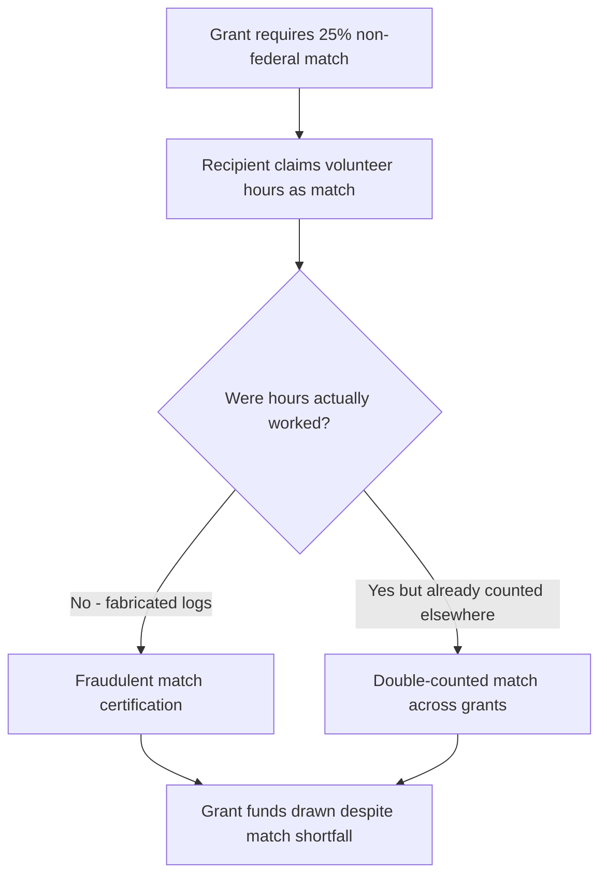
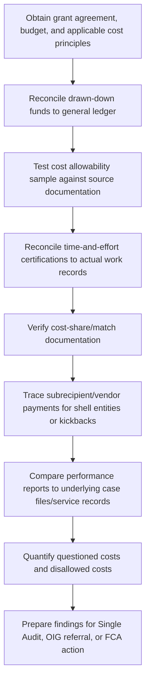

## Grant Fraud and Misuse of Public Funds

### Overview

Grant fraud involves the misrepresentation, misappropriation, or misapplication of funds awarded by federal, state, or local government agencies (or private foundations administering public-purpose funds) to support research, social services, infrastructure, education, or disaster relief. Unlike procurement, where the government buys goods/services, grants transfer funds to recipients to carry out a public purpose with less direct government control over day-to-day spending decisions — creating distinct fraud risk patterns centered on cost allowability, performance reporting, and subrecipient monitoring failures.

### Legal and Regulatory Framework

**False Claims Act (31 U.S.C. §§ 3729–3733)**

Applies to grant fraud where a recipient knowingly submits a false claim for grant funds, a false certification of compliance, or a false progress/financial report material to continued funding — the same statute and damages framework (treble damages, per-claim penalties, qui tam provisions) covered in the procurement fraud item applies equally here.

**2 C.F.R. Part 200 — Uniform Administrative Requirements, Cost Principles, and Audit Requirements for Federal Awards ("Uniform Guidance")**

Consolidated federal regulation governing allowability of costs, administrative requirements, and audit requirements for all federal grants and cooperative agreements. Subpart E (Cost Principles) defines which costs are allowable, allocable, and reasonable; Subpart F establishes the Single Audit requirement.

**Single Audit Act (31 U.S.C. §§ 7501–7507)**

Requires non-federal entities expending $750,000 or more in federal awards during a fiscal year to undergo an annual "single audit" covering both financial statements and federal award compliance, performed under Government Auditing Standards (GAGAS) and reported per 2 C.F.R. Part 200, Subpart F.

**18 U.S.C. § 666 — Theft or Bribery Concerning Programs Receiving Federal Funds**

Criminalizes embezzlement, theft, or bribery by an agent of an organization or government entity that receives more than $10,000 in federal benefits in a one-year period, where the transaction involves at least $5,000.

**31 U.S.C. § 3801 et seq. — Program Fraud Civil Remedies Act (PFCRA)**

Provides an administrative (non-judicial) remedy for federal agencies to pursue false claims and statements below the litigation threshold typically pursued under the FCA.

**Agency-Specific Grant Regulations**

Individual agencies (HHS, DOE, NSF, HUD, FEMA) layer additional program-specific compliance requirements on top of the Uniform Guidance, particularly around allowable activities, matching/cost-share requirements, and performance/outcome reporting.

### Categories of Grant Fraud

**Key Points**

- **Application fraud**: False statements in the grant application regarding eligibility, capacity, matching funds already secured, or prior performance history
- **Cost misallocation/mischarging**: Charging unallowable, unallocable, or unrelated costs to the grant (personal expenses, lobbying, entertainment, costs benefiting a different program)
- **Cost-share/matching fraud**: Falsely claiming in-kind or cash matching contributions that were never actually made or were double-counted across multiple funding sources
- **Time-and-effort reporting fraud**: Certifying personnel effort/salary charges to a grant that do not reflect actual work performed (a leading single-audit finding area)
- **Subrecipient monitoring failures/fraud**: Pass-through entities failing to monitor subrecipients, or subrecipients diverting funds with inadequate oversight
- **Performance/outcome reporting fraud**: Fabricating program outcomes, participant counts, or deliverables to justify continued or renewed funding
- **Duplicate billing / double-dipping**: Charging the same costs to multiple grants or to both a grant and another funding source

### Cost Allowability Framework (2 C.F.R. § 200.403–200.405)

For a cost to be allowable under a federal award, it generally must be:

| Criterion | Requirement |
| --- | --- |
| Necessary and reasonable | Cost is prudent under the circumstances and necessary for grant performance |
| Allocable | Cost benefits the specific award in proportion to the benefit received |
| Consistent treatment | Costs treated consistently whether charged to federal or non-federal sources |
| Conforming | Consistent with GAAP (unless otherwise provided) |
| Not included as match elsewhere | Not counted as cost sharing/match on another federal award |
| Adequately documented | Supported by source documentation |
| Net of applicable credits | Reduced by rebates, refunds, or other credits |

**Unallowable Cost Categories (2 C.F.R. § 200.421 et seq.)**

Commonly cited unallowable costs include: alcoholic beverages, bad debts, contributions/donations, entertainment, fines and penalties, fundraising, lobbying, and certain executive compensation above statutory caps.

### Grant Fraud Schemes: Mechanics

**Time-and-Effort Certification Fraud**

Federal grants often fund a percentage of an employee's salary. Fraud occurs when an employee is certified as spending, e.g., 50% of their time on a federally funded research project, but actually spends significantly less, with the difference charged to the grant to subsidize unrelated institutional activities.

$$\text{Overcharged Salary} = (\text{Certified \%} - \text{Actual \%}) \times \text{Annual Salary}$$

**Cost-Share/Match Fraud**

**Phantom Vendor / Kickback Schemes**

A grant recipient's procurement staff sets up a shell vendor to bill the grant for goods/services never delivered, or inflates legitimate vendor invoices in exchange for a kickback — the same tracing methodology used in procurement fraud investigations applies directly.

**Duplicate/Double-Dipping Across Multiple Awards**

The same equipment purchase, salary cost, or indirect cost pool is charged in full to two or more federal awards, or to a federal award and a state/private grant simultaneously, exceeding actual total costs incurred.

**Fabricated Outcome Reporting**

A social services grantee reports inflated participant enrollment or service delivery numbers in periodic performance reports to justify continued disbursement, without underlying case files or service logs to support the figures.

**Example**

A nonprofit receiving a $2 million federal workforce training grant reports serving 1,200 participants annually to satisfy its performance benchmark and trigger continued funding. A forensic reconstruction comparing the reported participant roster against sign-in sheets, case manager notes, and third-party employer verification identifies only 640 individuals with any documented program contact, and of those, fewer than half have supporting attendance records meeting the grant's definition of "served." The gap between reported and substantiated participants, combined with time-and-effort records showing case managers logging 100% grant-funded time despite email and calendar evidence of substantial non-grant duties, supports both a False Claims Act theory (false progress reports material to continued funding) and referral under 18 U.S.C. §666.

### Subrecipient vs. Contractor Determination

A critical and frequently misapplied threshold question (2 C.F.R. § 200.331) is whether a downstream entity is a **subrecipient** (subject to full Uniform Guidance compliance and monitoring requirements) or a **contractor/vendor** (subject to standard procurement rules only).

| Characteristic | Subrecipient | Contractor |
| --- | --- | --- |
| Determines eligibility for assistance | Yes | No |
| Has performance measured against program objectives | Yes | No |
| Has responsibility for programmatic decision-making | Yes | No |
| Provides goods/services within normal business operations | No | Yes |
| Operates in a competitive market with other similar entities | No | Yes |

**Key Points**

- Misclassifying a subrecipient as a contractor to avoid pass-through monitoring obligations is itself a compliance failure that facilitates downstream fraud, since contractors are not subject to the same cost-allowability scrutiny.

### Forensic Investigative Methodology

**Key Analytical Techniques**

- **Questioned cost testing**: Sampling transactions charged to the grant and tracing to invoices, timesheets, and approval documentation to identify costs lacking adequate support or falling into unallowable categories
- **Indirect cost rate verification**: Confirming the recipient applied its federally negotiated indirect cost rate (or de minimis 10% rate) correctly and consistently across all awards
- **Drawdown reconciliation**: Comparing cash drawn from the federal payment system (e.g., HHS Payment Management System) against actual expenditures incurred, to identify excess cash draws held in violation of cash management requirements (2 C.F.R. § 200.305)
- **Benford's Law / anomaly detection**: Applied to expense populations to flag manipulated figures, consistent with techniques used in procurement fraud analysis

### Single Audit Findings as an Investigative Starting Point

**Key Points**

- A Single Audit's Schedule of Findings and Questioned Costs is often the first formal indicator of grant compliance failures and frequently triggers a deeper forensic investigation.
- Repeat findings across multiple audit cycles (uncorrected prior-year findings) are a significant red flag for systemic control weakness or intentional noncompliance rather than isolated error.
- Auditee corrective action plans that are consistently unimplemented can support a finding of reckless disregard sufficient for False Claims Act scienter.

### Civil, Criminal, and Administrative Remedies

| Remedy | Basis | Effect |
| --- | --- | --- |
| Disallowance / cost recovery | Agency compliance review or audit finding | Recipient must repay questioned/disallowed costs |
| Suspension or debarment | 2 C.F.R. Part 180 | Recipient barred from future federal awards |
| False Claims Act liability | 31 U.S.C. §3729 | Treble damages, per-claim penalties |
| Program Fraud Civil Remedies Act | 31 U.S.C. §3801 | Administrative penalties without full litigation |
| Criminal prosecution | 18 U.S.C. §666, §1001, mail/wire fraud | Fines, imprisonment |
| Grant termination | Terms of award | Immediate cessation of funding |

### Red Flags Checklist

**Key Points**

- Time-and-effort certifications showing round, unchanging percentages (e.g., exactly 50% every reporting period) with no variation despite changing project activity
- Cost-share documentation lacking contemporaneous sign-in sheets, timesheets, or third-party valuation support
- Same equipment, salary, or indirect costs appearing on budgets/reports for multiple concurrent awards
- Performance reports with participant/outcome numbers that cannot be reconciled to case files or service logs
- Subrecipients with no independent capacity, minimal staff, or close personal ties to the pass-through entity's leadership
- Repeated or escalating uncorrected Single Audit findings
- Excess cash draws sitting in recipient accounts well beyond immediate cash needs
- Vendor addresses matching employee home addresses or lacking any verifiable business presence

### Related Topics

- Procurement and contract fraud schemes (parallel public-sector fraud pattern)
- False Claims Act materiality and damages theories
- Single Audit requirements under 2 C.F.R. Part 200, Subpart F
- Subrecipient monitoring and pass-through entity obligations
- Cost allowability principles and indirect cost rate negotiation
- Bid-rigging in government contracting
- Whistleblower/qui tam procedures in grant-funded programs
- Benford's Law and anomaly detection in public-fund expenditure testing