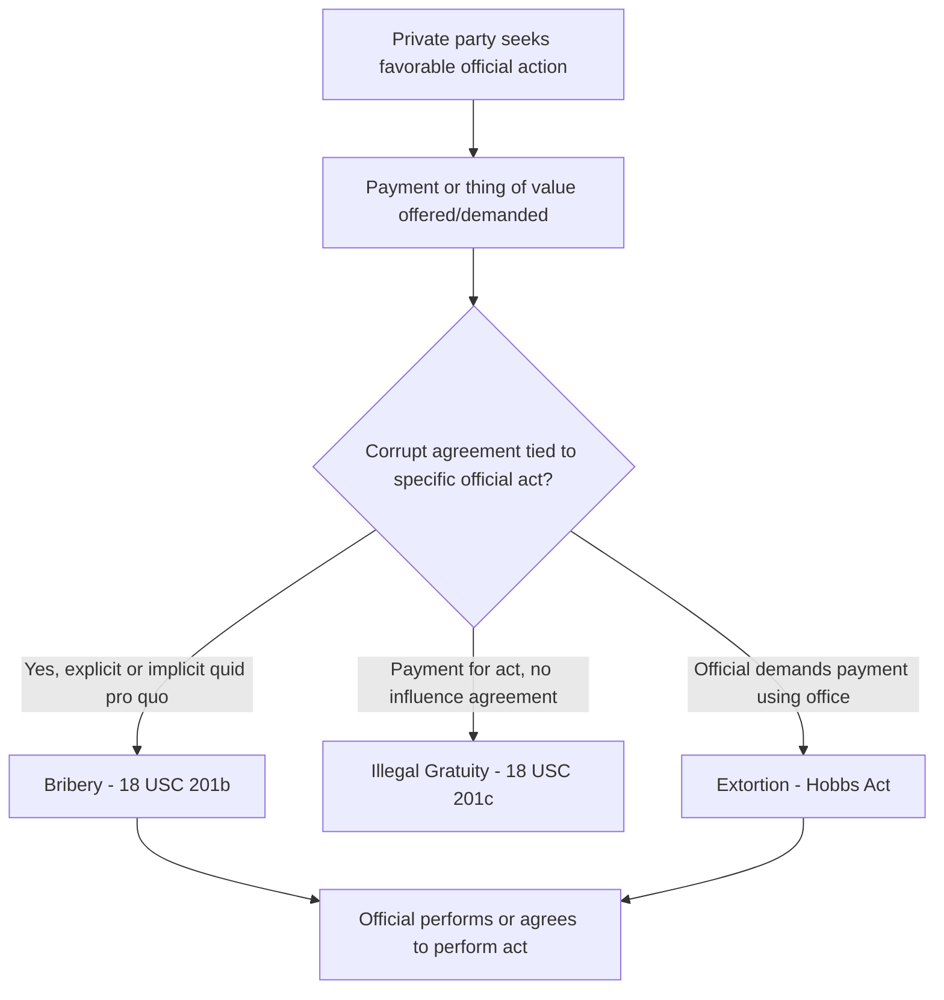
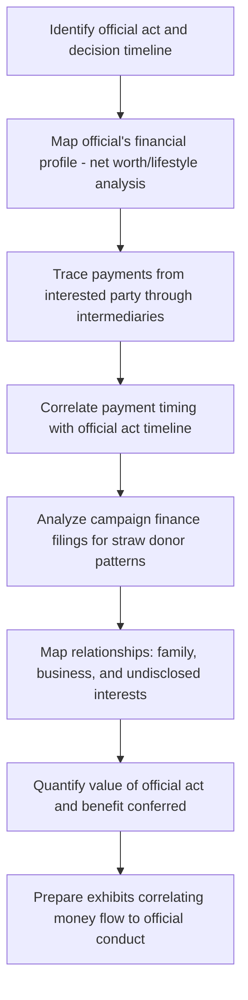

## Political and Public Corruption Schemes

### Overview

Political and public corruption schemes involve public officials, candidates, or political organizations abusing entrusted power for private gain, or private parties corrupting public decision-making through illicit payments or favors. These schemes range from direct bribery and extortion to more diffuse forms such as campaign finance violations, patronage/nepotism abuse, and honest services fraud. Forensic accountants support investigations by tracing illicit payment flows, reconstructing campaign finance records, quantifying the value of official acts, and analyzing conflicts of interest — work that frequently intersects with the procurement, grant, and kickback schemes covered elsewhere in this chapter.

### Legal Framework

**18 U.S.C. § 201 — Bribery of Public Officials and Witnesses**

Criminalizes corruptly giving, offering, or promising anything of value to a federal public official with intent to influence an official act (bribery), and the lesser offense of giving something of value for or because of an official act without the corrupt quid pro quo intent (illegal gratuity).

**Hobbs Act (18 U.S.C. § 1951) — Extortion Under Color of Official Right**

Criminalizes a public official's extortion of payments in exchange for official action — the "wrongful use of official position" theory of extortion, distinct from bribery in that it can be proven without showing the payer initiated the transaction.

**Honest Services Fraud (18 U.S.C. § 1346)**

Extends mail/wire fraud statutes to schemes to deprive another of the "intangible right of honest services." Following *Skilling v. United States* (2010), honest services fraud in the public corruption context is limited to schemes involving bribes or kickbacks (not undisclosed self-dealing or conflicts of interest alone).

**Travel Act (18 U.S.C. § 1952)**

Criminalizes interstate travel or use of interstate facilities to promote, manage, or carry on bribery in violation of state law, frequently used to federalize state and local corruption schemes.

**Foreign Corrupt Practices Act (15 U.S.C. §§ 78dd-1 et seq.)**

Prohibits bribery of foreign officials to obtain or retain business, with anti-bribery provisions applicable to U.S. issuers, domestic concerns, and certain foreign persons, plus books-and-records and internal controls provisions applicable to issuers.

**Federal Election Campaign Act (52 U.S.C. § 30101 et seq.)**

Governs contribution limits, source restrictions (corporate/foreign national contribution bans), and disclosure requirements for federal campaigns; violations include illegal contributions, straw donor schemes, and coordination violations.

**State and Local Analogues**

Most states have parallel bribery, extortion, and official misconduct statutes, often enforced alongside federal charges via the Travel Act or through direct state prosecution.

### Categories of Public Corruption Schemes

**Key Points**

- **Bribery/quid pro quo schemes**: Direct exchange of money or value for a specific official act (contract award, favorable ruling, zoning approval, legislative vote)
- **Extortion schemes**: Official demands payment as a condition of performing (or not obstructing) an official act
- **Kickback schemes**: Payments to officials tied to contracts or grants they control, as discussed in the procurement fraud items
- **Nepotism and patronage abuse**: Awarding positions, contracts, or benefits based on personal/family relationships rather than merit, often layered with fraud when disguised or misrepresented
- **Campaign finance violations**: Illegal contributions, straw donor schemes, coordination violations, and personal use of campaign funds
- **Self-dealing / undisclosed conflicts of interest**: Officials directing public resources or decisions to entities in which they hold an undisclosed financial interest
- **Embezzlement of public funds**: Direct theft or diversion of public monies by an official with custodial control

### Bribery vs. Extortion vs. Illegal Gratuity

| Element | Bribery (§201(b)) | Illegal Gratuity (§201(c)) | Extortion Under Color of Official Right (Hobbs Act) |
| --- | --- | --- | --- |
| Intent standard | Corrupt intent to influence official act (quid pro quo) | Given "for or because of" an official act, no corrupt intent to influence required | Official's wrongful use of position induces payment |
| Who typically initiates | Either party | Payer, often after the fact | Official (demand) |
| Penalty severity | Higher (up to 15 years) | Lower (up to 2 years) | Up to 20 years |
| Proof focus | Explicit or implicit agreement tied to specific act | Payment connected to act, lesser intent showing | Official's exploitation of office to obtain payment |

### The Quid Pro Quo Standard

Following *McDonnell v. United States* (2016), an "official act" for bribery/honest services purposes must involve a formal exercise of governmental power on a specific matter — not merely setting up meetings, hosting events, or making calls on a constituent's behalf without more. Forensic and legal teams must carefully map alleged conduct to a concrete official act to sustain federal bribery charges.

### Tracing and Concealment Techniques in Corruption Schemes

**Key Points**

- **Shell company layering**: Bribe payments routed through consulting or shell entities to disguise the true payor and purpose, as seen in procurement kickback schemes
- **Family and associate accounts**: Payments made to spouses, children, or close associates of the official rather than directly to the official
- **In-kind benefits**: Gifts, travel, home renovations, employment for relatives, or below-market real estate transactions in lieu of cash
- **Campaign contribution laundering**: Bribes disguised as campaign contributions, including straw donor schemes where a third party is reimbursed for making contributions in their own name to conceal the true source
- **Structuring**: Breaking payments into amounts below reporting thresholds (CTR/SAR triggers) to avoid detection
- **Barter/reciprocal favor schemes**: Non-monetary exchanges (e.g., an official steering a contract in exchange for a no-show job for a relative) that require valuation analysis to quantify

### Forensic Methodology for Corruption Investigations

**Net Worth and Lifestyle Analysis**

Applied to the official (and often their family members) to identify unexplained increases in wealth inconsistent with disclosed salary and legitimate income sources, using the same net worth reconstruction methodology applied in tax fraud investigations.

**Timeline Correlation Analysis**

Building a parallel timeline of (1) payments/benefits received and (2) official actions taken (votes, contract approvals, permit issuances, regulatory decisions) to demonstrate temporal proximity supporting an inference of quid pro quo.

**Financial Disclosure Reconciliation**

Comparing an official's mandatory financial disclosure filings (assets, income, gifts, outside positions) against actual bank, brokerage, and property records to identify omissions or misrepresentations that independently support false statement charges and corroborate concealment of corrupt proceeds.

**Example**

A city council member votes to approve a rezoning application benefiting a real estate developer. Financial disclosure reconciliation shows the council member's spouse was employed as a "consultant" by an LLC controlled by the developer beginning three months before the vote, receiving $8,000 monthly payments despite no verifiable consulting work product. Bank tracing shows the LLC's funds originate from the developer's operating account, and the consulting arrangement terminates two months after the rezoning vote is finalized. A timeline correlation exhibit places the consulting payments' initiation, the vote, and the arrangement's termination in close proximity, supporting a Hobbs Act extortion or honest services fraud theory even absent an explicit recorded agreement.

### Campaign Finance Fraud

**Straw Donor Schemes**

A prohibited source (corporation, foreign national, or a donor who has exceeded contribution limits) funnels money through individuals who make contributions in their own names and are reimbursed, concealing the true source and evading contribution limits or source restrictions.

**Personal Use Violations**

Diversion of campaign funds to pay personal expenses (mortgage, personal travel, retail purchases) unrelated to campaign or officeholder duties, prohibited under FEC personal use rules.

**Coordination Violations**

Formally "independent" expenditures (e.g., by a Super PAC) that are secretly coordinated with a candidate's campaign, circumventing contribution limits that apply to direct campaign contributions but not to genuinely independent expenditures.

**Forensic Indicators**

| Red Flag | Indicator |
| --- | --- |
| Reimbursement pattern | Multiple donors contributing identical amounts near the same date, followed by matching deposits from a common source |
| Donor capacity mismatch | Contributions inconsistent with donor's disclosed income/employment |
| Personal expense clustering | Campaign disbursements to retailers, restaurants, or vendors unrelated to campaign activity |
| Shared vendors/consultants | Same consultants used by "independent" PAC and campaign committee, with overlapping strategy documents |

### Honest Services Fraud Post-*Skilling*

**Key Points**

- After *Skilling v. United States*, honest services fraud prosecutions in the public corruption sphere must be grounded in a bribery or kickback scheme — mere failure to disclose a conflict of interest, without an accompanying bribe or kickback, is generally insufficient.
- This narrowed the government's toolkit, increasing reliance on direct bribery, Hobbs Act extortion, and state law violations (via the Travel Act) to reach self-dealing conduct that would previously have been charged solely as honest services fraud.

### Civil and Administrative Remedies

| Mechanism | Effect |
| --- | --- |
| Criminal prosecution (§201, Hobbs Act, §1346) | Imprisonment, fines, forfeiture of proceeds |
| Asset forfeiture (18 U.S.C. §981/982) | Seizure of bribe proceeds and traceable assets |
| Civil RICO (18 U.S.C. §1964) | Treble damages for injured competitors/parties |
| Ethics commission / disciplinary action | Removal from office, fines, disqualification from future office |
| Campaign finance civil penalties | FEC administrative fines, disgorgement |
| Debarment | Bars corrupt contractors from future government business |

### Red Flags Checklist

**Key Points**

- Official's net worth or lifestyle inconsistent with disclosed salary and legitimate income
- Family members or associates receiving payments, employment, or contracts from parties with pending matters before the official
- Financial disclosure omissions or undervaluation of gifts, outside income, or business interests
- Campaign contributions clustering suspiciously by amount and timing, especially near key votes or decisions
- Reimbursed or straw donor contribution patterns
- Official actions closely timed with receipt of payments, gifts, or benefits from an interested party
- Shell entities or consulting arrangements with no verifiable work product connecting an official's associates to an interested party
- Coordinated messaging or shared vendors between a campaign and a nominally independent expenditure committee

### Related Topics

- Procurement and contract fraud schemes (kickback overlap with corrupted contract awards)
- Bid-rigging in government contracting
- Grant fraud and misuse of public funds
- Net worth and lifestyle reconstruction methodology (tax fraud chapter)
- Foreign Corrupt Practices Act enforcement and cross-border bribery tracing
- Asset forfeiture and disgorgement of criminal proceeds
- Money laundering typologies applied to bribe proceeds
- Whistleblower and qui tam mechanisms in public corruption exposure