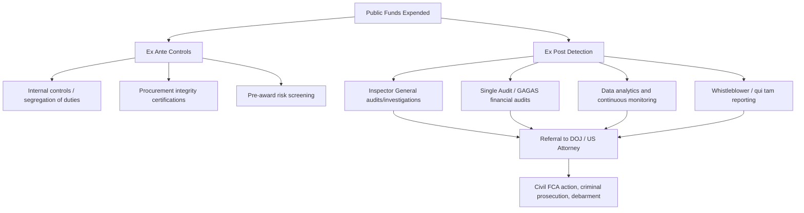
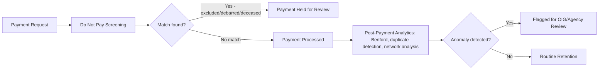
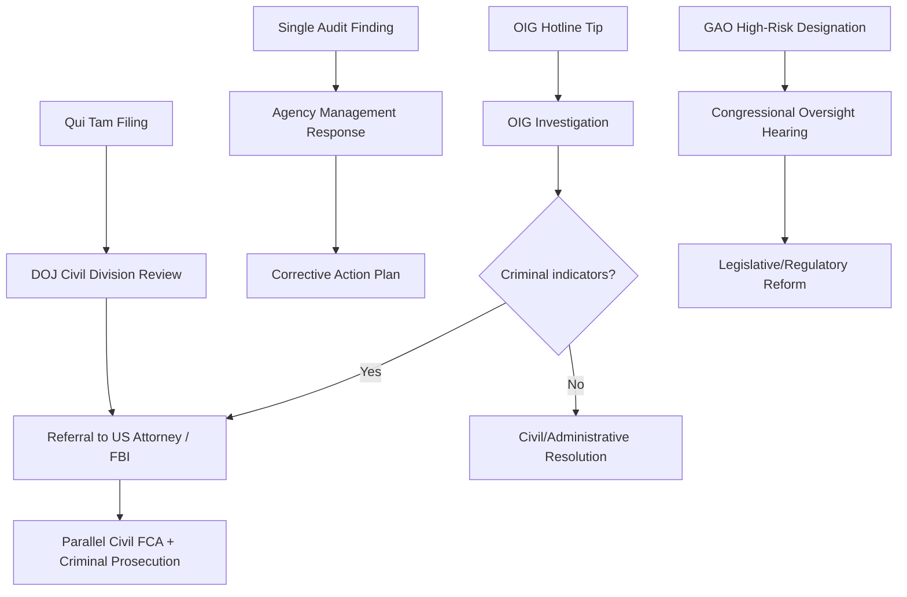

## Oversight Mechanisms in Government Fraud Prevention

### Overview

Oversight mechanisms are the institutional, statutory, and technological structures designed to prevent, detect, and remediate fraud, waste, and abuse in the expenditure of public funds. These mechanisms operate across a continuum from ex ante controls (procurement design, internal controls, pre-award certifications) to ex post detection (audits, data analytics, whistleblower reporting) and enforcement (referral to investigative and prosecutorial agencies). This item synthesizes the oversight architecture that underlies the detection of the procurement, grant, bid-rigging, and corruption schemes covered earlier in this chapter.

### Institutional Oversight Architecture

**Key Points**

- **Legislative branch**: Congressional/state legislative committees with appropriations and oversight authority; the Government Accountability Office (GAO) as the legislative branch's independent audit and investigative arm
- **Executive branch, internal**: Agency Offices of Inspector General (OIGs), Chief Financial Officers, agency internal audit functions, and the Office of Management and Budget (OMB), which issues government-wide financial management guidance including the Uniform Guidance (2 C.F.R. Part 200)
- **Executive branch, cross-agency**: Council of the Inspectors General on Integrity and Efficiency (CIGIE), the Pandemic Response Accountability Committee (PRAC) model for emergency spending oversight, and interagency data-sharing initiatives
- **Judicial branch**: Courts adjudicating False Claims Act suits, criminal prosecutions, and bid protests
- **External/independent**: Independent public accountants performing Single Audits, state auditors general, and qui tam relators/whistleblowers acting as private enforcers

### The Inspector General System

**Inspector General Act of 1978 (5 U.S.C. App.)**

Established independent Offices of Inspector General within federal agencies, with dual reporting responsibility to the agency head and to Congress, to conduct audits and investigations relating to agency programs and operations, and to recommend policies to prevent fraud, waste, and abuse.

**Key Structural Features**

- Statutory independence: IGs generally cannot be removed without notification to Congress, and OIG budgets/staffing are intended to be insulated from the agencies they oversee
- Dual audit/investigative function: OIGs combine financial and performance auditors with criminal investigators (often carrying law enforcement authority) under one roof
- Semiannual reports to Congress: Statutorily required public reporting on audit findings, investigations, and agency responsiveness to recommendations
- Hotlines: Each OIG maintains a fraud, waste, and abuse hotline for employee and public tip reporting

**Council of the Inspectors General on Integrity and Efficiency (CIGIE)**

Coordinates cross-agency OIG activity, develops professional standards for OIG audits and investigations, and facilitates joint task forces for fraud schemes spanning multiple federal programs (e.g., pandemic relief fraud spanning SBA, Treasury, and Department of Labor programs).

### Government Accountability Office (GAO)

**Key Points**

- Operates as an independent, nonpartisan agency within the legislative branch, auditing federal agency performance and spending at the request of Congress or under statutory mandate
- Publishes the **High-Risk List**, identifying federal programs and operations vulnerable to fraud, waste, abuse, or mismanagement, updated biennially and used to prioritize congressional oversight attention
- Issues **Government Auditing Standards (GAGAS / the "Yellow Book")**, the authoritative standards governing financial and performance audits of government entities and programs, including Single Audits performed by independent public accountants
- Conducts **bid protest adjudication** for federal procurement disputes under the Competition in Contracting Act, providing an additional check on procurement irregularities

### Single Audit Framework as an Oversight Mechanism

As introduced in the grant fraud item, the Single Audit Act and 2 C.F.R. Part 200, Subpart F create a standardized, mandatory external audit mechanism for non-federal entities expending $750,000+ in federal awards annually.

**Key Points**

- Combines a financial statement audit with a compliance audit over "major programs," selected via a risk-based major program determination process
- Findings are compiled centrally through the **Federal Audit Clearinghouse (FAC)**, enabling cross-agency and cross-recipient trend analysis
- Auditee **corrective action plans** and **summary schedules of prior audit findings** create an accountability trail that agencies and OIGs use to assess whether identified weaknesses are actually remediated
- Persistent, uncorrected findings function as a key oversight escalation trigger, often prompting deeper agency review or referral

### Internal Control Frameworks

**COSO Internal Control – Integrated Framework**

Widely adopted framework (Control Environment, Risk Assessment, Control Activities, Information & Communication, Monitoring Activities) used as the basis for evaluating internal controls in both Single Audits and OIG control reviews.

**GAO's Green Book (Standards for Internal Control in the Federal Government)**

Adapts the COSO framework specifically for federal agencies, establishing the internal control standards federal managers are required to implement and that OIGs/GAO test against during audits.

**Segregation of Duties in Public-Sector Context**

$$\text{Fraud Risk} \propto \frac{1}{\text{Degree of Segregation Among Authorization, Custody, and Recordkeeping}}$$

Effective oversight design separates the authority to approve a transaction (e.g., contract award), custody of the related asset (e.g., payment disbursement), and recordkeeping (e.g., accounting entry) among different individuals, reducing single-point-of-failure fraud opportunities identified repeatedly in procurement and grant fraud cases.

### Data Analytics and Continuous Monitoring

**Key Points**

- **Do Not Pay (DNP) system**: A centralized federal data-matching service that screens payments against exclusion, debarment, death, and other eligibility databases before disbursement, intended to prevent payments to ineligible or fraudulent recipients
- **Payment Integrity Information Act (PIIA)** (successor to the Improper Payments Information Act): Requires agencies to estimate and report improper payment rates for susceptible programs and implement corrective action plans
- **Data analytics screens**: Statistical bid-spread and win-share analysis (as detailed in the bid-rigging item), Benford's Law digit analysis, duplicate payment detection, and network/relationship mapping applied at scale across agency transaction data
- **Continuous auditing**: Real-time or near-real-time transaction monitoring, as opposed to traditional periodic post-hoc audit sampling, increasingly deployed for high-volume payment programs

### Whistleblower and Qui Tam Mechanisms

**Key Points**

- **False Claims Act qui tam provisions** (31 U.S.C. §3730) allow private relators to file suit on the government's behalf and share in any recovery, historically responsible for a substantial share of total FCA recoveries and a major source of case initiation across procurement and grant fraud
- **Whistleblower Protection Act (5 U.S.C. § 2302)** and agency-specific protections shield federal employees from retaliation for disclosing fraud, waste, or abuse
- **IRS Whistleblower Program** (26 U.S.C. §7623) provides analogous incentives specific to tax fraud reporting, connecting to the tax/bankruptcy coordination topic covered earlier
- OIG hotlines, GAO FraudNet, and agency-specific reporting channels provide non-litigation reporting avenues that frequently generate the initial referral triggering a forensic investigation

### Debarment and Suspension

**2 C.F.R. Part 180 / FAR Subpart 9.4**

Government-wide framework allowing agencies to exclude contractors, grantees, and individuals from receiving federal contracts or financial assistance based on a showing of present responsibility concerns, including fraud convictions, civil judgments, or a pattern of serious performance/integrity failures.

**Key Points**

- The **System for Award Management (SAM.gov) Exclusions** database centralizes debarment and suspension records government-wide, supporting the Do Not Pay screening process
- Debarment is an administrative (not criminal) remedy and can proceed on a preponderance standard independent of, and often prior to, resolution of related criminal charges
- Suspension provides an immediate, temporary exclusion pending completion of an investigation or legal proceeding, addressing the gap between fraud discovery and final adjudication

### Coordination Across Oversight Layers

### The Forensic Accountant's Interface with Oversight Bodies

**Key Points**

- Forensic accountants frequently serve as contracted or in-house auditors performing Single Audit fieldwork, as expert consultants to OIG investigators reconstructing financial records, or as testifying experts in resulting FCA or criminal litigation
- Work performed for a Single Audit must comply with GAGAS independence and documentation standards, which differ in rigor and purpose from a purely investigative forensic engagement — a critical distinction when the same practitioner transitions from audit to investigative support role
- Findings developed during a compliance audit can serve as the evidentiary predicate for an OIG investigation, but investigative work products (especially those involving law enforcement coordination) may become subject to different privilege, disclosure, and grand jury secrecy constraints, as discussed in the tax/fraud coordination item

### Emerging Oversight Trends

**Key Points**

- Expansion of cross-program data analytics following large emergency spending programs (e.g., pandemic-era relief), which exposed gaps in real-time verification and prompted post-hoc "pay and chase" recovery efforts alongside stronger pre-payment screening
- Increased reliance on machine learning-based anomaly detection layered on top of traditional statistical screens (Benford's Law, bid-spread analysis), though the reliability and legal defensibility of black-box model outputs in litigation remains an evolving and contested area [Inference: forensic practitioners should expect increasing scrutiny of model explainability when analytics-driven findings are offered as evidence]
- Growing emphasis on interagency and public-private data sharing (e.g., between FinCEN, IRS-CI, and agency OIGs) to break down silos that historically allowed the same bad actor to defraud multiple programs without cross-detection

### Related Topics

- Grant fraud and misuse of public funds (Single Audit mechanics)
- Procurement and contract fraud schemes / bid-rigging detection
- Political and public corruption schemes
- Coordination between tax and fraud investigations
- COSO Internal Control – Integrated Framework and the GAO Green Book
- False Claims Act qui tam litigation mechanics
- Improper payment measurement under the Payment Integrity Information Act
- Debarment and suspension procedures under FAR Subpart 9.4