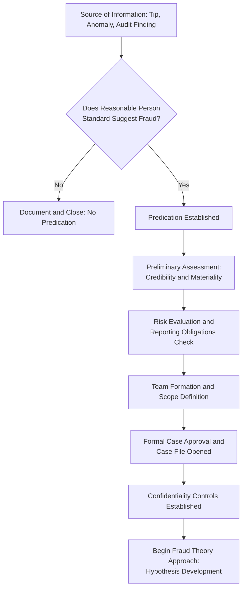

## Predication and Case Initiation

### Definition of Predication

Predication is the totality of circumstances that would lead a reasonable, professionally trained, and prudent individual to believe a fraud has occurred, is occurring, or will occur. It is the threshold concept that justifies the commencement of a fraud examination. Without predication, initiating an examination is inappropriate and exposes the examiner and organization to legal and reputational risk.

**Key Points**

- Predication must exist before any fraud examination begins; fraud examiners do not investigate on mere suspicion, curiosity, or a hunch.
- The standard is objective ("reasonable person"), not subjective (the examiner's personal belief alone is insufficient).
- Predication is the foundation for the entire fraud examination methodology, distinguishing legitimate examinations from unfounded witch hunts.
- Proper predication protects against claims of defamation, invasion of privacy, or wrongful termination that could arise from an examination lacking a factual basis.

### Sources of Predication

Predication typically originates from one or more of the following:

1. **Tips and complaints** – anonymous hotlines, whistleblower reports, employee complaints, or vendor/customer disclosures. Globally, tips are consistently the most common detection method for occupational fraud.
2. **Accounting anomalies** – unexplained variances, irregular journal entries, discrepancies between subsidiary ledgers and the general ledger, or unusual account reconciliations.
3. **Internal control weaknesses** – deficiencies identified during internal audits, external audits, or risk assessments (e.g., lack of segregation of duties).
4. **Analytical anomalies** – results from data analytics, Benford's Law testing, ratio analysis, or trend analysis that reveal statistical irregularities.
5. **Extravagant lifestyle** – an employee's spending pattern that appears inconsistent with known income (a common behavioral red flag).
6. **Behavioral red flags** – unusual behavioral changes such as defensiveness, refusal to take leave, or excessive control over specific tasks/records.
7. **Third-party information** – findings from regulators, law enforcement, external auditors, or business partners.
8. **Document irregularities** – altered, missing, or duplicated documents (invoices, contracts, receipts).

### The Fraud Theory Approach and Predication

Predication is the trigger that initiates the **fraud theory approach**, the standard methodology used in fraud examinations:

1. Analyze available data
2. Create a hypothesis (fraud theory)
3. Test the hypothesis
4. Refine and amend the hypothesis based on findings

Predication informs the initial hypothesis: it identifies who might be involved, what scheme may be occurring, and which evidence should be examined first.

### Case Initiation Process

Once predication is established, case initiation follows a structured sequence:

**Step 1: Preliminary Assessment**

- Document the source and nature of the predication (who reported it, when, and what specific facts were alleged).
- Assess credibility of the source, especially for anonymous tips.
- Determine whether the allegation, if true, constitutes fraud, waste, abuse, or a policy violation (not all misconduct is fraud).

**Step 2: Risk and Materiality Evaluation**

- Estimate potential financial exposure and reputational risk.
- Consider regulatory reporting obligations (e.g., SEC, government audit bodies) that may be triggered.
- Evaluate urgency — active/ongoing schemes may require immediate action to prevent continuing loss or evidence destruction.

**Step 3: Team Formation and Scoping**

- Assemble a multidisciplinary team (fraud examiners, legal counsel, internal audit, IT/forensic specialists, HR) as warranted by case complexity.
- Define scope: which entities, accounts, time periods, and individuals are subject to examination.
- Establish reporting lines — typically to the audit committee, general counsel, or board, particularly when senior management may be implicated.

**Step 4: Case Approval and Documentation**

- Obtain formal authorization to proceed (often via an engagement letter or internal case-opening memo).
- Open a case file documenting the predication basis, scope, objectives, and team assignments.
- Establish a chain-of-custody protocol before any evidence is collected.

**Step 5: Confidentiality and Need-to-Know Controls**

- Limit knowledge of the investigation to essential personnel to prevent evidence destruction, retaliation, or witness collusion.
- Establish secure communication channels distinct from potentially compromised systems (e.g., avoid company email if an IT employee is a subject).

### Predication vs. Insufficient Basis for Investigation

| Basis | Predication? | Rationale |
| --- | --- | --- |
| Anonymous tip alleging specific falsified invoices | Yes | Specific, actionable, falls within reasonable-person standard |
| Employee is generally disliked by coworkers | No | Personal animus, not evidence-based |
| Auditor identifies unreconciled variance exceeding materiality threshold | Yes | Objective anomaly |
| Manager "just has a feeling" about an employee | No | Subjective, insufficient standard alone |
| Vendor invoice with duplicate invoice number and altered amount | Yes | Documentary irregularity |

### Legal and Ethical Considerations

- **Defamation risk**: Initiating or conducting an examination without predication, and subsequently making accusatory statements, can expose the organization to defamation claims.
- **Employment law**: Adverse employment actions taken without documented predication and due process may result in wrongful termination suits.
- **Presumption of innocence**: Fraud examiners must approach the examination with an open, unbiased mindset; the goal is fact-finding, not confirming a predetermined conclusion.
- **Documentation duty**: Examiners should contemporaneously document the basis for predication, as this record may later be scrutinized in litigation, arbitration, or regulatory proceedings.

### Case Initiation Workflow (Diagram)

### Example

An internal auditor at a local government unit notices that three separate purchase orders under $10,000 (the threshold requiring competitive bidding) were issued to the same vendor within a single week, all approved by the same procurement officer. This pattern — potential invoice splitting to avoid bidding requirements — constitutes sufficient predication. The auditor documents the specific transactions, dates, and approving officer, then escalates to the internal audit head, who authorizes formal case initiation, defines the scope (all purchase orders from that officer over the past fiscal year), and assembles a small examination team before any interviews are conducted.

**Next Steps**

- Evidence collection and chain of custody
- Conducting the vulnerability/fraud risk assessment
- Planning the fraud examination (objectives, scope, and methodology)
- Interviewing techniques (admission-seeking vs. informational interviews)
- Legal considerations in fraud examinations (rights of the accused, employment law)