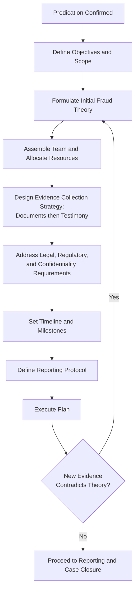

## Developing a Fraud Examination Plan

### Purpose and Objectives

A fraud examination plan is the structured roadmap that translates predication into a systematic, defensible investigative process. It ensures the examination is conducted methodically, evidence is gathered in a legally sound manner, resources are allocated efficiently, and findings will withstand scrutiny in litigation, arbitration, disciplinary proceedings, or regulatory review.

**Key Points**

- The plan operationalizes the **fraud theory approach**: analyze available data, create a hypothesis, test the hypothesis, and refine it as evidence emerges.
- Planning must remain flexible — new evidence often requires the theory and plan to be revised iteratively.
- A well-documented plan protects the examiner and organization by demonstrating due professional care.

### Core Components of the Plan

**1. Statement of Objectives**

- Define precisely what the examination seeks to determine (e.g., whether funds were misappropriated, the scheme mechanics, the amount of loss, and who is responsible).
- Distinguish primary objectives (proving/disproving the allegation) from secondary objectives (identifying control weaknesses, recovering assets).

**2. Scope Definition**

- Time period under review (often extends beyond the suspected period to capture the full scheme duration and any prior similar conduct).
- Entities, departments, accounts, and individuals covered.
- Explicit boundaries — what is **out of scope** to prevent scope creep and control examination costs.

**3. Fraud Theory Formulation**

- Based on predication, articulate a working hypothesis: who committed the act, what scheme was used, how it was concealed, and the approximate timeframe and magnitude.
- The theory should identify the applicable fraud triangle elements (pressure, opportunity, rationalization) to guide areas of inquiry.

**4. Resource Allocation and Team Structure**

- Identify required expertise: forensic accountants, digital forensics/IT specialists, legal counsel, HR representatives, and potentially external experts (appraisers, actuaries).
- Assign roles and a lead examiner with overall case responsibility.
- Budget for time, tools (data analytics software, e-discovery platforms), and potential third-party engagements (e.g., forensic document examiners).

**5. Evidence Collection Strategy**

- Sequence evidence-gathering activities to preserve chain of custody and avoid alerting the subject prematurely (evidence most susceptible to destruction or alteration is typically secured first).
- Identify documentary evidence needed: financial records, contracts, emails, access logs, bank statements.
- Plan for **testimonial evidence** — determine interview order, typically starting with neutral third-party witnesses, moving to corroborative witnesses, and concluding with the admission-seeking interview of the primary suspect(s).

**6. Legal and Regulatory Considerations**

- Coordinate with legal counsel on privilege (attorney work-product doctrine), employment law constraints, and evidentiary admissibility standards.
- Identify mandatory reporting triggers (e.g., regulatory bodies, law enforcement, government audit institutions for public sector entities).
- Address data privacy laws applicable to employee records and electronic communications.

**7. Confidentiality Protocol**

- Define need-to-know access to case information.
- Establish secure, out-of-band communication channels if company systems may be compromised or monitored by a subject.

**8. Timeline and Milestones**

- Set target dates for key phases: evidence collection, interviews, analysis, and reporting.
- Build in checkpoints for reassessing the fraud theory as findings emerge.

**9. Reporting Plan**

- Determine the reporting format, audience (audit committee, board, management, external auditors), and frequency of interim updates.
- Establish protocols for how and when findings will be escalated if evidence of criminal conduct is discovered mid-examination.

### Fraud Examination Plan Development Workflow

### Sequencing Principle: Documents Before Testimony

A foundational planning principle is to move from the general to the specific and from the periphery to the center:

1. Public record and open-source information
2. Neutral third-party documentary evidence (external, harder to alter)
3. Internal documentary evidence (company records, which may be more easily accessed/altered by the subject)
4. Neutral third-party witness interviews
5. Corroborative witness interviews (colleagues, supervisors with less direct involvement)
6. Co-conspirator interviews, if applicable
7. Admission-seeking interview of the primary subject (conducted last, after other evidence is secured)

This sequencing minimizes the risk that the subject becomes aware of the examination before evidence can be preserved.

### Example

A fraud examination team plans an investigation into suspected ghost-employee payroll fraud at a local government unit. The plan defines the scope as the payroll department over the last 24 months; the fraud theory posits that a payroll clerk created fictitious employee records and diverted the associated direct deposits to a personal account. The evidence strategy calls for first pulling HR personnel files and biometric attendance logs (documents least susceptible to the clerk's alteration), then cross-referencing direct deposit bank account numbers against known employee accounts, followed by interviews of department supervisors, and finally an admission-seeking interview of the clerk once the documentary trail is fully secured.

**Related Topics**

- Fraud theory approach in detail
- Evidence collection and chain of custody
- Interviewing techniques (informational vs. admission-seeking)
- Data analytics and Benford's Law in fraud detection
- Report writing and communicating examination results