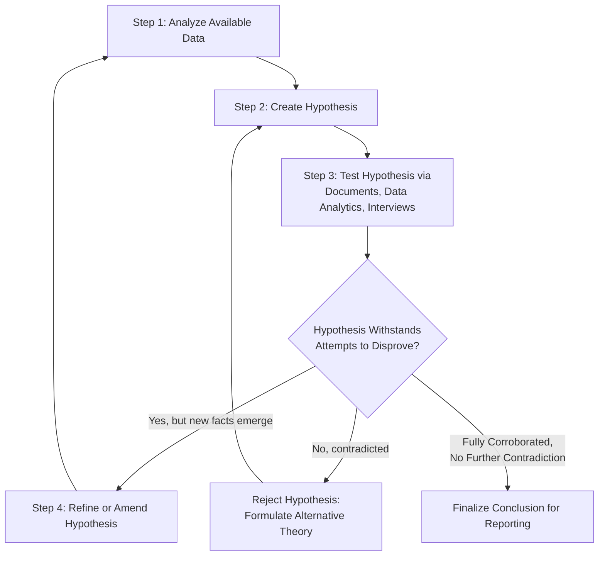

## Fraud Theory Approach and Hypothesis Testing

### Overview

The fraud theory approach is the core investigative methodology used in fraud examinations. It applies deductive reasoning in a structured, iterative cycle, allowing examiners to move from limited initial information (predication) toward a fully substantiated conclusion, while remaining open to revising conclusions as new evidence emerges.

**Key Points**

- The approach is inherently iterative, not linear — the hypothesis is expected to change as facts develop.
- It requires objectivity: the examiner tests the hypothesis rather than seeking only evidence that confirms it (avoiding confirmation bias).
- It provides a defensible, documented rationale for investigative decisions, which is critical if findings are later challenged in legal proceedings.

### The Four Steps of the Fraud Theory Approach

**Step 1: Analyze Available Data**

- Review all information gathered during predication and preliminary assessment: financial statements, internal controls documentation, tips, and known anomalies.
- Identify what is known, what is suspected, and what critical information gaps exist.
- Conduct preliminary data analysis (ratio analysis, trend analysis, Benford's Law) to identify areas warranting deeper focus.

**Step 2: Create a Hypothesis**

- Formulate the most plausible explanation for the observed facts based on the fraud triangle: who had the opportunity, what pressure/incentive existed, and how rationalization might apply.
- The hypothesis should be as specific as possible: identify the likely perpetrator(s), the suspected scheme type (e.g., asset misappropriation, corruption, financial statement fraud), the method of concealment, and the approximate time period and magnitude.
- At this early stage, the hypothesis is assumed to be the "best explanation," not a confirmed conclusion — it exists to be tested, not proven.

**Step 3: Test the Hypothesis**

- Design specific investigative procedures aimed at either corroborating or refuting the hypothesis.
- Testing methods include:
  - Document examination (tracing transactions, verifying authenticity, reconciling records)
  - Data analytics (digital analysis of complete population, not just samples)
  - Interviews (informational interviews of neutral witnesses first)
  - Physical evidence examination
  - Public records and background research
- Crucially, the examiner should seek evidence that would **disprove** the hypothesis, not merely evidence that supports it. If the hypothesis withstands genuine attempts at refutation, confidence in its validity increases.

**Step 4: Refine or Amend the Hypothesis**

- If testing reveals inconsistencies, contradictions, or new facts, the hypothesis must be revised — this may involve narrowing the scope, expanding it to additional suspects or schemes, or abandoning the theory altogether in favor of an alternative.
- This step feeds back into Step 1 (further data analysis) and Step 3 (further testing) in a continuous loop until the theory can no longer be reasonably disproved, or evidence establishes it is incorrect.

### Fraud Theory Approach Cycle

### Application of the Fraud Triangle in Hypothesis Formation

| Fraud Triangle Element | Investigative Question | Example Indicator |
| --- | --- | --- |
| Pressure/Incentive | What motive might the suspect have? | Financial hardship, unrealistic performance targets |
| Opportunity | How could the suspect access and manipulate the process? | Lack of segregation of duties, weak oversight |
| Rationalization | How might the suspect justify the act? | "I was underpaid," "I was going to pay it back" |

Hypotheses grounded in all three elements tend to be more robust and investigatively actionable than those based on opportunity alone.

### Distinguishing Hypothesis Testing from Confirmation Bias

- **Correct approach**: The examiner actively seeks disconfirming evidence and follows facts wherever they lead, even if they exonerate the initial suspect or implicate additional parties.
- **Confirmation bias (to avoid)**: Selectively pursuing only evidence supporting the initial hypothesis, ignoring or dismissing contradictory findings, and framing interview questions to elicit predetermined answers.
- Fraud examination standards (e.g., ACFE Code of Professional Ethics) require examiners to obtain evidence-based conclusions and to maintain objectivity throughout, rather than adopting an advocacy posture.

### Example

**Predication**: An accounts payable clerk's bank account shows deposits inconsistent with salary.

**Step 1 (Analyze Data)**: Review vendor master file changes, payment history, and the clerk's system access rights over the past 18 months.

**Step 2 (Hypothesis)**: The clerk created a fictitious (shell) vendor and processed payments to that vendor for personal benefit.

**Step 3 (Test)**: Verify the shell vendor's business registration and physical address (public records); trace bank routing/account numbers on vendor payments against the clerk's personal account; interview the clerk's supervisor about approval controls.

**Step 4 (Refine)**: Testing reveals the vendor address matches the clerk's residence, but the bank account does not match the clerk's personal account — instead, it matches a relative's account. The hypothesis is refined to include a related-party collusion element, prompting additional data analysis on the relative and revised interview planning.

**Next Steps**

- Evidence collection and chain of custody
- Interviewing techniques (informational vs. admission-seeking interviews)
- Data analytics and Benford's Law in fraud detection
- Report writing and communicating examination conclusions
- Legal standards of proof (civil vs. criminal) in fraud findings