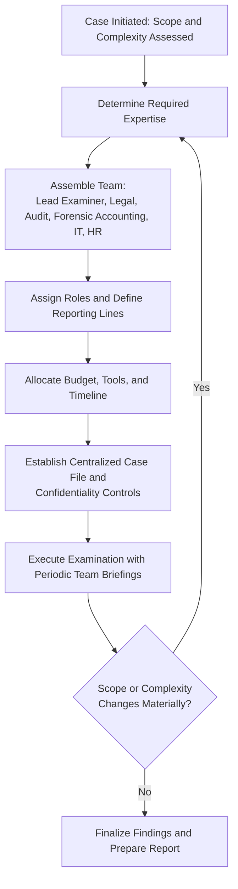

## Managing Examination Teams and Resources

### Overview

Effective management of examination teams and resources ensures that a fraud examination is executed efficiently, ethically, and within legal and organizational constraints. This encompasses team composition, role assignment, coordination across disciplines, resource budgeting, and oversight mechanisms that maintain examination integrity from initiation through reporting.

**Key Points**

- Team composition should be scaled to case complexity, materiality, and risk — not every examination requires a full multidisciplinary team.
- Clear role delineation prevents duplication of effort, evidentiary gaps, and chain-of-custody breaks.
- Resource management includes not only personnel but also technology, budget, and time.

### Team Composition

**1. Core Fraud Examiner(s) / Lead Investigator**

- Directs the overall examination strategy, maintains the fraud theory, and coordinates all team members.
- Responsible for ensuring the fraud theory approach is properly applied and documented.

**2. Legal Counsel (In-house or External)**

- Advises on privilege, evidentiary admissibility, employment law, and regulatory reporting obligations.
- May direct the examination under attorney-client privilege in anticipation of litigation, which affects how findings are documented and communicated.

**3. Internal Audit**

- Provides institutional knowledge of controls, processes, and prior audit findings.
- Assists with testing internal control effectiveness and identifying control breakdowns that enabled the scheme.

**4. Forensic Accountants / Certified Fraud Examiners (CFEs)**

- Perform financial analysis, tracing of funds, damages/loss quantification, and data analytics.

**5. Digital Forensics / IT Specialists**

- Preserve and analyze electronic evidence (emails, system logs, metadata) using forensically sound methods that maintain data integrity and chain of custody.

**6. Human Resources**

- Advises on employment policies, disciplinary procedures, and coordinates interview logistics involving employees.
- Ensures examination actions align with labor law and existing HR policy.

**7. External Specialists (as needed)**

- Forensic document examiners, valuation experts, actuaries, or industry-specific consultants for specialized or high-complexity cases.

**8. Security/Loss Prevention**

- Assists with physical evidence preservation, surveillance coordination, and safety considerations if confrontational risk exists.

### Roles and Responsibilities Matrix

| Role | Primary Responsibility | Key Deliverable |
| --- | --- | --- |
| Lead Examiner | Overall strategy, fraud theory management | Case plan, final report |
| Legal Counsel | Privilege, admissibility, regulatory compliance | Legal risk assessment |
| Internal Audit | Control testing, process knowledge | Control gap analysis |
| Forensic Accountant | Financial tracing, loss quantification | Loss/damages schedule |
| IT/Digital Forensics | Evidence preservation, e-discovery | Forensic image, log analysis |
| HR | Employment policy compliance, interview logistics | Personnel file access, policy guidance |

### Resource Allocation Considerations

**1. Budget Management**

- Estimate costs for staff time, external experts, forensic software/tools, and potential litigation support.
- Balance the cost of examination against the estimated magnitude of loss (proportionality principle) — although non-financial factors (fiduciary duty, regulatory obligation, reputational risk) may still justify examination even where monetary recovery is small.

**2. Technology and Tools**

- Data analytics platforms for full-population testing (rather than sampling), including techniques such as Benford's Law analysis, duplicate payment detection, and outlier identification.
- E-discovery and digital forensics tools for preserving and searching electronic evidence in a forensically defensible manner.
- Secure case management systems with restricted access controls for evidence and work papers.

**3. Time Management**

- Establish milestones for evidence collection, interviews, analysis, and reporting phases.
- Balance thoroughness against the urgency of stopping ongoing losses or evidentiary destruction risk.

### Coordination and Communication Protocols

- **Centralized case file**: All evidence, interview notes, and analysis should be logged in a single controlled repository with version control and access logging.
- **Regular team briefings**: Structured check-ins to synchronize findings, reassess the fraud theory, and reallocate resources as the investigation evolves.
- **Need-to-know confidentiality**: Team membership and case details are restricted to those with a legitimate operational need, reducing risk of leaks, retaliation, or evidence tampering.
- **Escalation protocol**: Predefined thresholds and pathways for escalating findings to the audit committee, board, or law enforcement when evidence indicates criminal conduct or when the scope of the fraud expands significantly.

### Team and Resource Management Workflow

### Managing Conflicts of Interest and Independence

- Screen team members for conflicts of interest (e.g., prior working relationship with the subject, reporting-line proximity).
- Where the subject is a senior executive, escalate team oversight directly to the audit committee or board rather than routing through normal management channels.
- Document independence assessments as part of the case file to support the credibility of findings.

### Example

A local government unit's internal audit office identifies a suspected procurement fraud scheme involving a mid-level officer and an external contractor. Given the moderate complexity and public-sector regulatory exposure, the audit head assembles a team consisting of two internal auditors, an IT specialist to preserve email records, and coordinates with the legal office for guidance on regulatory reporting requirements (e.g., to the Commission on Audit or Ombudsman, as applicable). Because the amount involved is below the threshold requiring external forensic accountants, no outside consultants are engaged, keeping the resource footprint proportionate to the case's scale while still preserving evidentiary integrity through documented IT procedures.

**Related Topics**

- Developing a fraud examination plan
- Evidence collection and chain of custody
- Confidentiality and information security in fraud examinations
- Reporting to those charged with governance (audit committees, boards)
- Legal and regulatory reporting obligations for public sector fraud