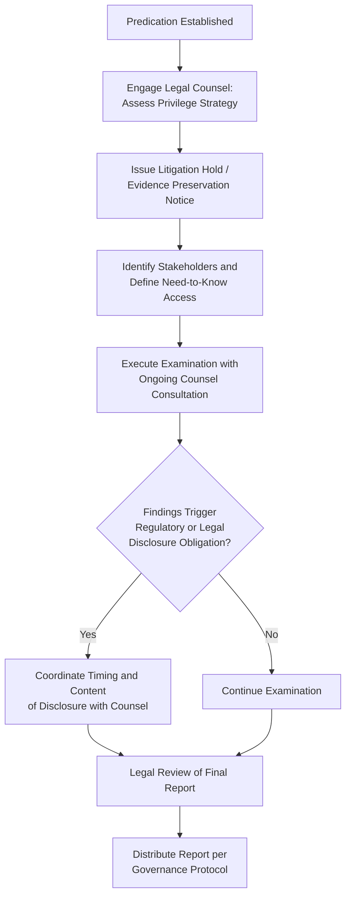

## Coordinating with Legal Counsel and Stakeholders

### Overview

Coordination with legal counsel and organizational stakeholders is essential to ensure a fraud examination is legally defensible, appropriately scoped, and effectively actioned upon completion. This coordination shapes decisions on privilege, evidence handling, regulatory disclosure, and governance reporting throughout the examination lifecycle.

**Key Points**

- Legal counsel involvement early in the examination can establish attorney-client privilege and work-product protection over investigative materials.
- Stakeholder coordination must balance the need for oversight and transparency against confidentiality requirements that protect the integrity of the investigation.
- Miscommunication or delayed coordination with legal counsel is a common cause of evidence being deemed inadmissible or examinations being challenged as procedurally defective.

### Role of Legal Counsel

**1. Establishing Privilege**

- When counsel directs the investigation (rather than management alone), communications and work product may be protected under attorney-client privilege and the attorney work-product doctrine.
- This protection is not absolute — courts examine whether the primary purpose of the investigation was to obtain legal advice, and privilege can be waived through improper disclosure.
- Fraud examiners often function as agents of counsel in privileged investigations, requiring clear engagement letters specifying this relationship.

**2. Advising on Evidence Collection Methods**

- Counsel evaluates whether evidence collection methods (e.g., accessing employee email, monitoring, searching personal devices or lockers) comply with applicable privacy laws, labor laws, and any collective bargaining agreements.
- Counsel advises on search and seizure limitations in the workplace and jurisdiction-specific consent requirements for recording interviews.

**3. Regulatory and Legal Reporting Obligations**

- Determines whether findings trigger mandatory disclosure to regulators (e.g., securities regulators, banking authorities, or, in the public sector, oversight bodies such as government audit institutions).
- Advises on timing of law enforcement referral, balancing the interest in completing a thorough internal examination against statutory reporting deadlines.

**4. Managing Litigation Risk**

- Assesses exposure to civil litigation (wrongful termination, defamation) and advises on communication protocols to minimize this risk.
- Prepares the organization for potential civil recovery actions or criminal referral, including anticipated evidentiary standards.

### Key Stakeholders and Their Interests

| Stakeholder | Primary Interest | Coordination Need |
| --- | --- | --- |
| Board of Directors / Audit Committee | Governance oversight, fiduciary duty | Periodic high-level briefings, final report |
| Senior Management | Operational impact, remediation | Scope updates (unless implicated) |
| External Auditors | Financial statement impact, disclosure | Coordination on materiality and disclosure timing |
| Regulators | Compliance, statutory reporting | Timely, accurate disclosures per legal requirements |
| Human Resources | Employment actions, policy compliance | Interview coordination, disciplinary process alignment |
| Law Enforcement | Criminal prosecution | Evidence preservation standards, referral timing |
| Insurance Carriers (Fidelity/Crime coverage) | Claims processing | Notice requirements, proof of loss documentation |

### Coordination Protocol Throughout the Examination Lifecycle

**Initiation Phase**

- Engage legal counsel at the outset to determine whether privilege should be established and to advise on initial evidence preservation (litigation hold notices).
- Identify which stakeholders require immediate notification versus those who will be briefed only upon conclusion.

**Execution Phase**

- Maintain regular, documented communication with counsel regarding evidence collection methods, especially before conducting searches of digital devices or accessing sensitive records.
- Provide the audit committee or designated governance body with periodic status updates, calibrated to avoid compromising the investigation (e.g., avoiding disclosure of the primary suspect's identity prematurely).
- Coordinate with external auditors when findings may affect financial statement accuracy or require disclosure in public filings.

**Conclusion Phase**

- Legal counsel typically reviews the final report before distribution to assess privilege implications and litigation exposure.
- Determine final distribution list based on need-to-know principles and governance requirements.
- Coordinate the timing and content of any required regulatory or law enforcement disclosures.

### Stakeholder Coordination Workflow

### Balancing Transparency and Confidentiality

- Governance bodies (boards, audit committees) have a fiduciary right to oversight, but premature or overly broad disclosure risks compromising the investigation, violating employee privacy rights, or triggering retaliation/evidence destruction.
- A common practice is tiered reporting: high-level status updates to broader governance bodies, with detailed findings reserved for a smaller oversight group (e.g., audit committee chair, general counsel) until the examination concludes.

### Common Pitfalls

- **Delayed counsel engagement**: Waiting until after evidence collection to involve legal counsel can forfeit privilege protection and result in improperly obtained evidence.
- **Over-disclosure to management**: Briefing operational management who may be implicated, or close to implicated parties, risking evidence tampering or witness coaching.
- **Ignoring insurance notification deadlines**: Fidelity/crime insurance policies often have strict notice periods; failure to notify promptly can jeopardize recovery claims.
- **Inconsistent messaging**: Uncoordinated communications between HR, legal, and examination teams can create conflicting statements that undermine credibility in subsequent proceedings.

### Example

During an examination into suspected collusive bidding involving a local government unit's procurement officer, the internal audit team immediately consults the legal office upon establishing predication. Legal counsel advises issuing a preservation notice for the officer's email and procurement system logs and recommends that the audit team operate under counsel's direction to preserve privilege, given anticipated referral to the Ombudsman. The audit committee receives a general status update ("an examination is underway regarding procurement irregularities") without specifics, while only the committee chair and legal counsel receive detailed interim findings, preserving both governance oversight and investigative confidentiality until the examination concludes and a formal report is prepared for referral.

**Related Topics**

- Attorney-client privilege and work-product doctrine in investigations
- Reporting to the audit committee and board
- Regulatory and law enforcement referral procedures
- Evidence collection and chain of custody
- Employment law considerations in fraud examinations