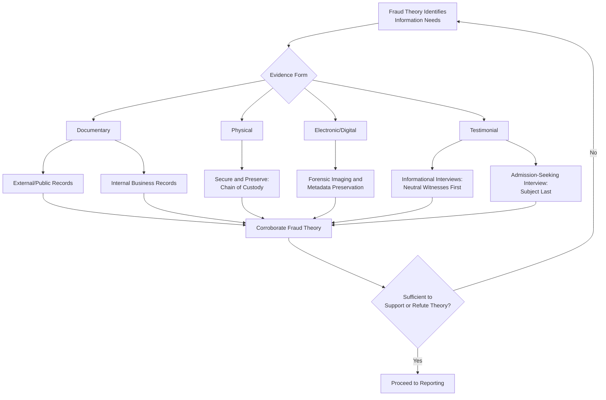

## Types and Sources of Evidence in Fraud Examinations

### Overview

Evidence in a fraud examination is any information used to establish or refute facts related to the fraud theory. Understanding the categories and sources of evidence enables examiners to plan systematic collection, assess evidentiary strength, and ensure findings are admissible and persuasive in legal, disciplinary, or regulatory proceedings.

**Key Points**

- Evidence is generally classified by form (testimonial, documentary, physical, electronic) and by its evidentiary weight (direct vs. circumstantial).
- Fraud cases are frequently proven predominantly through circumstantial and documentary evidence, since direct evidence of intent is rare.
- The strength of evidence depends heavily on its source's independence, timeliness of collection, and integrity of custody.

### Categories of Evidence by Form

**1. Testimonial Evidence**

- Statements obtained from witnesses, victims, or suspects through interviews.
- Subcategories:
  - **Informational interviews** – gather background facts from neutral or cooperative witnesses.
  - **Admission-seeking interviews** – conducted with the suspect, typically last in the sequence, aimed at obtaining an admission or confession.
- Strength depends on witness credibility, corroboration, and consistency with documentary/physical evidence.

**2. Documentary Evidence**

- Written or recorded materials: invoices, contracts, bank statements, journal entries, correspondence, policies, and procedures.
- Often considered strong evidence in fraud cases because financial schemes typically leave a paper trail (the "audit trail").
- Subcategories:
  - **Original/primary documents** – preferred over copies for authenticity.
  - **Business records** – created and maintained in the ordinary course of business, generally carrying strong evidentiary weight.
  - **Altered or fabricated documents** – themselves become evidence of fraud when detected (e.g., through forensic document examination).

**3. Physical Evidence**

- Tangible items: counterfeit currency, forged signatures on physical documents, computer hardware, inventory items, or other objects directly connected to the scheme.
- Requires careful physical preservation and chain-of-custody documentation to maintain admissibility.

**4. Electronic (Digital) Evidence**

- Emails, text messages, system access logs, metadata, financial system audit trails, and data extracted from computers, servers, or mobile devices.
- Requires specialized digital forensic techniques to preserve integrity (e.g., forensic imaging, write-blockers, hash verification) and to prevent spoliation claims.
- Metadata (creation/modification dates, author information) can be critical for establishing timelines and authenticity.

### Categories of Evidence by Evidentiary Weight

**1. Direct Evidence**

- Evidence that, if believed, directly proves a fact without requiring an inference (e.g., a witness who directly observed the fraudulent act, or a confession).
- Relatively rare in fraud cases, since fraud is typically committed covertly.

**2. Circumstantial Evidence**

- Evidence that requires an inference to connect it to a conclusion (e.g., financial records showing unexplained deposits correlating with a suspect's access to funds).
- The majority of fraud cases are built substantially on circumstantial evidence, which, when sufficiently corroborated and consistent, can be highly persuasive.

### Sources of Evidence

**1. Internal Sources**

- General ledger and subsidiary ledgers, journal entries, and financial statements.
- Internal policies, procedures, and control documentation.
- Employee personnel files, access control logs, and organizational charts.
- Internal audit reports and prior examination files.
- Company email systems, shared drives, and internal messaging platforms.

**2. External Sources**

- Public records: business registrations, property records, court records, liens, and bankruptcy filings.
- Financial institution records: bank statements, wire transfer records, loan applications (often requiring subpoena or formal request).
- Vendor and customer records: invoices, purchase orders, delivery receipts held by third parties.
- Credit bureaus and asset search databases.
- Social media and open-source intelligence (OSINT).
- Regulatory filings (e.g., securities filings, licensing records).

**3. Testimonial Sources**

- Whistleblowers and tipsters.
- Coworkers, supervisors, and subordinates of the suspect.
- Vendors, customers, and business partners.
- Former employees.
- The suspect(s) themselves (typically interviewed last).

### Evidence Hierarchy and Collection Sequencing

| Evidence Source | Alteration Risk by Subject | Typical Collection Priority |
| --- | --- | --- |
| Public records (external) | Very low | Early |
| Third-party financial institution records | Low | Early |
| Internal system logs / metadata | Moderate (if subject has admin access) | Early to mid |
| Internal business documents | Moderate to high | Mid |
| Neutral witness testimony | Low | Mid |
| Subject's personal statements/testimony | N/A (obtained directly) | Last |

This sequencing principle — from least alterable/most independent sources toward the subject — minimizes the risk of evidence destruction or witness collusion.

### Evidence Sourcing and Classification Workflow

### Admissibility and Reliability Considerations

- **Authentication**: Evidence must be shown to be what it purports to be (e.g., via witness testimony, metadata, or forensic examination).
- **Hearsay concerns**: Out-of-court statements offered to prove the truth of the matter asserted may be inadmissible in legal proceedings unless an exception applies (e.g., business records exception).
- **Best evidence rule**: Original documents are generally preferred over copies; where originals are unavailable, examiners should document the reason and provide the best available substitute.
- **Chain of custody**: Establishes an unbroken record of evidence handling from collection to presentation, critical for both physical and electronic evidence.

### Example

In an examination of suspected check tampering at a local government treasury office, the examiner collects: (1) *documentary evidence* — canceled checks and bank statements obtained directly from the bank (external, low alteration risk); (2) *electronic evidence* — the accounting system's audit trail showing which user account voided and reissued checks; (3) *testimonial evidence* — informational interviews with two co-workers regarding cash-handling procedures; and (4) *physical evidence* — the original check register book, secured and logged in a chain-of-custody form. Only after this evidence is fully collected and analyzed does the examiner conduct the admission-seeking interview with the cashier identified in the system logs.

**Related Topics**

- Chain of custody procedures and documentation
- Digital forensics and electronic evidence preservation
- Interviewing techniques (informational and admission-seeking)
- Rules of evidence and admissibility standards
- Data analytics for evidence identification (Benford's Law, duplicate testing)