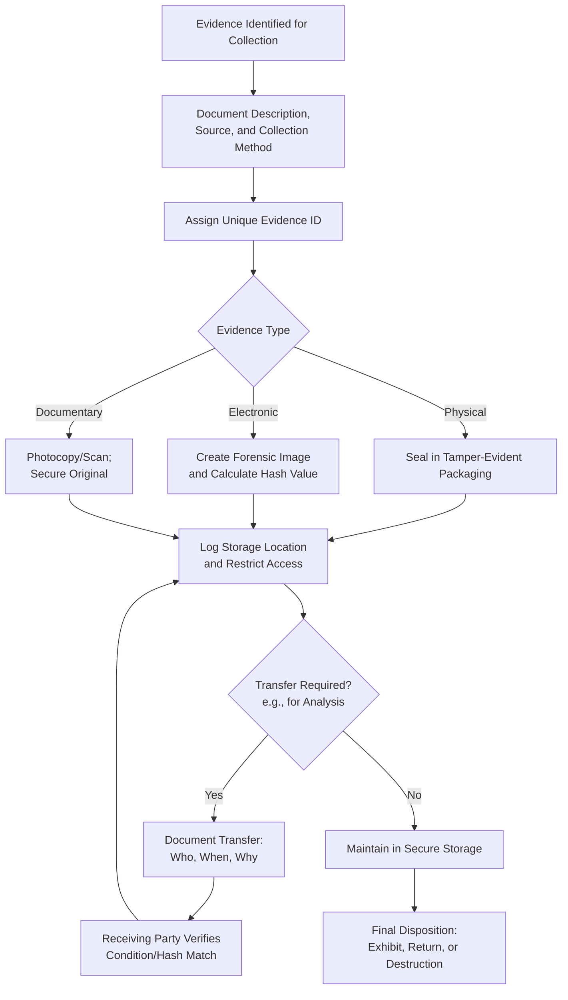

## Chain of Custody Requirements

### Definition and Purpose

Chain of custody is the chronological documentation that records the seizure, custody, control, transfer, analysis, and disposition of evidence from the moment it is collected through its presentation in legal or disciplinary proceedings. It exists to demonstrate that evidence has not been altered, tampered with, contaminated, or substituted at any point, thereby preserving its authenticity and admissibility.

**Key Points**

- A broken or incomplete chain of custody can result in evidence being excluded from legal proceedings or its credibility being successfully challenged.
- Chain of custody applies to all evidence forms: physical, documentary, and electronic.
- The burden of proving an unbroken chain typically rests with the party seeking to introduce the evidence.

### Core Elements of Chain of Custody Documentation

For each item of evidence, the chain of custody record must capture:

1. **Description of the evidence** – detailed enough to uniquely identify it (item type, serial/reference numbers, distinguishing marks).
2. **Date and time of collection** – precise timestamp of when evidence came into the examiner's possession.
3. **Location of collection** – where the evidence was obtained.
4. **Identity of the collector** – name and role of the person who first obtained the evidence.
5. **Method of collection** – how the evidence was acquired (e.g., voluntary production, forensic imaging, physical seizure).
6. **Every subsequent transfer** – identity of each person who received custody, the date/time of transfer, and the purpose of the transfer (e.g., analysis, storage, legal review).
7. **Storage conditions** – how and where evidence was secured between transfers (locked cabinet, evidence room, encrypted digital storage).
8. **Final disposition** – how the evidence was ultimately handled (returned, destroyed, submitted as an exhibit).

### Chain of Custody Form Structure (Illustrative)

| Field | Example Entry |
| --- | --- |
| Evidence ID | EV-2026-014 |
| Description | Original canceled check, no. 10452, $25,000, dated March 3, 2026 |
| Collected By | J. Santos, Fraud Examiner |
| Date/Time Collected | 2026-03-15, 10:42 AM |
| Source | Municipal Treasury Bank, official request |
| Transferred To | M. Reyes, Forensic Document Examiner |
| Date/Time Transferred | 2026-03-16, 09:00 AM |
| Purpose of Transfer | Signature authentication analysis |
| Storage Location | Locked evidence safe, Audit Office, Room 204 |
| Signatures | [Collector] / [Receiver] |

### Physical Evidence Custody Procedures

- Seal evidence in tamper-evident packaging immediately upon collection.
- Label packaging with a unique evidence identifier cross-referenced to the chain of custody form.
- Restrict access to a designated evidence custodian; log every access event.
- Store in a secure, access-controlled location (locked cabinet or room with entry logs).
- Minimize the number of individuals who handle the evidence to reduce the number of custody links that must be documented and defended.

### Electronic Evidence Custody Procedures

- Use forensically sound imaging techniques (bit-for-bit copies) rather than working from original media directly, preserving the original as the unaltered master copy.
- Apply cryptographic hash values (e.g., SHA-256) at the time of imaging; recalculate and compare hashes at each subsequent access point to verify data integrity has not changed.
- Employ write-blocking hardware/software during acquisition to prevent inadvertent modification of source media.
- Maintain detailed logs of all forensic tools used, including version numbers, since tool reliability may be scrutinized.
- Store digital evidence in encrypted, access-logged repositories with role-based access controls.

**[Inference]** Specific hash algorithm choice and forensic tool selection may vary by jurisdiction and applicable digital forensics standards; examiners should confirm current accepted practice with digital forensics specialists and legal counsel for the relevant jurisdiction.

### Chain of Custody Workflow

### Common Breaks in Chain of Custody and Their Consequences

| Break Type | Example | Potential Consequence |
| --- | --- | --- |
| Undocumented transfer | Evidence moved between offices without a log entry | Gap in custody record challenged in proceedings |
| Unsecured storage | Documents left in an unlocked, shared drawer | Claim of possible tampering or contamination |
| Missing hash verification | Digital evidence copied without hash comparison | Question of data integrity/authenticity |
| Excessive handlers | Evidence passed through many individuals informally | Difficulty establishing accountability at each link |
| Delayed documentation | Chain of custody form completed days after collection | Reduced reliability of recorded timestamps |

### Best Practices

- Complete chain of custody documentation contemporaneously (at the time of each transfer), not retrospectively.
- Limit the number of individuals who have access to or handle evidence.
- Use standardized, pre-printed chain of custody forms to ensure consistency across the examination team.
- Train all team members on proper evidence handling procedures before the examination begins.
- Periodically audit the evidence log against physical/digital inventory to detect discrepancies early.

### Example

A fraud examiner obtains an employee's government-issued laptop suspected of containing evidence of a kickback scheme. The examiner documents the laptop's serial number, condition, and time of receipt, then transfers custody to a digital forensics specialist, who creates a forensic image using write-blocking hardware and records the SHA-256 hash of both the original drive and the image. The original laptop is then sealed, logged into a secured evidence locker with restricted key access, and the chain of custody form is updated to reflect this storage. When the forensic image is later analyzed, the specialist re-verifies the hash value against the original recorded value to confirm no data alteration occurred before proceeding with analysis, ensuring the resulting findings remain defensible if referred to prosecutorial authorities.

**Next Steps**

- Digital forensics and electronic evidence preservation techniques
- Documentary evidence examination (authentication, forensic document analysis)
- Evidence admissibility and rules of evidence
- Interviewing techniques and documentation of testimonial evidence
- Report writing: presenting evidence to support conclusions