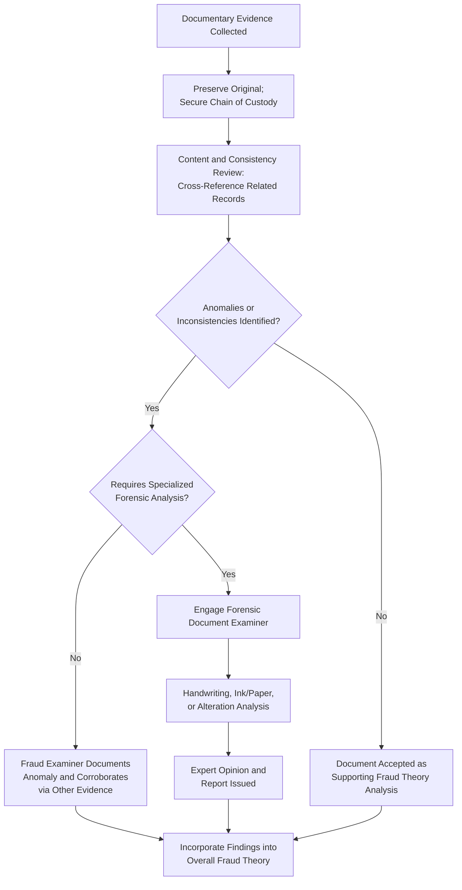

## Document Examination and Authentication

### Overview

Document examination and authentication involves systematically analyzing documentary evidence to verify its genuineness, detect alteration or fabrication, and establish its evidentiary reliability. In fraud examinations, documents (invoices, contracts, checks, ledgers, signatures) are often the primary trail of a scheme, making authentication a critical step before such documents can support conclusions or withstand legal challenge.

**Key Points**

- Authentication establishes that a document is what it purports to be — its origin, date, and author are as represented.
- Document examination can be conducted at two levels: general fraud examiner review (content, consistency, logic) and specialized forensic document examination (physical/scientific analysis of the document itself).
- Even genuine documents can reveal fraud through their content (e.g., inconsistent terms, backdated agreements) without requiring forensic alteration analysis.

### Levels of Document Examination

**1. Content and Consistency Analysis (Fraud Examiner Level)**

- Cross-referencing document content against other records (e.g., comparing a vendor invoice against the purchase order and receiving report — the "three-way match").
- Checking internal consistency: dates, amounts, signatures, and approval sequences that should logically align.
- Comparing documents against known authentic templates or historical patterns from the same source.
- Identifying anomalies such as sequential/duplicate invoice numbers, round-dollar amounts, or unusual formatting.

**2. Forensic Document Examination (Specialist Level)**

- Requires a qualified forensic document examiner, typically engaged for high-stakes or legally contested matters.
- Techniques include:
  - **Handwriting and signature analysis** – comparing questioned signatures against verified exemplars for consistency in stroke pattern, pressure, and formation.
  - **Ink and paper analysis** – chemical or spectral analysis to determine ink age, paper composition, and consistency with the claimed document date.
  - **Indented writing examination** – using techniques such as Electrostatic Detection Apparatus (ESDA) to recover impressions left on underlying pages.
  - **Alteration detection** – identifying erasures, overwriting, obliterations, or insertions using techniques such as infrared/ultraviolet imaging.
  - **Printer/typewriter source identification** – matching characteristic defects in printed output to a specific device.

### Authentication Methods

| Method | Description | Typical Use Case |
| --- | --- | --- |
| Witness authentication | A person with knowledge testifies the document is genuine | Business records, correspondence |
| Metadata verification | Digital file properties confirm creation/modification history | Electronic documents, emails |
| Chain of custody | Documented handling history supports unaltered condition | All document types |
| Comparison to exemplars | Known genuine samples compared against questioned document | Signatures, handwriting |
| Business records exception support | Showing the document was made in the regular course of business | Ledgers, invoices, logs |
| Third-party corroboration | Independent source confirms document content (e.g., bank confirms a statement) | Financial statements, contracts |

### Common Red Flags in Document Examination

- **Sequential anomalies**: Vendor invoices with consecutive numbers issued close in time despite claims of being from different unrelated transactions.
- **Round numbers**: Unusually frequent round-dollar amounts, which are statistically less common in legitimate, itemized transactions.
- **Photocopies where originals should exist**: Repeated reliance on copies rather than originals, especially for supporting documentation of high-value transactions.
- **Inconsistent fonts or formatting**: Variations suggesting a document was altered after initial creation.
- **Backdating indicators**: Document metadata or ink/paper analysis inconsistent with the stated document date.
- **Missing or altered approval signatures**: Signatures appearing photocopied, traced, or inconsistent with the purported signer's known signature.
- **Duplicate payments**: Same invoice number, amount, and vendor paid more than once, potentially indicating a scheme rather than a mere clerical error.

### Document Examination and Authentication Workflow

### Digital Document Authentication Considerations

- Verify metadata (author, creation date, last-modified date, revision history) using the native application or forensic tools, noting that metadata can itself be manipulated and should be corroborated where possible.
- For emails, examine full headers (not just displayed sender/recipient fields) to verify routing information and detect spoofing.
- Maintain original electronic files in their native format; avoid working from printed versions alone, as printing strips metadata.
- Use forensic imaging and hash verification (as in chain of custody procedures) to demonstrate that electronic documents have not been altered since collection.

### Legal Considerations in Authentication

- **Authentication as a threshold requirement**: Before a document can be admitted as evidence, its authenticity generally must be established, often through witness testimony, distinctive characteristics, or expert analysis.
- **Business records exception to hearsay**: Documents created and maintained in the regular course of business may be admissible despite hearsay rules if proper foundation is laid (regularity of the record-keeping practice, contemporaneous creation).
- **Best evidence rule**: Original documents are generally preferred; if unavailable, the examiner should document the reason and the reliability of secondary evidence used in its place.
- **[Inference]** Specific admissibility standards and exceptions vary by jurisdiction and legal system; examiners should confirm applicable evidentiary rules with legal counsel for the relevant forum.

### Example

During an examination of suspected fictitious billing at a local government unit, the examiner cross-references a contractor's invoice against the purchase order and delivery acceptance report (three-way match) and finds the delivery report lacks a receiving officer's signature, unlike all other files in the same period. Content analysis further reveals the invoice number sequence for this vendor jumps inconsistently compared to other vendors of similar transaction volume. Given the materiality of the finding, the examiner engages a forensic document examiner, who determines through ink analysis that the receiving signature on a related document was added using a different pen than the rest of the form, corroborating the fraud theory that documents were fabricated to support a fictitious delivery.

**Related Topics**

- Chain of custody requirements
- Digital forensics and electronic evidence preservation
- Data analytics and Benford's Law in detecting anomalies
- Rules of evidence and admissibility standards
- Interviewing techniques for corroborating documentary findings