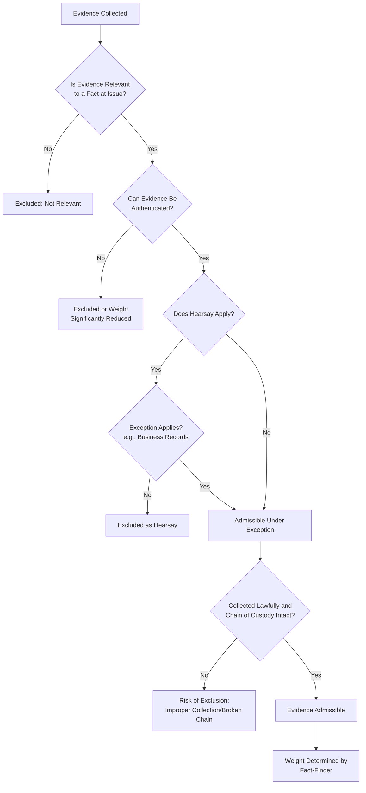

## Admissibility Standards for Evidence

### Overview

Admissibility standards govern whether evidence gathered during a fraud examination may be presented and considered in a legal, arbitral, or regulatory proceeding. Even highly probative evidence can be excluded if it fails to meet foundational legal requirements, making an understanding of these standards essential to how evidence should be collected, documented, and preserved from the outset of an examination.

**Key Points**

- Admissibility is distinct from evidentiary weight: a court first decides whether evidence *may* be considered, then a fact-finder decides how much weight to give it.
- Fraud examiners should collect and document evidence as though it will be scrutinized in litigation, even if the matter is ultimately resolved administratively.
- Admissibility rules vary significantly by jurisdiction and forum (criminal court, civil court, arbitration, internal disciplinary proceeding); examiners should coordinate closely with legal counsel on forum-specific requirements.

### Core Admissibility Requirements

**1. Relevance**

- Evidence must have a tendency to make a fact of consequence more or less probable than it would be without the evidence.
- Even relevant evidence may be excluded if its probative value is substantially outweighed by risks such as unfair prejudice, confusion, or undue delay.

**2. Authentication**

- The proponent must establish that the evidence is what it purports to be (see Document Examination and Authentication).
- Methods include witness testimony, distinctive characteristics, metadata verification, and expert analysis.

**3. Reliability**

- Evidence must be shown to be trustworthy, particularly for scientific, technical, or expert evidence, and for records offered under hearsay exceptions.
- Reliability is closely tied to the integrity of collection methods and chain of custody.

**4. Compliance with Legal Collection Standards**

- Evidence obtained through unlawful means (e.g., improper search, violation of privacy statutes, coerced statements) may be excluded regardless of its probative value.
- This is particularly relevant to workplace investigations involving employee monitoring, email review, and device searches, which must comply with applicable labor and privacy laws.

### Hearsay and Its Exceptions

- **Hearsay**: An out-of-court statement offered to prove the truth of the matter it asserts; generally inadmissible unless an exception applies.
- **Business records exception**: Records made and kept in the regular course of business, at or near the time of the event, by a person with knowledge, are often admissible despite being technically hearsay — highly relevant to financial and accounting records central to fraud cases.
- **Admissions by a party-opponent**: Statements made by the subject of the examination (e.g., during an admission-seeking interview) are typically not excluded as hearsay when offered against that person.
- **[Inference]** The precise scope and formulation of hearsay exceptions differ across jurisdictions and legal systems (common law vs. civil law traditions); examiners should verify applicable rules with legal counsel for the relevant forum.

### Best Evidence Rule

- Generally requires that the original of a document be produced to prove its contents, rather than relying solely on a copy, unless the original is unavailable for a legitimate reason (loss, destruction, possession by an opposing party).
- When originals are unavailable, the examiner should document why, and if possible, obtain testimony or other corroboration establishing the accuracy of secondary evidence (e.g., a certified copy).

### Standards Specific to Electronic Evidence

- Courts and forums increasingly require demonstration of a forensically sound collection process: use of validated tools, hash verification, and a documented, unbroken chain of custody.
- Metadata integrity is often central to authentication of electronic evidence; alteration or loss of metadata (e.g., through improper handling such as opening and re-saving files) can undermine admissibility.
- Some jurisdictions apply specific rules or statutes governing electronic evidence and digital signatures, which may prescribe particular authentication procedures.

### Expert and Opinion Evidence

- Forensic accountants, forensic document examiners, and other specialists may offer expert opinion testimony, subject to standards assessing the reliability and relevance of the expert's methodology (commonly referred to in various jurisdictions using standards analogous to *Daubert* or *Frye* in U.S. federal and state courts).
- Experts must generally be qualified by knowledge, skill, experience, training, or education, and their methodology should be testable, subject to peer review, and generally accepted in the relevant field.
- **[Inference]** The specific standard governing expert testimony admissibility depends on the jurisdiction and court system involved.

### Admissibility Assessment Workflow

### Practical Steps to Preserve Admissibility

1. Engage legal counsel early to align collection methods with applicable evidentiary and privacy standards.
2. Document the source, method, and timing of every piece of evidence at the point of collection.
3. Maintain rigorous chain of custody records for all evidence forms.
4. Preserve originals wherever possible; when working from copies, document the reason and the copy's reliability.
5. Use validated, forensically sound methods for electronic evidence acquisition, including hash verification.
6. Avoid unlawful collection methods (e.g., unauthorized access, improper recording of interviews without required consent).
7. Corroborate testimonial evidence with documentary or physical evidence wherever possible to strengthen reliability.

### Example

In an examination supporting a potential referral to prosecutorial authorities, an examiner seeks to introduce a spreadsheet allegedly used by a suspect to track diverted funds, recovered from the suspect's work computer. To support admissibility, the examiner ensures: the computer was imaged using a validated forensic tool with hash values recorded before and after imaging (supporting authentication and reliability); the file's metadata is preserved and reviewed to confirm creation and modification dates align with the suspected fraud period; and the chain of custody log documents every individual who accessed the forensic image. Because the spreadsheet was created by the suspect in the ordinary course of tracking the scheme (not a business record in the traditional sense), counsel advises that it will likely be introduced as an admission or through witness authentication rather than under the business records hearsay exception.

**Related Topics**

- Chain of custody requirements
- Document examination and authentication
- Digital forensics and electronic evidence preservation
- Interviewing techniques and documentation of testimonial evidence
- Coordinating with legal counsel and stakeholders