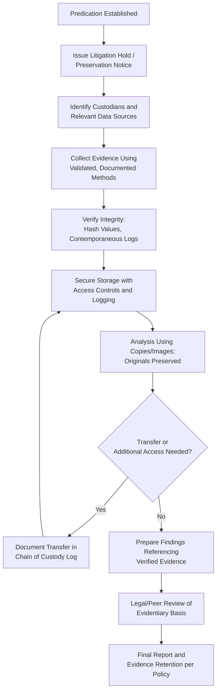

## Preserving Evidentiary Integrity Throughout an Investigation

### Overview

Preserving evidentiary integrity means implementing consistent controls, procedures, and safeguards across the entire lifespan of an examination to ensure that evidence remains accurate, complete, unaltered, and defensible from the moment it is identified until it is presented in a final report or legal proceeding. This is a continuous discipline spanning collection, storage, analysis, transfer, and reporting — not a single procedural step.

**Key Points**

- Evidentiary integrity is undermined by even well-intentioned handling errors, not only by deliberate tampering.
- Integrity failures at any single point in the investigation can compromise the reliability of the entire body of evidence and the credibility of the examiner.
- Preservation obligations often begin before formal evidence collection, triggered by the "reasonable anticipation" of litigation or investigation (duty to preserve / litigation hold).

### The Duty to Preserve and Litigation Holds

- A **litigation hold** (preservation notice) is issued as soon as an organization reasonably anticipates litigation, regulatory action, or formal investigation, suspending routine document destruction/retention policies for relevant records.
- The hold should be issued promptly upon predication being established, ideally in coordination with legal counsel, and should clearly identify custodians, relevant data types, and the applicable date range.
- Failure to issue a timely litigation hold can result in **spoliation** — the destruction or alteration of evidence — which may lead to adverse legal inferences, sanctions, or exclusion of related evidence.

### Core Principles of Evidentiary Integrity Preservation

**1. Minimize Handling**

- Limit the number of individuals who physically or digitally interact with evidence.
- Work from copies or forensic images wherever possible; reserve access to originals for situations that specifically require them (e.g., forensic document analysis).

**2. Contemporaneous Documentation**

- Record collection details, transfers, and analysis actions at the time they occur, not retrospectively, to ensure accuracy and credibility of the record.
- Maintain detailed examiner work papers documenting each procedure performed, its rationale, and its results.

**3. Secure Storage**

- Physical evidence: locked, access-controlled storage with entry/exit logging.
- Electronic evidence: encrypted storage, role-based access controls, and audit logging of every access event.
- Segregate case evidence from general organizational systems where feasible to reduce exposure to unauthorized access or accidental alteration.

**4. Validated Methods and Tools**

- Use established, validated forensic tools and methodologies for evidence acquisition and analysis (e.g., write-blockers and hash verification for digital evidence).
- Document tool versions and settings used, as methodology may later be challenged.

**5. Independent Verification**

- Where feasible, have a second qualified individual verify critical procedures (e.g., dual verification of hash values, independent recalculation of financial analyses) to corroborate integrity and reduce single-point error risk.

**6. Confidentiality Controls**

- Restrict case information and evidence access to personnel with a genuine need-to-know, reducing risk of leaks, tampering, or witness coaching.
- Use secure, segregated communication channels when there is a risk that standard organizational systems (e.g., email) may be monitored or accessed by a subject.

### Integrity Preservation Across the Investigation Lifecycle

| Phase | Integrity Risk | Mitigation |
| --- | --- | --- |
| Predication/Initiation | Delayed preservation, evidence destruction | Issue litigation hold promptly |
| Collection | Improper acquisition method, missed originals | Use validated tools, prioritize originals/images |
| Storage | Unauthorized access, environmental damage | Secure, access-logged storage |
| Analysis | Working from unverified copies, tool errors | Hash verification, documented methodology |
| Transfer | Undocumented custody changes | Chain of custody logs at every transfer |
| Reporting | Selective or inaccurate representation of evidence | Objective, evidence-based conclusions; peer review |
| Disposition | Premature destruction, improper return | Follow legal counsel guidance on retention/disposal |

### Evidentiary Integrity Preservation Workflow

### Common Threats to Evidentiary Integrity

- **Spoliation**: Intentional or negligent destruction/alteration of evidence after the duty to preserve arises.
- **Chain of custody gaps**: Undocumented handling or storage periods that create opportunities to challenge authenticity.
- **Contamination**: Physical evidence exposed to conditions or handling that alters its state (e.g., unprotected documents exposed to moisture, digital evidence accessed without write-blocking).
- **Metadata loss**: Opening, editing, printing, or converting electronic files in ways that alter or strip metadata critical to authentication.
- **Confirmation bias in analysis**: Selectively preserving or emphasizing evidence supporting a predetermined conclusion while discarding or under-documenting contradictory evidence.
- **Inadequate access controls**: Overly broad access to case files or evidence repositories, increasing risk of leaks or tampering.

### Coordination with Legal and IT Functions

- Legal counsel should be consulted on the scope and timing of litigation holds and on jurisdiction-specific preservation obligations.
- IT and digital forensics specialists should implement holds on electronic systems (e.g., suspending auto-deletion policies, preserving backup tapes) promptly upon notice.
- Regular audits of hold compliance help ensure custodians are not inadvertently destroying relevant data through routine business practices.

### Example

Upon establishing predication in a suspected kickback scheme involving a local government unit's procurement officer, the examination team immediately works with legal counsel to issue a litigation hold covering the officer's email account, procurement system records, and financial transaction logs for the prior 24 months, suspending the standard email retention/auto-deletion policy. IT preserves a forensic image of the officer's mailbox with a recorded hash value before any analysis begins. All subsequent document reviews are conducted on the forensic image or verified copies, with the original preserved untouched in a secured, access-logged digital evidence repository. Every transfer of the evidence — to the forensic accountant for financial analysis, then to legal counsel for privilege review — is logged with date, time, and purpose, ensuring that if the matter proceeds to referral or litigation, the full evidentiary chain can be demonstrated as unbroken and reliable.

**Related Topics**

- Chain of custody requirements
- Litigation holds and spoliation risk management
- Digital forensics and electronic evidence preservation
- Admissibility standards for evidence
- Confidentiality and information security in fraud examinations