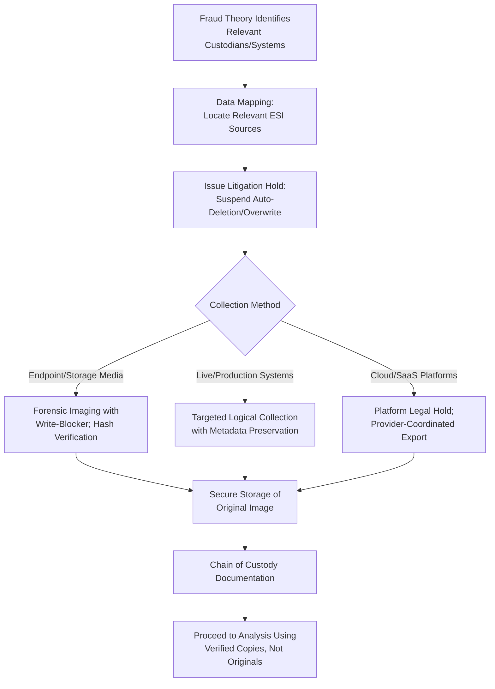

## Digital Evidence Identification and Preservation

### Overview

Digital evidence identification and preservation is the process of locating, recognizing, and securing electronically stored information (ESI) relevant to a fraud examination in a manner that maintains its integrity and legal defensibility. Given the pervasiveness of digital systems in modern financial operations, this phase is often foundational to the entire evidentiary strategy of a fraud examination.

**Key Points**

- Digital evidence is inherently fragile — it can be altered, overwritten, or destroyed through routine system operations (auto-deletion, log rotation, software updates) if not promptly preserved.
- Identification must be broad enough to capture all potentially relevant sources but scoped enough to remain proportionate and manageable.
- Preservation must occur before analysis, and original media/data must remain unaltered to support authentication.

### Sources of Digital Evidence

**1. Endpoint Devices**

- Desktop and laptop computers, including local hard drives, temporary files, and recycle bin/trash contents.
- Mobile devices (smartphones, tablets), including call logs, messages, application data, and location data.
- External storage media: USB drives, external hard drives, memory cards.

**2. Network and Server-Based Sources**

- File servers and shared network drives.
- Email servers (including archived/backup mail stores).
- Database servers hosting financial, ERP, or transactional systems.
- Cloud storage and SaaS platforms (e.g., cloud email, document collaboration tools).

**3. System and Application Logs**

- Authentication and access logs (login/logout times, failed access attempts).
- Application audit trails (who created, modified, or deleted specific records, and when).
- Firewall, VPN, and network access logs.
- Financial/ERP system transaction logs showing user-level activity.

**4. Communication Data**

- Email (including headers, attachments, and metadata).
- Instant messaging and collaboration platform data (chat logs, shared files).
- Voicemail and call detail records, where accessible and legally permissible.

**5. Backup and Archival Systems**

- Backup tapes, disk-based backups, and archived data that may contain deleted or historical versions of relevant files.

### Identification Process

**1. Scoping Custodians and Data Sources**

- Identify individuals (custodians) whose data is likely relevant based on the fraud theory (subjects, witnesses, approvers).
- Map systems and applications each custodian used that might contain relevant ESI (email, financial systems, file shares, devices).

**2. Data Mapping**

- Document where relevant data resides physically and logically (on-premises servers, cloud environments, third-party-hosted systems).
- Identify retention policies and auto-deletion schedules that could affect data availability if not promptly preserved.

**3. Relevance and Proportionality Assessment**

- Balance thoroughness of identification against cost and operational impact, particularly for large organizations with extensive data footprints.
- Prioritize sources most likely to contain direct evidence relevant to the fraud theory.

### Preservation Techniques

**1. Litigation Hold Implementation**

- Suspend routine auto-deletion, log rotation, and backup overwrite cycles for identified custodians and systems immediately upon predication.
- Issue clear, documented hold notices to relevant custodians and IT personnel.

**2. Forensic Imaging**

- Create a bit-for-bit (physical) copy of storage media using forensically validated tools, capturing not only active files but also deleted, hidden, and unallocated space data.
- Calculate a cryptographic hash value (e.g., SHA-256) of the source media and the resulting image immediately after acquisition to verify an exact, unaltered copy.
- Use write-blocking hardware or software during acquisition to prevent any modification to the original source media.

**3. Logical Collection**

- For systems where full forensic imaging is impractical (e.g., live production servers, cloud SaaS platforms), collect targeted logical copies of relevant files, records, or logs, preserving associated metadata to the extent possible.
- Document the limitations of logical collection compared to full forensic imaging (e.g., inability to recover deleted data).

**4. Cloud and SaaS Data Preservation**

- Use platform-native e-discovery/legal hold features where available (many enterprise email and collaboration platforms provide built-in preservation holds).
- Coordinate with the service provider regarding data export formats, retention capabilities, and any jurisdictional data-access limitations.

**5. Metadata Preservation**

- Preserve file system metadata (creation, modification, and access timestamps; author information) during collection, since improper handling (e.g., simply copying and pasting files through a standard file explorer without forensic tools) can alter these values.

### Digital Evidence Identification and Preservation Workflow

### Documentation Requirements

- Record the source device/system, collection date and time, collector identity, tool and version used, and resulting hash values for every acquisition.
- Log any deviations from standard forensic procedure (e.g., inability to power down a live server) along with the justification and potential impact on evidentiary integrity.
- Maintain a data preservation log tracking all litigation holds issued, custodians notified, and confirmation of hold acknowledgment.

### Common Pitfalls

- **Delayed preservation**: Waiting to preserve data until formal investigation procedures begin, risking loss through routine deletion or user actions.
- **Working from live/original systems**: Conducting analysis directly on original devices or production systems, risking inadvertent alteration of metadata or content.
- **Incomplete custodian identification**: Overlooking relevant data sources such as personal devices used for business purposes (bring-your-own-device scenarios) or shadow IT applications.
- **Ignoring cloud/SaaS complexity**: Failing to account for data retention limitations or export constraints specific to third-party-hosted platforms.
- **Insufficient hash documentation**: Failing to record and later re-verify hash values, undermining the ability to demonstrate data integrity.

### Example

In an examination of suspected procurement fraud at a local government unit, the team identifies the procurement officer's work laptop, email account, and access logs to the e-procurement system as key digital evidence sources. Legal counsel issues a preservation notice to IT, directing suspension of the officer's email auto-archival deletion cycle. A digital forensics specialist images the laptop's hard drive using a write-blocker, recording a SHA-256 hash value of both the source drive and the resulting image. Because the e-procurement system is a shared production platform, the team instead performs a targeted logical export of the officer's transaction and approval logs for the relevant period, documenting that full forensic imaging of the shared server was not feasible and noting this limitation in the case file. All preserved data is transferred into a secured, access-logged evidence repository before any substantive analysis begins.

**Related Topics**

- Chain of custody requirements
- E-discovery processes and workflows
- Forensic imaging and analysis tools
- Metadata analysis and its evidentiary significance
- Admissibility standards for electronic evidence