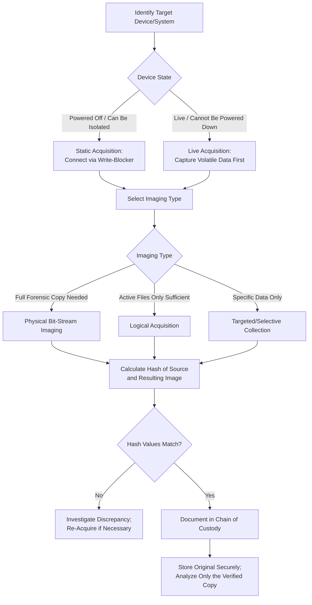

## Data Acquisition and Imaging Techniques

### Overview

Data acquisition and imaging techniques comprise the technical methods used to create forensically sound copies of digital storage media and electronically stored information (ESI) for analysis in a fraud examination. Proper acquisition ensures that the resulting evidence is a complete, verifiable, and unaltered representation of the source, forming the foundation for all subsequent digital forensic analysis.

**Key Points**

- Acquisition must occur before analysis, and analysis should always be performed on a copy/image, never on the original media.
- The choice of acquisition method (physical vs. logical) depends on the type of device, its operational status (live vs. offline), and legal/practical constraints.
- Integrity verification through cryptographic hashing is the cornerstone of defensible digital evidence acquisition.

### Types of Data Acquisition

**1. Physical (Bit-Stream) Imaging**

- Captures every bit of data on a storage device, including active files, deleted files, file slack space, and unallocated space.
- Produces a complete forensic image (e.g., in E01/EWF, raw/DD, or AFF formats) that is an exact sector-by-sector replica of the source media.
- Preferred method when full forensic examination — including recovery of deleted or hidden data — may be necessary.

**2. Logical Acquisition**

- Captures only active, accessible files and folders as recognized by the file system, without imaging unallocated space or deleted data remnants.
- Used when physical imaging is impractical (e.g., large-capacity network storage, live production servers) or when the full device is not within scope.

**3. Targeted/Selective Collection**

- Collects specific files, folders, or data types relevant to the fraud theory (e.g., only a custodian's email mailbox or specific financial system export).
- Common for large enterprise environments or cloud/SaaS sources where full imaging is not feasible or proportionate.

**4. Live Acquisition**

- Performed on a running system that cannot be powered down (e.g., a production server, or when volatile memory/RAM data is needed).
- Captures volatile data (running processes, network connections, memory contents) that would be lost upon shutdown, but carries inherent risk of minor system state changes during capture.

**5. Static (Dead-Box) Acquisition**

- Performed on a powered-down device, connected via write-blocking hardware to a forensic workstation.
- Preferred where operationally feasible, as it eliminates the risk of the acquisition process itself altering the source data.

### Core Acquisition Principles

**1. Write Protection**

- Hardware or software write-blockers are used to ensure the acquisition process cannot modify the source media in any way.

**2. Hash Verification**

- A cryptographic hash algorithm (commonly SHA-256, sometimes alongside MD5 for legacy compatibility) is calculated on the source media before imaging and on the resulting image after imaging.
- Matching hash values confirm the image is a bit-for-bit, unaltered duplicate of the source.
- The hash value is documented in the chain of custody record and should be re-verified before any subsequent analysis session.

**3. Documentation of Tools and Process**

- Record the specific forensic tool, version, acquisition method, start/end times, and any anomalies encountered (e.g., bad sectors, encryption barriers) during acquisition.
- Tool validation matters: examiners should use tools generally accepted and tested within the digital forensics field, as methodology may be challenged.

**4. Order of Volatility**

- When multiple types of evidence must be captured from a live system, collection should generally proceed from most volatile to least volatile to minimize data loss:
  1. CPU registers, cache, and RAM contents
  2. Network state and active connections
  3. Running processes
  4. Temporary file systems
  5. Disk data
  6. Remote logging and monitoring data
  7. Physical/archival storage (backups)

### Data Acquisition Workflow

### Handling Special Acquisition Scenarios

| Scenario | Consideration | Approach |
| --- | --- | --- |
| Encrypted devices | Encryption may block standard imaging | Obtain credentials/keys through legal means; document limitations if inaccessible |
| Cloud/SaaS data | No physical media to image | Use provider legal-hold/export tools; document API/export method used |
| RAID/network storage arrays | Complex physical structure | Logical acquisition often more practical than physical imaging |
| Mobile devices | OS-level restrictions, encryption | Use specialized mobile forensic tools; may require different acquisition levels (logical, file system, physical) depending on device |
| Solid-state drives (SSDs) | TRIM operations may permanently remove deleted data | Document limitation; acquire as promptly as possible after preservation notice |

**[Inference]** The feasibility and completeness of data recovery on SSDs versus traditional hard drives can vary based on device firmware, operating system behavior, and elapsed time since deletion; examiners should consult current digital forensics guidance and specialists for device-specific limitations.

### Documentation and Reporting of Acquisition

- Maintain an acquisition log capturing: device identifiers (make, model, serial number), acquisition date/time, examiner name, tool and version, acquisition type, hash values (source and image), and any anomalies.
- Photograph physical devices before disconnection/acquisition to document their condition and connection state.
- Prepare a summary of acquisition methodology suitable for inclusion in the final examination report or for expert testimony, in plain language that non-technical stakeholders (e.g., audit committee, legal counsel) can understand.

### Example

A digital forensics specialist is tasked with acquiring data from a suspected employee's government-issued laptop in a payroll fraud examination. The laptop is powered down and connected to a forensic workstation via a hardware write-blocker. The specialist performs a full physical bit-stream acquisition using a validated forensic imaging tool, capturing the entire drive including unallocated space where deleted files may reside. Before and after imaging, the specialist calculates a SHA-256 hash of the source drive and the resulting image file, confirming an exact match, and records both values along with the tool version and acquisition timestamps in the case's chain of custody log. The original laptop is then returned to secure evidence storage, and all subsequent analysis is performed exclusively on the verified forensic image.

**Next Steps**

- Metadata analysis and its evidentiary significance
- E-discovery processes and workflows
- Chain of custody requirements
- Mobile device forensics considerations
- Admissibility standards for electronic evidence