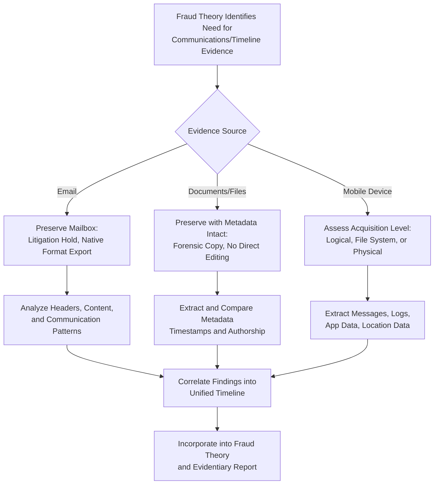

## Email, Metadata, and Mobile Device Forensics

### Overview

Email, metadata, and mobile device forensics involve specialized techniques for preserving, extracting, and analyzing electronic communications and associated contextual data to support fraud examination findings. These sources frequently provide critical evidence of intent, communication patterns, timelines, and relationships between parties involved in a scheme.

**Key Points**

- Email and metadata often reveal not just *what* happened but *who knew what, when* — establishing timelines and intent that documentary financial records alone cannot show.
- Mobile devices increasingly contain evidence unavailable elsewhere (encrypted messaging apps, location data, call logs).
- Each of these evidence types requires specialized preservation techniques distinct from standard computer forensics due to their unique storage architectures.

### Email Forensics

**1. Email Sources**

- On-premises mail servers (e.g., Exchange) and their databases/stores.
- Cloud-hosted email platforms (e.g., hosted enterprise email services), often requiring platform-specific legal hold and export tools.
- Local email client archives (PST/OST files, mailbox exports) stored on individual devices.
- Backup and archival email systems, which may retain messages deleted from active mailboxes.

**2. Email Header Analysis**

- Full email headers contain routing information (originating server, IP addresses, timestamps at each relay) beyond the displayed "From/To" fields.
- Header analysis helps detect spoofed sender addresses, business email compromise schemes, or manipulated timestamps.
- Key header fields include Received, Message-ID, Return-Path, and Authentication-Results (SPF/DKIM/DMARC validation results).

**3. Email Preservation Considerations**

- Preserve emails in their native format (e.g., .eml, .msg, or full mailbox export) rather than as printed or converted copies, to retain headers and metadata.
- Apply litigation holds at the mailbox level to suspend auto-deletion or archiving policies before collection.
- Document the collection method (direct export from server, client-side archive, forensic image of local cache) since this affects completeness (e.g., server-side deletion may not remove locally cached copies, and vice versa).

**4. Email Analysis Techniques**

- Keyword and pattern searching across large volumes of correspondence to identify relevant communications.
- Communication network/link analysis to map relationships and frequency of contact between individuals of interest.
- Timeline reconstruction correlating email activity with financial transaction dates.
- Attachment extraction and analysis, since attachments (spreadsheets, altered documents) are often more evidentially significant than the message body itself.

### Metadata Analysis

**1. Types of Metadata**

- **File system metadata**: creation date, last modified date, last accessed date, file size, and file path.
- **Application metadata (embedded)**: author name, editing history, comments, and revision tracking embedded within documents (e.g., Word, Excel, PDF properties).
- **Email metadata**: sender/recipient addresses, timestamps, routing headers, and read receipts.
- **Image/media metadata (EXIF)**: camera/device information, GPS coordinates, and capture timestamps embedded in photos.

**2. Evidentiary Significance**

- Establishes timelines: when a document was actually created or modified versus its purported date.
- Identifies authorship: embedded author fields can corroborate or contradict claims about who created a document.
- Detects backdating or fabrication: inconsistency between claimed document dates and underlying metadata timestamps is a strong red flag.

**3. Preservation Cautions**

- Simple actions like opening, copying, printing, or converting a file format can alter or strip metadata; forensic tools and read-only access methods should be used whenever metadata may be evidentially significant.
- Metadata should be extracted and documented as part of the acquisition process, not left for later ad hoc review.

**[Inference]** Metadata itself can, in some cases, be manipulated by a sophisticated actor; examiners should corroborate critical metadata findings with independent sources (e.g., server logs, third-party timestamps) where the stakes warrant it.

### Mobile Device Forensics

**1. Data Types on Mobile Devices**

- Call logs, SMS/MMS messages, and contacts.
- Application data, including encrypted messaging apps, financial/banking apps, and cloud storage sync apps.
- Location data (GPS history, cell tower connection logs).
- Photos and videos, including embedded EXIF metadata.
- Cloud backup data synchronized from the device (which may be accessible even without the physical device).

**2. Acquisition Levels**

- **Logical acquisition**: extracts accessible data (contacts, messages, call logs) as presented by the device's operating system; least invasive but may miss deleted data.
- **File system acquisition**: extracts the device's file structure, providing access to more data than logical acquisition, including some application databases.
- **Physical acquisition**: extracts a complete bit-for-bit copy of the device's storage, including deleted and unallocated data where technically feasible; increasingly restricted by modern device encryption and security architectures.

**3. Mobile-Specific Challenges**

- Device encryption and lock mechanisms (PIN, biometric) may limit acquisition options without proper legal authority and technical capability.
- Frequent operating system updates can affect the availability and reliability of forensic extraction methods.
- Cloud synchronization means some relevant data may reside off-device, requiring coordination with cloud acquisition procedures.
- Legal and policy constraints (e.g., personal devices under bring-your-own-device policies) may limit the scope of permissible examination without specific consent or legal process.

### Email, Metadata, and Mobile Forensics Workflow

### Legal and Privacy Considerations

- Employee monitoring and email review must comply with applicable labor law, data privacy statutes, and any collective bargaining or company policy provisions regarding reasonable expectation of privacy.
- Personal mobile devices used for business purposes (BYOD) raise heightened privacy considerations; legal counsel should advise on the scope of permissible examination.
- Cross-border data transfer restrictions may apply when cloud-hosted email or mobile backup data is stored in a different jurisdiction than the examination.
- **[Inference]** Specific privacy and labor law requirements vary significantly by jurisdiction; examiners should confirm current applicable requirements with legal counsel before accessing personal communications or devices.

### Example

In an examination of suspected collusive bidding at a local government unit, the examination team preserves the procurement officer's work email mailbox under litigation hold and exports it in native format, revealing header data showing after-hours message exchanges with a bidder's personal email address rather than the standard company address. Metadata analysis of a submitted technical specification document shows an "author" field matching the bidder's staff member rather than the officer who claimed to have drafted it, and a "last modified" timestamp predating the official bid opening date. With appropriate legal authorization, a logical acquisition of the officer's government-issued mobile phone recovers SMS messages referencing a meeting location consistent with the timeline established through email analysis, corroborating the fraud theory of improper pre-bid coordination.

**Related Topics**

- Data acquisition and imaging techniques
- Chain of custody requirements
- E-discovery processes and workflows
- Communication network and link analysis
- Admissibility standards for electronic evidence