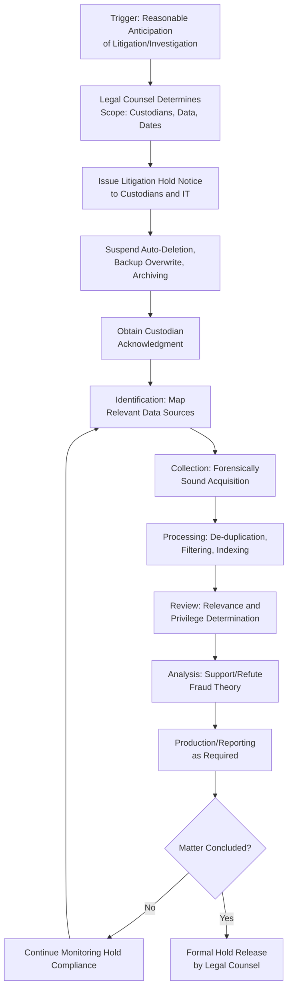

## E-Discovery Process and Litigation Holds

### Overview

E-discovery (electronic discovery) is the structured process of identifying, preserving, collecting, processing, reviewing, and producing electronically stored information (ESI) in connection with a fraud examination, litigation, or regulatory proceeding. Litigation holds are the mechanism by which this process begins — legally suspending the ordinary destruction or alteration of potentially relevant data as soon as an obligation to preserve arises.

**Key Points**

- The duty to preserve typically arises upon "reasonable anticipation" of litigation, investigation, or regulatory action — often well before a formal complaint or claim is filed.
- Failure to implement a timely and effective litigation hold can result in spoliation findings, adverse inferences, sanctions, or exclusion of evidence.
- E-discovery is typically conducted in close coordination among legal counsel, IT, fraud examiners, and (for larger matters) outside e-discovery vendors.

### The Litigation Hold Process

**1. Trigger Identification**

- The duty to preserve arises when litigation, government investigation, or internal disciplinary action becomes reasonably foreseeable — this can occur before an examination is even formally opened, based on receipt of a credible tip or identification of a significant anomaly.

**2. Scope Determination**

- Identify custodians (individuals) whose data is likely relevant.
- Identify relevant date ranges, data types (email, financial records, chat logs, documents), and systems involved.
- Scope should be broad enough to capture relevant information but proportionate to the matter's materiality and complexity.

**3. Hold Notice Issuance**

- Legal counsel typically issues a formal, written litigation hold notice to custodians and IT personnel.
- The notice should clearly instruct recipients to preserve (not necessarily produce) all potentially relevant information and to suspend any automatic deletion, archiving, or destruction processes affecting that data.
- Notices should avoid disclosing unnecessary investigative detail to custodians who may be subjects, balancing preservation needs against confidentiality.

**4. IT System-Level Preservation**

- Suspend auto-deletion policies, backup tape recycling, and retention schedule purges for identified data sources.
- Preserve system logs, access records, and application audit trails relevant to the matter.

**5. Acknowledgment and Monitoring**

- Obtain written acknowledgment from custodians that they have received and understood the hold notice.
- Periodically follow up to confirm continued compliance, particularly for long-running examinations.
- Update the hold scope as the fraud theory evolves and additional custodians or data sources are identified.

**6. Hold Release**

- Formally release the litigation hold upon conclusion of the matter (examination closure, settlement, final judgment, or expiration of applicable retention/appeal periods), documented by legal counsel.

### The E-Discovery Reference Model (EDRM) Stages

| Stage | Description |
| --- | --- |
| Information Governance | Baseline data management practices before any dispute arises |
| Identification | Locating potentially relevant ESI and custodians |
| Preservation | Ensuring ESI is protected from alteration/destruction (litigation hold) |
| Collection | Gathering ESI in a forensically sound, defensible manner |
| Processing | Reducing volume (de-duplication, filtering) and preparing data for review |
| Review | Analyzing ESI for relevance, privilege, and confidentiality |
| Analysis | Evaluating content and patterns to support or refute the fraud theory |
| Production | Delivering responsive, non-privileged ESI to requesting parties/regulators |
| Presentation | Displaying ESI as evidence in proceedings or reporting |

**[Inference]** The EDRM is a widely referenced conceptual framework in e-discovery practice; specific stage terminology and sequencing may be adapted differently across organizations and jurisdictions.

### E-Discovery and Litigation Hold Workflow

### Processing and Review Techniques

- **De-duplication**: Removing identical copies of the same document/email across multiple custodians or storage locations to reduce review volume.
- **Filtering**: Narrowing data sets by date range, file type, or custodian to focus on relevant material.
- **Keyword and concept searching**: Using search terms (developed collaboratively between examiners and counsel) to identify potentially relevant documents within large data volumes.
- **Technology-assisted review (TAR) / predictive coding**: Machine-learning-assisted prioritization of documents by likely relevance, used in high-volume matters to improve review efficiency.
- **Privilege review**: Identifying and segregating documents protected by attorney-client privilege or work-product doctrine before production to third parties.

### Spoliation Risk and Consequences

- **Spoliation** occurs when a party fails to preserve evidence it had a duty to preserve, whether through negligence, recklessness, or intentional conduct.
- Consequences can include adverse inference instructions (a fact-finder may presume destroyed evidence was unfavorable to the party that destroyed it), monetary sanctions, or in severe cases, dismissal of claims or defenses.
- **[Inference]** The specific legal standards and available remedies for spoliation vary by jurisdiction; examiners should coordinate with legal counsel on applicable rules for the relevant forum.

### Common Pitfalls

- **Delayed hold issuance**: Failing to recognize when the preservation duty is triggered, resulting in loss of relevant data through routine business processes.
- **Overly narrow scope**: Excluding relevant custodians or data types (e.g., personal devices, cloud collaboration tools) from the hold.
- **Poor hold monitoring**: Issuing a hold notice but failing to verify ongoing compliance, particularly as automated systems continue routine deletion in the background.
- **Inadequate documentation**: Failing to retain records of when the hold was issued, to whom, and what scope it covered — critical if the adequacy of preservation efforts is later challenged.
- **Ignoring third-party/cloud data**: Overlooking data held by external vendors, cloud providers, or business partners that may also require preservation requests.

### Example

A local government unit's audit office receives a credible whistleblower complaint alleging a procurement officer manipulated bid evaluations. Recognizing that an internal investigation — and potential referral to an oversight body — is reasonably anticipated, legal counsel immediately issues a litigation hold covering the officer's email, the e-procurement system's bid evaluation records, and related committee members' correspondence for the prior 18 months, directing IT to suspend the standard six-month email archival deletion policy. Custodians acknowledge receipt of the hold in writing. As the examination progresses and reveals a second employee's involvement, counsel expands the hold's scope to include that individual's data. Upon conclusion of the examination and submission of findings to the appropriate oversight body, counsel formally documents the release of the hold, specifying the applicable record retention period going forward.

**Related Topics**

- Digital evidence identification and preservation
- Data acquisition and imaging techniques
- Chain of custody requirements
- Coordinating with legal counsel and stakeholders
- Admissibility standards for electronic evidence