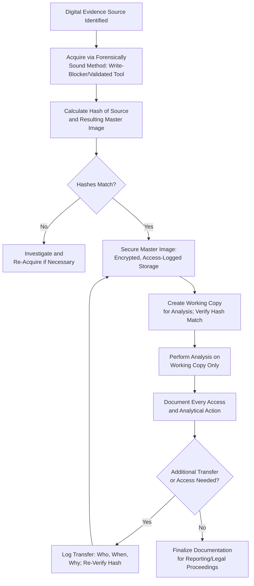

## Chain of Custody for Digital Evidence

### Overview

Chain of custody for digital evidence is the specialized application of chain-of-custody principles to electronically stored information (ESI), addressing the unique technical characteristics of digital data — its ease of duplication, susceptibility to invisible alteration, and reliance on metadata and cryptographic verification to establish authenticity. Because digital evidence can be modified without visible signs of tampering, the documentation and technical safeguards required are more rigorous than for physical evidence alone.

**Key Points**

- Digital chain of custody must document not only *who* handled the evidence but also *what technical processes* were applied to it (imaging, hashing, analysis tools).
- Cryptographic hash verification is the primary technical control that substitutes for the visible tamper-evidence used with physical evidence.
- A broken digital chain of custody is often more difficult to detect than a physical break, making rigorous, contemporaneous documentation especially critical.

### Core Documentation Requirements for Digital Evidence

For each item of digital evidence, the custody record should capture:

1. **Source identification** – device make/model/serial number, system name, or account identifier (e.g., email address, cloud storage account).
2. **Acquisition details** – date, time, examiner, acquisition method (physical, logical, targeted), and tool/version used.
3. **Hash values** – cryptographic hash (e.g., SHA-256) calculated at the point of acquisition, and at each subsequent verification point.
4. **Storage location** – specific repository, server, or encrypted storage device where the evidence resides, including access control configuration.
5. **Access log** – every instance of access to the original evidence or its forensic image, including who accessed it, when, and for what purpose.
6. **Analysis actions** – documentation of every analytical procedure performed on a working copy, distinguishing it from the preserved master image.
7. **Transfer records** – each transfer of custody (e.g., from IT to forensic examiner to legal counsel), with corresponding hash re-verification.
8. **Final disposition** – ultimate handling of the evidence (retained per policy, submitted as an exhibit, or destroyed per legal counsel's direction after matter conclusion).

### The Master Image Principle

- Upon acquisition, the original forensic image is treated as the **master copy** and is never directly analyzed or modified.
- All analysis is performed on a **working copy** duplicated from the master image, verified by hash comparison to confirm it is identical.
- If the working copy is questioned or corrupted, a fresh working copy can be regenerated from the untouched master, and its hash re-verified against the original.

### Hash Verification as a Custody Control

| Verification Point | Purpose |
| --- | --- |
| At acquisition (source vs. image) | Confirms the image is an exact, complete copy of the original |
| Before each analysis session | Confirms the working copy has not been altered since last access |
| After each analysis session | Confirms analysis tools did not inadvertently modify the data |
| Before production/presentation | Confirms the evidence presented matches what was originally preserved |

A hash mismatch at any point triggers an immediate investigation into the cause (tool malfunction, storage corruption, unauthorized access) before the evidence can be relied upon further.

### Digital Chain of Custody Workflow

### Access Control and Storage Safeguards

- Store master images and working copies in encrypted repositories with role-based access control, ensuring only authorized personnel can access evidence.
- Maintain comprehensive access logs (automated where possible) capturing every login, file access, and export action related to the evidence.
- Physically or logically segregate case-specific digital evidence from general organizational IT systems to reduce exposure to unauthorized access or accidental modification.
- Apply version control to any derivative work products (e.g., extracted spreadsheets, search result exports) so that each output can be traced back to the verified source evidence.

### Multi-Custodian and Multi-System Considerations

- In examinations involving multiple custodians, maintain a separate, clearly labeled chain of custody record for each individual's data set to avoid commingling and confusion.
- Where data spans multiple systems (email server, endpoint device, cloud storage), document how findings from each source were correlated, since combined analysis (e.g., timeline reconstruction) draws on evidence with potentially different chains of custody.
- For cloud/SaaS-sourced data lacking a traditional "device" to image, document the export method, the platform's own audit/access logs (if available), and any hash values the platform provides for exported data sets.

### Common Digital-Specific Chain of Custody Risks

| Risk | Mitigation |
| --- | --- |
| Metadata alteration through improper handling (e.g., opening files directly) | Use forensic tools and read-only access; never open originals in native applications |
| Unauthorized or undocumented remote access to storage | Enforce strict access controls and automated access logging |
| Tool-induced changes during analysis | Use validated, tested forensic software; document tool behavior |
| Storage media degradation over time | Use redundant, verified backups of master images; periodic hash re-verification |
| Ambiguous responsibility across multiple examiners | Assign a single designated evidence custodian for each case |

### Example

A digital evidence custodian receives a forensic image of a suspected employee's work computer from the acquiring specialist, along with its recorded SHA-256 hash value. Upon receipt, the custodian independently recalculates the hash to confirm it matches before accepting custody, logging this verification with a timestamp in the case management system. The custodian then creates a working copy for the forensic accountant's analysis, again verifying the hash match before granting access. Throughout the analysis phase, every file the forensic accountant opens or exports is logged automatically by the case management system. When the analysis concludes and findings are prepared for referral to an oversight body, the custodian re-verifies the master image's hash one final time to confirm it remains unaltered, and this verification, along with the complete access log, is included as an appendix supporting the integrity of the digital evidence presented in the final report.

**Related Topics**

- Data acquisition and imaging techniques
- Digital evidence identification and preservation
- Admissibility standards for electronic evidence
- E-discovery process and litigation holds
- Report writing: presenting digital evidence findings