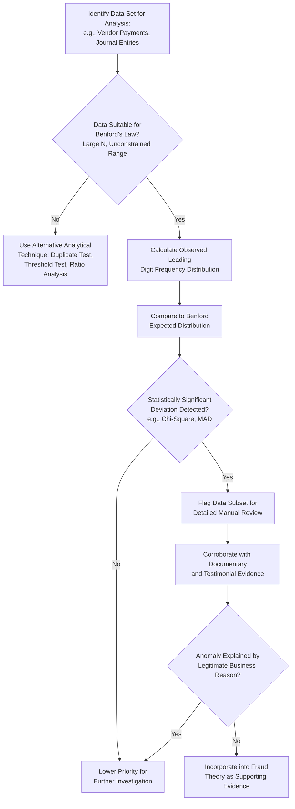

## Benford's Law and Digital Analysis

### Overview

Benford's Law is a statistical phenomenon describing the expected frequency distribution of leading digits in naturally occurring numerical data sets. In fraud examination, it serves as an analytical technique to identify data sets or transactions that deviate from expected patterns, flagging areas warranting closer scrutiny. Digital analysis, more broadly, refers to the family of numerical/statistical techniques (including but not limited to Benford's Law) applied to detect anomalies in financial data.

**Key Points**

- Benford's Law is a screening/detection tool, not proof of fraud — deviations indicate areas for further investigation, not confirmed misconduct.
- The law applies best to large data sets with naturally occurring, unconstrained numbers spanning several orders of magnitude (not data with imposed minimums/maximums or sequential numbering).
- Digital analysis should be used within the broader fraud theory approach, generating hypotheses to be tested with additional evidence, not as a standalone conclusion.

### The Mathematical Basis of Benford's Law

Benford's Law predicts that in many naturally occurring data sets, the leading (first) digit $d$ (where $d \in \{1, 2, ..., 9\}$) appears with probability:

$$P(d) = \log_{10}\left(1 + \frac{1}{d}\right)$$

This produces a logarithmic (not uniform) distribution, where the digit 1 appears as the leading digit approximately 30.1% of the time, while the digit 9 appears only about 4.6% of the time.

| Leading Digit | Expected Frequency (Benford) |
| --- | --- |
| 1 | 30.1% |
| 2 | 17.6% |
| 3 | 12.5% |
| 4 | 9.7% |
| 5 | 7.9% |
| 6 | 6.7% |
| 7 | 5.8% |
| 8 | 5.1% |
| 9 | 4.6% |

The law can be extended to second-digit, first-two-digit, and digit-combination analyses for more granular anomaly detection.

### Conditions for Appropriate Application

Benford's Law tends to work well for data sets that:

- Span several orders of magnitude (e.g., transactions ranging from tens to millions).
- Result from a combination of multiple underlying distributions (e.g., invoice amounts from many different vendors/processes).
- Are not subject to artificial constraints (e.g., fixed price points, assigned ranges, or sequential identifiers).
- Represent a sufficiently large sample size to allow meaningful statistical comparison.

Benford's Law is generally **not appropriate** for:

- Data with an imposed minimum or maximum (e.g., prices capped at a fixed maximum authorization limit).
- Sequentially assigned numbers (e.g., check numbers, invoice sequence numbers) rather than transaction values.
- Data sets with very few observations, where statistical fluctuation would produce unreliable comparisons.
- Data that is inherently non-random by design (e.g., fixed subscription fees, standardized product prices).

### Common Digital Analysis Techniques Used Alongside Benford's Law

**1. First-Digit and Second-Digit Tests**

- Compare the observed frequency distribution of leading digits (and second digits) in a data set against the Benford expected distribution.

**2. First-Two-Digits Test**

- Provides finer granularity, useful for detecting specific clusters of anomalous numbers (e.g., values just under an approval threshold).

**3. Summation Test**

- Sums all values sharing a given leading digit combination and compares proportions to expected values, useful for identifying disproportionately large contributions from a small number of transactions.

**4. Number Duplication Test**

- Identifies unusually frequent exact-value duplicates, which can indicate fabricated or copied transaction records.

**5. Round Number Test**

- Flags data sets with statistically unusual concentrations of round numbers (e.g., amounts ending in 000), which occur less frequently in genuine, itemized transactions than in estimated or fabricated figures.

**6. Threshold/Just-Below Test**

- Identifies clustering of transaction amounts just below approval or review thresholds (e.g., numerous invoices at $9,900 when the approval threshold is $10,000), a common indicator of structuring to avoid oversight.

### Statistical Evaluation of Deviations

- **Chi-square goodness-of-fit test**: Commonly used to statistically assess whether observed digit frequencies significantly deviate from the Benford-expected distribution.
- **Mean Absolute Deviation (MAD)**: An alternative, sample-size-independent measure sometimes used to gauge conformity, with established conformity thresholds referenced in forensic accounting literature.
- **[Inference]** Specific statistical thresholds for "acceptable" deviation (e.g., particular MAD cutoff values) vary across methodological frameworks and professional guidance; examiners should apply thresholds consistent with the standards and tools their engagement or profession recognizes.

### Benford's Law Analysis Workflow

### Limitations and Cautions

- **False positives**: Legitimate business reasons (seasonal pricing, fixed fee structures, currency conversion effects) can cause deviations unrelated to fraud.
- **False negatives**: A sophisticated perpetrator aware of Benford's Law could deliberately structure fabricated numbers to conform to the expected distribution, though this requires considerable effort and is uncommon in typical occupational fraud schemes.
- **Not a standalone conclusion**: Deviation from Benford's Law is an analytical flag, not evidence of fraud in itself; findings must be corroborated with document examination, interviews, or other evidence before being relied upon in conclusions.
- **Requires sufficient data volume**: Small or narrow data sets can produce statistically unstable results that are not meaningfully interpretable.

### Example

A forensic accountant analyzes 18 months of disbursement vouchers from a local government unit's general fund, comprising several thousand transactions across many vendors and expense categories — a data set well-suited to Benford's Law given its size and natural variability. The first-digit test reveals a marked overrepresentation of the digit 9 as a leading digit, well above the expected 4.6%, concentrated in transactions just under the $50,000 threshold requiring higher-level approval. Applying a threshold/just-below test confirms a disproportionate cluster of transactions between $47,000 and $49,999. This statistical anomaly is then cross-referenced against supporting documentation, revealing that a significant number of these transactions originate from a single requesting office and were split from what appear to be larger single procurements — corroborating a fraud theory of deliberate transaction structuring to circumvent approval controls, which the accountant then investigates further through document examination and targeted interviews.

**Related Topics**

- Data analytics techniques in fraud examination (ratio analysis, trend analysis)
- Document examination and authentication
- Fraud theory approach and hypothesis testing
- Journal entry testing and general ledger analysis
- Statistical sampling methods in fraud examinations