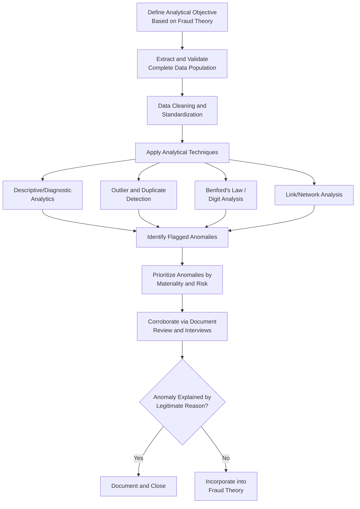

## Data Mining and Anomaly Detection

### Overview

Data mining and anomaly detection encompass the analytical techniques used to examine large volumes of structured data — transactional, financial, and operational — to uncover patterns, relationships, and outliers indicative of potential fraud. Unlike traditional sample-based auditing, these techniques typically analyze entire populations of data, increasing the likelihood of detecting anomalies that might otherwise be missed in a limited sample.

**Key Points**

- Data mining shifts fraud detection from sample-based testing to full-population analysis, substantially improving detection coverage.
- Anomaly detection identifies transactions or patterns that deviate from expected norms, which then require further investigation to determine whether the deviation reflects fraud, error, or a legitimate explanation.
- Effective data mining requires clean, complete, and well-understood data as a prerequisite; poor data quality undermines the reliability of any analytical output.

### Categories of Data Mining Techniques

**1. Descriptive Analytics**

- Summarizes historical data to identify patterns, trends, and relationships (e.g., transaction volume by vendor, expense category trends over time).
- Includes basic statistical summaries: means, medians, standard deviations, and frequency distributions.

**2. Diagnostic Analytics**

- Investigates why an identified anomaly or pattern occurred, drilling into underlying transaction detail.
- Often follows descriptive analytics once an area of concern has been flagged.

**3. Predictive Analytics**

- Uses historical data patterns and statistical/machine-learning models to estimate the likelihood of future fraudulent activity or to score transactions/entities by risk.
- Commonly used in continuous monitoring and fraud risk scoring systems.

**4. Link/Network Analysis**

- Maps relationships between entities (employees, vendors, bank accounts, addresses) to identify hidden connections, such as an employee sharing an address or bank account with a purportedly independent vendor.

### Common Anomaly Detection Techniques

**1. Outlier Detection**

- Identifies transactions or values that fall significantly outside the normal range for a given data set, using statistical measures such as standard deviation thresholds, interquartile range (IQR) methods, or z-scores.

**2. Duplicate Testing**

- Searches for duplicate payments, invoice numbers, vendor records, or employee identifiers (e.g., matching bank account numbers, tax identification numbers, or addresses across seemingly distinct vendor or employee records).

**3. Trend and Ratio Analysis**

- Analyzes financial ratios and trends over time (e.g., expense-to-revenue ratios, vendor payment growth rates) to identify deviations from historical norms or industry benchmarks.

**4. Benford's Law and Digital Analysis**

- Statistical testing of leading-digit distributions to flag data sets warranting further review (see related topic for detailed treatment).

**5. Segregation of Duties (SoD) Testing**

- Cross-references user access logs and transaction approval records to identify instances where a single individual performed conflicting functions (e.g., creating a vendor and approving payment to that vendor).

**6. Threshold/Structuring Analysis**

- Detects transactions clustered just below approval or reporting thresholds, suggesting deliberate structuring to avoid oversight controls.

**7. Time-Based Anomaly Detection**

- Flags transactions occurring at unusual times (e.g., after-hours system access, weekend approvals, activity during an employee's scheduled leave).

**8. Vendor/Employee Master File Analysis**

- Compares vendor and employee master files for matching addresses, phone numbers, bank accounts, or tax IDs — a common technique for detecting fictitious ("shell") vendors or ghost employees.

### Data Mining and Anomaly Detection Workflow

### Data Quality and Preparation Considerations

- **Completeness**: Ensure the extracted data set represents the full population relevant to the fraud theory's time period and scope, not a partial or filtered extract that could miss relevant transactions.
- **Data validation**: Reconcile extracted data totals against source system control totals (e.g., general ledger balances) to confirm no records were lost or duplicated during extraction.
- **Standardization**: Normalize formats (dates, currency, text case) across data sources to enable accurate matching and comparison, particularly when combining data from multiple systems.
- **Documentation**: Record the data source, extraction method, extraction date, and any filtering or transformation applied, supporting both reproducibility and evidentiary defensibility.

### Analytical Tools Commonly Used

- Spreadsheet software (e.g., Excel) for smaller data sets and ad hoc analysis.
- Dedicated audit/forensic data analytics software designed for full-population testing, duplicate detection, and Benford's Law analysis.
- Structured Query Language (SQL) for querying and joining large relational data sets.
- Statistical and data science platforms (e.g., R, Python with data analysis libraries) for more advanced statistical modeling, machine learning-based anomaly detection, and visualization.
- Business intelligence and visualization tools for presenting findings to non-technical stakeholders.

**[Inference]** Specific tool selection depends on organizational resources, data volume, and the complexity of analysis required; larger or more complex examinations may warrant specialized forensic data analytics platforms or data science expertise beyond spreadsheet-based analysis.

### Interpreting Results: Avoiding False Positives

- Anomalies identified through data mining are **investigative leads**, not conclusions. Many flagged items will have legitimate explanations (e.g., a genuine bulk purchase, a seasonal expense spike, a data entry correction).
- Each anomaly should be corroborated with additional evidence (documentary review, interviews) before being incorporated into the fraud theory, consistent with the broader fraud theory approach's emphasis on testing rather than assuming conclusions.
- Prioritization frameworks (e.g., scoring anomalies by materiality, frequency, and risk indicators) help focus limited investigative resources on the most significant leads first.

### Example

A forensic data analyst examines the complete vendor master file and 24 months of disbursement data for a local government unit's engineering department. Duplicate testing reveals that two vendors, registered under different business names, share an identical bank account number. Segregation-of-duties testing further reveals that the same staff member both created one of these vendor records and approved multiple payments to it, a conflict that should have been prevented by system controls. Threshold analysis additionally shows that a disproportionate number of purchase orders from this department fall just below the competitive bidding threshold. Individually, each finding is only an anomaly; together, correlated across the same vendor, staff member, and timeframe, they form a coherent pattern that the examination team incorporates into a fraud theory involving vendor fraud facilitated by inadequate segregation of duties, which is then tested through targeted document review and interviews.

**Related Topics**

- Benford's Law and digital analysis
- Journal entry testing and general ledger analysis
- Vendor and payroll fraud detection techniques
- Fraud theory approach and hypothesis testing
- Continuous monitoring and fraud risk indicators