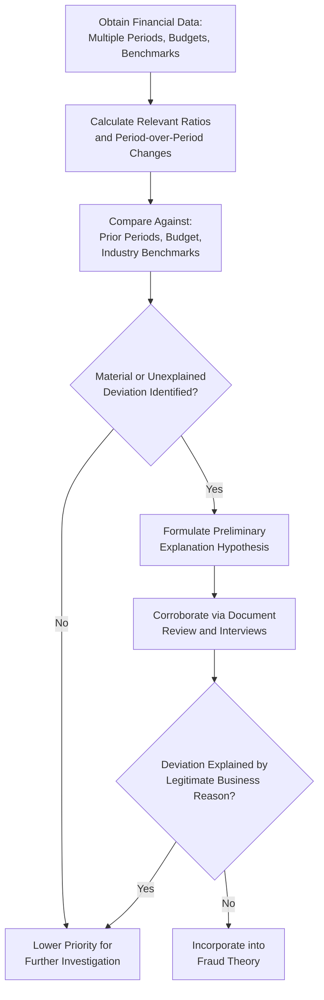

## Ratio and Trend Analysis for Fraud Detection

### Overview

Ratio and trend analysis are analytical procedures that examine financial relationships and changes over time to identify anomalies inconsistent with normal business operations, industry norms, or historical patterns. These techniques are foundational tools in forensic accounting, often serving as an initial screening mechanism that generates leads for deeper investigation under the fraud theory approach.

**Key Points**

- Ratio analysis examines relationships between financial statement line items at a point in time; trend analysis examines changes in those items or ratios across multiple periods.
- Both techniques rely on comparison — against prior periods, budgeted figures, industry benchmarks, or comparable entities — since a ratio or trend in isolation has limited diagnostic value.
- Anomalies identified through these techniques are indicators warranting further investigation, not standalone proof of fraud.

### Types of Financial Ratios Used in Fraud Detection

**1. Liquidity Ratios**

- Current ratio, quick ratio — unusual changes may indicate cash flow manipulation or concealment of liabilities.

**2. Profitability Ratios**

- Gross margin, net profit margin, operating margin — inconsistent margins compared to industry peers may suggest revenue overstatement or expense understatement.

**3. Activity/Efficiency Ratios**

- Accounts receivable turnover, inventory turnover, days sales outstanding (DSO) — a rising DSO may indicate fictitious receivables or channel stuffing; unusual inventory turnover may signal inventory fraud.

**4. Leverage Ratios**

- Debt-to-equity, interest coverage — used to identify potential off-balance-sheet financing or misclassification of liabilities.

**5. Fraud-Specific Diagnostic Ratios**

- Ratios developed specifically for fraud risk screening, such as comparing the growth rate of receivables against the growth rate of sales, or comparing selling/administrative expense growth against revenue growth, to detect inconsistent relationships between related accounts.

### Formula Reference for Common Diagnostic Ratios

$$\text{Days Sales Outstanding (DSO)} = \frac{\text{Accounts Receivable}}{\text{Total Credit Sales}} \times 365$$

$$\text{Inventory Turnover} = \frac{\text{Cost of Goods Sold}}{\text{Average Inventory}}$$

$$\text{Gross Margin} = \frac{\text{Revenue} - \text{Cost of Goods Sold}}{\text{Revenue}}$$

A material, unexplained deviation in DSO relative to prior periods, for example, may indicate that receivables are being recorded without corresponding genuine collectible sales.

### Trend Analysis Techniques

**1. Horizontal Analysis**

- Compares line items across multiple periods (e.g., quarter-over-quarter, year-over-year) expressed in both absolute and percentage change terms, highlighting unusual growth or decline patterns.

**2. Vertical (Common-Size) Analysis**

- Expresses each financial statement line item as a percentage of a base figure (e.g., total revenue for income statement items, total assets for balance sheet items), enabling comparison of structural composition across periods or against peer organizations.

**3. Budget-to-Actual Variance Analysis**

- Compares actual results against budgeted or forecasted figures, flagging significant unexplained variances for follow-up.

**4. Peer/Industry Benchmarking**

- Compares an entity's ratios and trends against industry averages or comparable organizations, since deviations from sector norms can indicate irregularities specific to the entity under examination.

**5. Regression and Correlation Analysis**

- Assesses whether related account balances move together as statistically expected (e.g., commission expense should generally correlate with sales volume); a breakdown in this expected correlation can indicate manipulation of one of the related accounts.

### Ratio and Trend Analysis Workflow

### Common Red-Flag Patterns Detected Through Ratio and Trend Analysis

| Pattern | Potential Indicator |
| --- | --- |
| Receivables growing faster than sales | Fictitious or overstated receivables |
| Declining gross margin without cost explanation | Revenue understatement or cost manipulation |
| Inventory growing faster than sales | Inventory overstatement or obsolete stock concealment |
| Expenses inconsistent with revenue trend | Expense manipulation to smooth reported earnings |
| Unusual spike in a specific expense category near period-end | Potential channel for fraudulent disbursements |
| Consistent "just-meeting" of budget/targets | Possible earnings/results manipulation |

### Application in Public Sector and Government Contexts

- Trend analysis of budget utilization rates across departments can reveal patterns such as disproportionate year-end spending spikes (potentially indicating rushed or improper procurement to exhaust budget allocations before fiscal year-end).
- Ratio analysis of per-unit procurement costs across time periods or comparable projects can flag potential overpricing or collusive bidding.
- Trend analysis of specific expenditure categories (e.g., travel, consulting, repairs and maintenance) relative to historical norms can highlight areas warranting closer document review.

### Limitations and Cautions

- Ratios and trends are influenced by legitimate business factors (seasonality, one-time events, changes in accounting policy, economic conditions); examiners must corroborate anomalies with underlying documentation before drawing conclusions.
- Aggregated ratios can mask fraud occurring in a small subset of transactions within a much larger, otherwise normal population — ratio analysis works best combined with more granular data mining techniques.
- Historical comparison baselines must themselves be verified as reliable; if prior-period figures were also subject to manipulation, trend analysis may fail to flag an ongoing scheme.

### Example

An examiner reviewing a local government unit's infrastructure maintenance budget performs trend analysis and observes that "emergency repair" expenditures, historically consistent at roughly 5% of the total maintenance budget over the prior three fiscal years, jumped to 22% in the current year, concentrated in the final quarter. Vertical analysis confirms this shift represents a structural change in spending composition rather than an overall budget increase. Ratio analysis of the average cost per "emergency repair" work order shows a marked increase compared to routine, competitively bid maintenance work orders of similar scope. These findings lead the examiner to hypothesize that the "emergency" classification — which bypasses standard competitive bidding requirements — may have been used to justify non-competitive, inflated contracts near fiscal year-end, a hypothesis then tested through document examination of the specific work orders and interviews with approving personnel.

**Related Topics**

- Data mining and anomaly detection
- Benford's Law and digital analysis
- Financial statement fraud detection techniques
- Fraud theory approach and hypothesis testing
- Budget and public procurement fraud indicators