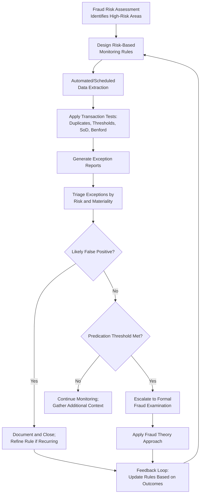

## Continuous Monitoring and Transaction Testing

### Overview

Continuous monitoring and transaction testing refer to the ongoing, systematic application of analytical procedures and control checks to full populations of transactional data, enabling near-real-time or periodic detection of fraud indicators rather than relying solely on periodic, retrospective audits. This proactive approach shifts fraud detection from reactive investigation toward early identification of anomalies as they occur.

**Key Points**

- Continuous monitoring operates on an ongoing or high-frequency basis (daily, weekly, or real-time), in contrast to traditional periodic audits conducted annually or quarterly.
- Transaction testing under continuous monitoring typically examines complete populations rather than statistical samples, increasing detection coverage.
- Effective continuous monitoring requires close collaboration between internal audit, IT, and fraud examination functions to design, implement, and maintain automated rule sets.

### Objectives of Continuous Monitoring

- Detect fraud indicators closer to the time of occurrence, reducing the window during which losses can accumulate undetected.
- Identify control breakdowns or override patterns as they emerge, rather than after significant damage has occurred.
- Provide ongoing assurance to management and governance bodies regarding the operating effectiveness of key controls.
- Generate a documented, defensible audit trail of monitoring activities and follow-up actions.

### Core Components of a Continuous Monitoring Program

**1. Risk-Based Rule Design**

- Rules and analytical tests are developed based on identified fraud risk areas (e.g., procurement, payroll, disbursements) informed by prior fraud risk assessments.
- Rules should be tailored to the organization's specific processes, control environment, and historical fraud patterns rather than generic, one-size-fits-all templates.

**2. Automated Data Extraction and Testing**

- Establish automated or scheduled extraction of relevant transactional data from source systems (ERP, payroll, procurement systems).
- Apply standardized analytical tests consistently across each monitoring cycle (e.g., duplicate payment tests, threshold/structuring tests, vendor-employee address matching).

**3. Exception Reporting and Triage**

- Flagged exceptions are compiled into exception reports, prioritized by risk score, materiality, or frequency.
- A designated reviewer (internal audit, compliance, or fraud examination staff) triages exceptions to distinguish likely false positives from items warranting further investigation.

**4. Escalation and Investigation Protocols**

- Establish clear thresholds and pathways for escalating significant or recurring exceptions to formal fraud examination processes.
- Ensure escalation triggers align with predication standards, so that an examination is only formally initiated when the reasonable-person threshold is met.

**5. Feedback Loop and Rule Refinement**

- Continuously refine monitoring rules based on investigation outcomes: confirmed fraud cases may reveal new patterns to incorporate, while high false-positive rates on existing rules may indicate a need for recalibration.

### Common Transaction Tests Used in Continuous Monitoring

| Test Type | Purpose |
| --- | --- |
| Duplicate payment/invoice test | Detects repeated payments to the same vendor for the same invoice or amount |
| Vendor/employee master file cross-match | Detects shared addresses, bank accounts, or tax IDs indicating shell vendors or ghost employees |
| Threshold/structuring test | Flags transactions clustered just below approval or bidding thresholds |
| Segregation of duties (SoD) test | Flags instances of conflicting access rights or approvals by a single user |
| Unusual timing test | Flags transactions processed outside normal business hours or during an employee's approved leave |
| Journal entry anomaly test | Flags unusual manual journal entries, especially those posted near period-end or by users without typical posting authority |
| Benford's Law/digit analysis | Flags statistically anomalous numerical patterns in transaction amounts |
| New vendor/rapid payment test | Flags newly created vendors receiving unusually rapid or high-value payments shortly after setup |

### Continuous Monitoring Workflow

### Distinguishing Continuous Monitoring from Traditional Auditing

| Aspect | Traditional Periodic Audit | Continuous Monitoring |
| --- | --- | --- |
| Frequency | Annual/quarterly | Ongoing/real-time/frequent cycles |
| Data coverage | Sample-based | Full population |
| Timing of detection | After the fact, often significantly delayed | Near real-time or shortly after occurrence |
| Primary focus | Financial statement assertions | Transaction-level anomalies and control breaches |
| Resource model | Concentrated audit periods | Ongoing analytical infrastructure and staffing |

### Implementation Considerations

- **Technology infrastructure**: Requires reliable, accessible data feeds from source systems and either dedicated continuous auditing/monitoring software or custom-built scripts/queries.
- **Governance and ownership**: Clear assignment of responsibility for rule maintenance, exception review, and escalation decisions, typically shared between internal audit and IT.
- **False positive management**: Poorly calibrated rules generating excessive false positives can lead to alert fatigue, undermining the program's effectiveness; regular rule tuning is essential.
- **Change management**: Monitoring rules must be updated as business processes, systems, and control environments evolve to remain relevant and effective.

### Example

A local government unit's internal audit office implements a continuous monitoring program covering its disbursement voucher system. Automated weekly extracts are tested using a rule set that includes duplicate payment detection, a threshold test flagging purchase orders between 90% and 99% of the competitive bidding threshold, and a vendor-employee address cross-match. In one monitoring cycle, the threshold test flags an unusually high number of purchase orders from a single department clustered just below the bidding threshold, all issued within a two-week period. Triage confirms this is not a recurring false-positive pattern seen in other departments, and cross-referencing shows several purchase orders went to the same vendor. Because the pattern meets the reasonable-person predication standard, the finding is escalated to the fraud examination team, which opens a formal case applying the fraud theory approach, while the monitoring team separately documents the exception resolution and considers whether the threshold test parameters should be extended to other departments proactively.

**Related Topics**

- Data mining and anomaly detection
- Benford's Law and digital analysis
- Fraud risk assessment methodologies
- Predication and case initiation
- Internal controls design to prevent and detect fraud