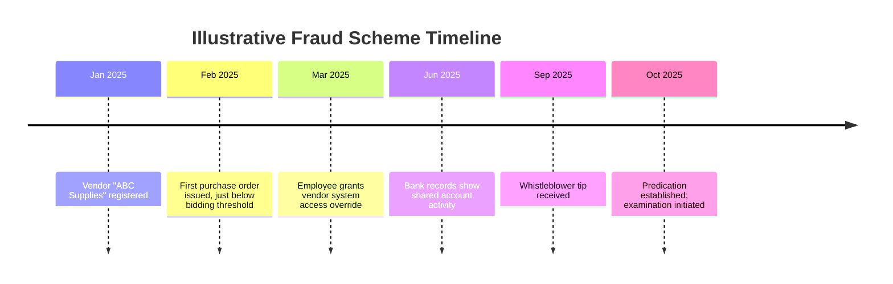

## Visualization Techniques for Forensic Findings

### Overview

Visualization techniques translate complex forensic analytical findings — financial flows, relationships between entities, and event sequences — into visual formats that improve comprehension for stakeholders such as management, audit committees, legal counsel, regulators, and, where applicable, courts or tribunals. Effective visualization supports both investigative analysis (helping examiners identify patterns) and communication of conclusions in the final report.

**Key Points**

- Visualization serves two distinct purposes: an **analytical tool** during the examination (helping the examiner see patterns) and a **communication tool** in reporting (helping others understand findings).
- The choice of visualization technique should match the nature of the finding — flow of funds, relationships between parties, or sequence of events each call for different visual approaches.
- Visualizations must accurately represent underlying data; oversimplification or selective presentation can undermine credibility and objectivity.

### Common Visualization Techniques

**1. Link/Relationship Diagrams**

- Depict connections between individuals, entities, bank accounts, and transactions to reveal hidden relationships (e.g., an employee and a "vendor" sharing an address or bank account).
- Useful for uncovering collusion networks, shell company structures, and related-party schemes.

**2. Flow of Funds Diagrams**

- Trace the movement of money from its source through intermediate accounts or entities to its ultimate destination.
- Particularly valuable in asset misappropriation, money laundering, and embezzlement cases where funds are layered through multiple accounts to obscure their origin.

**3. Timelines**

- Sequence key events chronologically (transactions, communications, approvals, personnel actions) to illustrate the progression of a scheme and correlate seemingly unrelated events.
- Useful for demonstrating opportunity (e.g., aligning a suspect's system access with the timing of irregular transactions).

**4. Organizational and Process Diagrams**

- Illustrate the structure of an organization, department, or business process to highlight where segregation-of-duties failures or control weaknesses occurred.

**5. Statistical Charts and Graphs**

- Bar charts, trend lines, and distribution charts presenting the results of ratio analysis, trend analysis, or Benford's Law testing in an accessible visual format.

**6. Heat Maps and Risk Matrices**

- Visually represent risk levels across departments, vendors, or transaction categories, often used in fraud risk assessments and continuous monitoring reporting.

### Link Analysis Diagram Example (SVG)

The following diagram illustrates a basic link analysis structure connecting an employee to a shell vendor through a shared bank account.

<svg xmlns="http://www.w3.org/2000/svg" viewBox="0 0 700 320">
<text x="350" y="30" text-anchor="middle" font-size="16" font-weight="bold" fill="#1a1a1a">Link Analysis: Employee–Vendor Connection (svg_diagram)</text>
<circle cx="120" cy="150" r="55" fill="#dbeafe" stroke="#1e40af" stroke-width="2" />
<text x="120" y="145" text-anchor="middle" font-size="13" fill="#1e3a8a">Employee</text>
<text x="120" y="162" text-anchor="middle" font-size="11" fill="#1e3a8a">(Procurement Officer)</text>
<circle cx="580" cy="150" r="55" fill="#fee2e2" stroke="#b91c1c" stroke-width="2" />
<text x="580" y="145" text-anchor="middle" font-size="13" fill="#7f1d1d">Vendor</text>
<text x="580" y="162" text-anchor="middle" font-size="11" fill="#7f1d1d">("ABC Supplies")</text>
<rect x="290" y="110" width="120" height="80" rx="8" fill="#fef9c3" stroke="#92400e" stroke-width="2" />
<text x="350" y="140" text-anchor="middle" font-size="12" fill="#78350f">Shared Bank</text>
<text x="350" y="156" text-anchor="middle" font-size="12" fill="#78350f">Account</text>
<text x="350" y="172" text-anchor="middle" font-size="10" fill="#78350f">No. XXXX-4471</text>
<line x1="175" y1="150" x2="290" y2="150" stroke="#4b5563" stroke-width="2" marker-end="url(#arrow)" />
<line x1="410" y1="150" x2="525" y2="150" stroke="#4b5563" stroke-width="2" marker-end="url(#arrow)" />

<text x="230" y="140" text-anchor="middle" font-size="10" fill="`#374151`">payroll deposit</text>

<text x="470" y="140" text-anchor="middle" font-size="10" fill="`#374151`">payment deposit</text>

<line x1="120" y1="205" x2="580" y2="205" stroke="#dc2626" stroke-width="1.5" stroke-dasharray="6,4" />
<text x="350" y="225" text-anchor="middle" font-size="11" fill="#dc2626">registered home address matches vendor address</text>
<text x="350" y="290" text-anchor="middle" font-size="11" fill="`#6b7280`">Diagram illustrates hypothetical connections identified through link analysis</text>

</svg>

### Timeline Visualization Approach

A forensic timeline typically integrates multiple evidence streams (financial transactions, communications, system access, personnel events) onto a single chronological axis, allowing the examiner and reviewers to visually identify correlations that might not be apparent when evidence is reviewed source-by-source in isolation.

### Selecting the Appropriate Visualization Technique

| Finding Type | Recommended Visualization |
| --- | --- |
| Relationships between people/entities | Link/relationship diagram |
| Movement of misappropriated funds | Flow of funds diagram |
| Sequence of events supporting the fraud theory | Timeline |
| Control weaknesses in a process | Process/organizational diagram |
| Statistical anomalies (ratios, Benford's Law) | Bar chart, trend line, distribution chart |
| Risk prioritization across multiple areas | Heat map or risk matrix |

### Best Practices for Forensic Visualizations

- **Accuracy over persuasion**: Visualizations must fairly and completely represent the underlying data; selectively omitting contradictory data to make a chart more compelling undermines examiner objectivity and credibility.
- **Source traceability**: Each visualization should be traceable back to its underlying evidentiary support, documented in work papers, so that any element can be verified upon challenge.
- **Audience-appropriate complexity**: Visualizations for a board or audit committee should emphasize clarity and high-level conclusions; more granular versions may be appropriate for legal counsel or expert testimony.
- **Consistency**: Use consistent symbols, color coding, and formatting conventions across all visualizations within a single report to avoid confusion.
- **Avoid overreach**: Visual inference of a connection (e.g., a link diagram showing shared attributes) should be clearly labeled as an analytical finding requiring further corroboration, not presented as definitive proof of a coordinated scheme.

### Example

In a report to the audit committee summarizing an examination into suspected collusive vendor arrangements at a local government unit, the examiner prepares a link diagram showing three separate "vendors" all resolving to the same registered business address and two overlapping personal bank accounts, alongside a timeline correlating each vendor's registration date with specific purchase orders issued by the same procurement officer. A supporting bar chart displays the marked deviation of transaction amounts from the Benford's Law expected distribution within this vendor group compared to the department's overall vendor population. Together, these visualizations allow the audit committee to grasp, within a few minutes of review, a pattern that took the examination team weeks of underlying document and data analysis to establish — while the detailed work papers supporting each diagram element remain available for legal counsel's review.

**Next Steps**

- Data mining and anomaly detection
- Report writing and communicating examination results
- Testifying as an expert witness (presenting visual evidence)
- Link/network analysis in fraud investigations
- Fraud theory approach and hypothesis testing