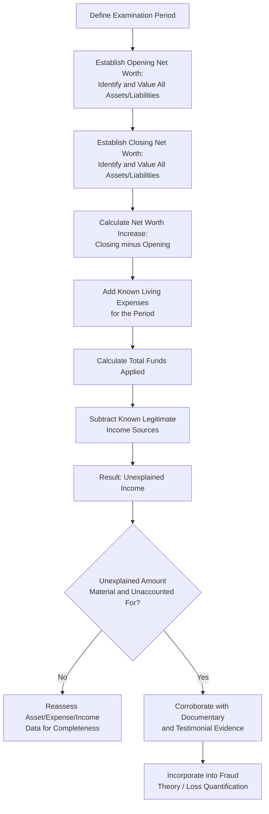

## Net Worth Method

### Overview

The net worth method is an indirect method of proof used in fraud examinations to estimate a subject's unexplained income by analyzing changes in their net worth (assets minus liabilities) over a specific period, adjusted for known living expenses and legitimate income sources. It is one of the most widely used techniques for establishing circumstantial evidence of illicit income in cases where direct evidence of theft or fraud proceeds is unavailable.

**Key Points**

- The net worth method is an indirect method — it does not trace specific stolen funds but instead demonstrates that a subject's wealth increased beyond what legitimate, identifiable income sources can explain.
- It is commonly used when a subject has converted illicit proceeds into assets (real estate, vehicles, investments) rather than holding them as easily traceable cash.
- The method relies on establishing an accurate opening net worth as its foundation; errors or omissions at this stage undermine the entire calculation.

### The Net Worth Method Formula

$$\text{Net Worth}_{\text{end}} - \text{Net Worth}_{\text{beginning}} = \text{Net Worth Increase}$$

$$\text{Net Worth Increase} + \text{Living Expenses} = \text{Total Funds Applied}$$

$$\text{Total Funds Applied} - \text{Known Legitimate Income} = \text{Unexplained Income (Funds from Unknown Source)}$$

Where:

- **Net Worth** = Total Assets − Total Liabilities, calculated at both the beginning and end of the period under examination.
- **Living Expenses** = All personal expenditures during the period not otherwise reflected in the change in assets (e.g., travel, dining, insurance premiums, routine household expenses).
- **Known Legitimate Income** = Salary, documented investment income, gifts, inheritances, loan proceeds, and other verifiable, legitimate sources of funds.

### Step-by-Step Application

**Step 1: Establish the Relevant Period**

- Define the beginning and ending dates of the analysis, typically aligned with the suspected period of the fraud scheme, but often extended to capture a baseline period before the scheme began.

**Step 2: Determine Opening Net Worth**

- Identify and value all assets and liabilities owned by the subject at the start of the period.
- Sources include: bank and brokerage statements, property records, vehicle registrations, loan documents, tax filings, and, where available, prior net worth statements (e.g., from loan or credit applications).
- This step is critical; an understated opening net worth will overstate the calculated unexplained income, and vice versa.

**Step 3: Determine Closing Net Worth**

- Repeat the asset and liability identification and valuation process as of the end of the period.

**Step 4: Calculate Net Worth Increase**

- Subtract opening net worth from closing net worth.

**Step 5: Add Known Living Expenses**

- Estimate personal expenditures during the period that did not result in an asset (i.e., consumed, not saved or invested), using bank/credit card statements, lifestyle analysis, and, where necessary, reasonable estimation techniques for undocumented cash expenditures.

**Step 6: Subtract Known Legitimate Income Sources**

- Identify and total all verifiable legitimate income received during the period (salary, bonuses, documented gifts/inheritances, tax refunds, loan proceeds, sale of previously owned assets at documented value).

**Step 7: Calculate Unexplained Income**

- The residual amount — funds applied (net worth increase plus expenses) that exceed identified legitimate income — represents income from an unknown or unexplained source, which may correspond to fraud proceeds.

### Net Worth Method Calculation Structure

| Component | Amount |
| --- | --- |
| Net worth at end of period | $X |
| Less: Net worth at beginning of period | ($Y) |
| **Net worth increase** | **$(X−Y)** |
| Add: Known living expenses during period | $Z |
| **Total funds applied** | **$(X−Y+Z)** |
| Less: Known legitimate income sources | ($W) |
| **Unexplained income (funds from unknown source)** | **$(X−Y+Z−W)** |

### Net Worth Method Workflow

### Data Sources for Net Worth Analysis

- **Assets**: Bank and brokerage account statements, real property records, vehicle titles, business ownership interests, valuable personal property (jewelry, art, collectibles), retirement accounts, cash on hand.
- **Liabilities**: Mortgage statements, loan agreements, credit card balances, tax liabilities, other outstanding debts.
- **Living expenses**: Credit card and bank statements, lifestyle observation, known recurring expenses (utilities, insurance, tuition), and, in some methodologies, a standardized cost-of-living estimate for undocumented cash spending.
- **Legitimate income**: Payroll records, tax returns, documented gifts or inheritances (with supporting documentation), loan proceeds, and documented proceeds from the sale of previously owned assets.

### Common Defenses and Challenges to the Net Worth Method

| Challenge Raised | Examiner's Response |
| --- | --- |
| "Cash hoard" defense — subject claims prior undisclosed cash savings explain the increase | Requires evidence corroborating the claimed cash hoard's existence and amount at the start of the period (e.g., prior consistent income capable of generating such savings) |
| Understated opening net worth | Requires thorough, independently corroborated asset/liability identification at the start date |
| Undocumented gifts or loans from family/friends | Requires corroborating testimony or documentation; uncorroborated claims warrant skepticism but should still be investigated |
| Incomplete living expense estimation | Requires reasonable, well-documented methodology and, where actual data is unavailable, a defensible estimation approach |

**[Inference]** The specific evidentiary weight given to a "cash hoard" or similar defense, and the standard of proof required to rebut it, depends on the applicable legal forum and jurisdiction; examiners should coordinate with legal counsel on how such defenses are typically addressed in the relevant proceeding.

### Strengths and Limitations

**Strengths**

- Effective when illicit proceeds have been converted into assets rather than retained as traceable cash.
- Provides a structured, quantifiable basis for estimating unexplained income even without direct evidence of specific stolen funds.
- Widely recognized and accepted as circumstantial evidence in many legal systems, particularly in tax evasion and corruption cases.

**Limitations**

- Requires extensive, often time-consuming data gathering across multiple asset and liability categories.
- Vulnerable to challenge if the opening net worth or living expense estimates are not thoroughly corroborated.
- Does not identify the specific source or method of the underlying fraud scheme — it establishes that unexplained income exists, not how it was obtained (making it a strong complement to, but not a replacement for, direct scheme-tracing techniques).

### Example

An examiner investigating a suspected corrupt government official calculates net worth as of the start and end of a three-year period. At the start, the official's documented assets (bank balances, one vehicle, a modest residence) total $120,000 against liabilities of $40,000, yielding an opening net worth of $80,000. At the end of the period, the official owns two additional properties, a new vehicle, and increased bank/investment balances, with total assets of $650,000 against liabilities of $150,000, yielding a closing net worth of $500,000 — a net worth increase of $420,000. Estimated living expenses for the period, based on credit card and bank statement analysis, total $180,000. Total funds applied are therefore $600,000. Documented legitimate income (salary and a small documented inheritance) totals $210,000 for the period, leaving $390,000 in unexplained income, which the examiner then seeks to corroborate through interviews, asset tracing, and correlation with the timing of specific contracts the official approved.

**Related Topics**

- Asset tracing and fund flow analysis
- Expenditure (source and application of funds) method
- Lifestyle analysis and indirect methods of proof
- Loss quantification and damages calculation
- Interviewing techniques for financial disclosure