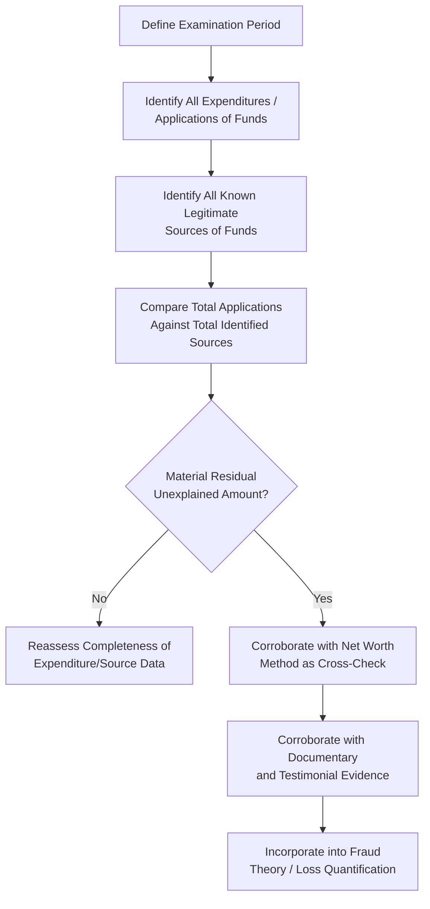

## Expenditure and Source-and-Application-of-Funds Methods

### Overview

The expenditure method and the source-and-application-of-funds method are indirect methods of proof used to establish unexplained income by comparing a subject's total expenditures (or total application of funds) against their known, legitimate sources of funds during a defined period. These methods are closely related to the net worth method but focus on cash flow during the period rather than the change in balance-sheet position, making them particularly useful when a subject spends illicit proceeds rather than accumulating them as net worth.

**Key Points**

- These methods are most effective when a subject dissipates illicit income through spending (lavish lifestyle, gambling, cash outlays) rather than converting it into traceable, appreciable assets.
- Unlike the net worth method, which relies on point-in-time balance sheet comparisons, expenditure-based methods focus on total funds expended or applied during the period, regardless of whether they resulted in retained assets.
- Both methods require careful, comprehensive identification of all expenditures/applications of funds and all sources of funds to avoid over- or understating unexplained income.

### The Expenditure Method

**Formula**

$$\text{Total Expenditures} - \text{Known Legitimate Income} = \text{Unexplained Income}$$

**Application Steps**

1. Identify and total all expenditures made by the subject during the period: living expenses, asset purchases, debt repayments, investments, and any other cash outlays.
2. Identify and total all known legitimate sources of funds available to cover those expenditures: salary, documented gifts, loan proceeds, savings drawn down from a verified prior balance, and other legitimate income.
3. Subtract legitimate sources from total expenditures; a material positive residual represents income from an unexplained source.

**Best Suited For**

- Subjects who spend rather than save illicit proceeds (cash-intensive fraud schemes, gambling-related dissipation, subjects supporting a lifestyle beyond documented means without corresponding asset accumulation).

### The Source-and-Application-of-Funds Method

**Formula**

$$\text{Total Application of Funds} - \text{Total Identified Sources of Funds} = \text{Funds from Unidentified Source}$$

**Application Steps**

1. Identify all **applications** of funds during the period: expenditures, asset acquisitions, debt reduction, and increases in cash/bank balances.
2. Identify all **sources** of funds during the period: opening cash/bank balances, income received, loan proceeds, asset sales, gifts, and any other identified inflow.
3. Compare total applications against total identified sources; a residual (applications exceeding identified sources) indicates funds derived from an unidentified — potentially illicit — source.

**Distinction from the Net Worth Method**

- The source-and-application-of-funds method is essentially a flow-based (cash flow) analysis for a specific period, whereas the net worth method is a stock-based (balance sheet) comparison between two points in time.
- The two methods are mathematically related and often used together as cross-checks: a well-executed net worth analysis, when the change in net worth is combined with expenditures, should reconcile with a properly performed source-and-application-of-funds analysis for the same period.

### Comparative Structure of the Three Indirect Methods

| Method | Basis of Analysis | Best Suited When |
| --- | --- | --- |
| Net worth method | Change in assets/liabilities between two points in time | Illicit funds converted into assets (property, investments) |
| Expenditure method | Total spending compared to legitimate income | Illicit funds spent/dissipated rather than saved |
| Source-and-application-of-funds method | Total funds applied compared to total funds sourced | General cash flow imbalance analysis; often used to corroborate the other two methods |

### Expenditure / Source-and-Application Method Workflow

### Data Sources for Expenditure and Application Analysis

- **Expenditures/Applications**: Bank and credit card statements, cash withdrawal patterns, real estate and vehicle purchase records, travel and entertainment records, loan repayment schedules, retirement/investment account contributions.
- **Sources**: Payroll records and tax filings, documented loan proceeds, verified gifts or inheritances (with supporting documentation), proceeds from sale of previously owned assets, opening cash/bank balances (verified as of the start of the period), and any other legitimate inflow.

### Handling Cash-Based Expenditures

- Cash expenditures are often the most difficult component to quantify, since they leave no direct bank or credit record.
- Common approaches include: analyzing ATM withdrawal patterns as a proxy for cash spending, applying documented or reasonably estimated cost-of-living figures for undocumented cash use, and corroborating lifestyle indicators through witness interviews (e.g., observations of cash-based spending habits, travel, or purchases).
- Any estimation methodology used for cash expenditures should be clearly documented and conservatively applied, since this component is often the most vulnerable to challenge.

### Common Challenges and Defenses

| Challenge | Examiner's Response |
| --- | --- |
| Unidentified/undocumented cash sources (e.g., "cash gifts," undisclosed side income) | Investigate corroborating evidence; absence of documentation does not automatically validate the claim but requires fair consideration |
| Overstated expenditure estimates | Use documented transaction data wherever possible; apply conservative, well-supported estimation methods only where necessary |
| Failure to account for a legitimate source (e.g., an undisclosed loan) | Conduct thorough source identification, including interviews and public record searches (liens, loan filings) |
| Double-counting or omission errors between the two methods | Cross-check calculations against a parallel net worth method analysis for consistency |

**[Inference]** As with other indirect methods, the specific evidentiary standards for estimation methodologies and how courts or tribunals weigh cash expenditure estimates vary by jurisdiction; examiners should confirm applicable standards with legal counsel for the relevant forum.

### Strengths and Limitations

**Strengths**

- Effective for cases where illicit proceeds are spent rather than retained as identifiable assets, complementing the net worth method's strengths in the opposite scenario.
- The source-and-application-of-funds method provides a useful cross-check mechanism to validate net worth method findings, increasing overall confidence in the conclusion.

**Limitations**

- Heavily dependent on the completeness and accuracy of expenditure and source data, particularly for cash-based transactions.
- Like the net worth method, it identifies the existence and magnitude of unexplained income but does not by itself establish the specific fraudulent scheme or mechanism that generated it.

### Example

An examiner investigating a procurement officer suspected of receiving kickbacks applies the expenditure method over a two-year period. Bank and credit card records show total identifiable expenditures (mortgage payments, credit card charges, tuition payments, and cash withdrawals treated as a proxy for cash spending) of $310,000. Documented legitimate income for the same period — salary and a modest documented family loan — totals $150,000, leaving $160,000 in unexplained expenditures. To corroborate this finding, the examiner separately performs a source-and-application-of-funds analysis for the same period, which independently calculates a comparable $155,000 gap between total funds applied (expenditures plus net increase in bank balances) and total identified sources, providing a consistent cross-check that strengthens confidence in the estimated unexplained income figure before it is incorporated into the broader fraud theory and corroborated with evidence regarding the officer's approval of specific vendor contracts during the same period.

**Next Steps**

- Net worth method
- Asset tracing and fund flow analysis
- Lifestyle analysis and indirect methods of proof
- Loss quantification and damages calculation
- Interviewing techniques for financial disclosure