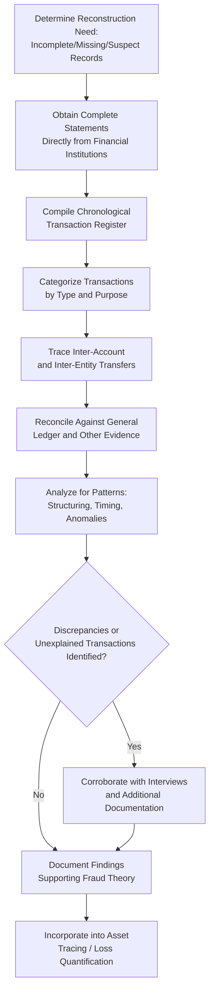

## Bank Record Reconstruction and Analysis

### Overview

Bank record reconstruction and analysis involves systematically gathering, organizing, and analyzing bank account records to reconstruct a subject's or entity's financial activity when complete records are unavailable, deliberately withheld, or destroyed, and to trace the flow of funds relevant to a fraud examination. This technique is foundational to indirect methods of proof (net worth, expenditure, and source-and-application-of-funds methods) and to direct fund-tracing efforts in asset misappropriation and money laundering cases.

**Key Points**

- Bank record reconstruction becomes necessary when a subject fails to maintain adequate records, destroys records, or when available records are incomplete, requiring the examiner to rebuild transaction history from external sources.
- Bank records are generally considered strong evidence because they are created and maintained by independent third-party financial institutions, reducing the risk of manipulation by the subject.
- Analysis extends beyond simple transaction listing to identifying patterns, tracing fund flows, and correlating banking activity with other evidence in the case.

### When Reconstruction Is Necessary

- The subject has failed to maintain or produce adequate financial records (common in cash-based or informally managed schemes).
- Original records have been destroyed, lost, or are claimed to be unavailable.
- The examiner suspects records provided by the subject are incomplete or altered.
- Multiple accounts, entities, or jurisdictions are involved, requiring consolidation of records from various financial institutions to form a complete picture.

### Sources for Reconstruction

**1. Financial Institution Records**

- Bank statements, canceled checks (front and back, to identify endorsements), deposit slips, wire transfer records, and account opening documentation (which often includes identification and signature cards useful for authentication purposes).
- Loan applications and financial statements submitted to the bank by the subject, which may contain self-reported financial information useful for comparison against other evidence.

**2. Third-Party Corroborating Records**

- Payee records from checks written (invoices, receipts corresponding to specific payments).
- Employer payroll records confirming direct deposit amounts and timing.
- Credit bureau reports identifying additional accounts or credit relationships not otherwise disclosed.

**3. Internal Organizational Records** (in an employment/organizational fraud context)

- General ledger entries corresponding to bank transactions, providing a cross-reference point for reconciliation.
- Internal approval and authorization records for disbursements.

### Reconstruction Methodology

**Step 1: Obtain Complete Bank Statements**

- Request full statements (not summaries) for the entire relevant period, including all pages and any transaction detail attachments.
- Where original statements are unavailable, obtain copies directly from the financial institution, which are generally considered reliable given their independent, third-party origin.

**Step 2: Organize Transactions Chronologically**

- Compile all deposits, withdrawals, transfers, and fees into a chronological transaction register, typically using spreadsheet or specialized forensic accounting software for larger volumes.

**Step 3: Categorize Transactions**

- Classify each transaction by type and, where identifiable, by purpose (e.g., payroll deposit, vendor payment, personal expense, transfer to another account).
- Flag transactions lacking clear documentation or explanation for further investigation.

**Step 4: Identify and Trace Inter-Account Transfers**

- Where a subject holds multiple accounts, trace transfers between them to avoid double-counting funds and to understand the complete picture of fund movement (a single deposit of illicit proceeds might be layered across several accounts).

**Step 5: Reconcile Against Other Evidence**

- Cross-reference reconstructed bank activity against the general ledger, known income sources, and other available evidence to identify discrepancies warranting further investigation.

**Step 6: Analyze for Patterns and Anomalies**

- Apply analytical techniques such as identifying structuring patterns (deposits/withdrawals kept just below reporting thresholds), unusual round-number transactions, or timing correlations with other events in the case (e.g., deposits shortly after suspicious disbursements from the victim organization).

### Bank Record Reconstruction Workflow

### Key Analytical Techniques Applied to Bank Records

| Technique | Purpose |
| --- | --- |
| Chronological transaction mapping | Establishes a complete timeline of account activity |
| Endorsement analysis (check backs) | Identifies who actually cashed/deposited a check, revealing true recipients |
| Structuring detection | Identifies deposits/withdrawals kept below regulatory reporting thresholds |
| Inter-account transfer tracing | Prevents double-counting and reveals fund layering across accounts |
| Deposit composition analysis | Breaks down deposits into cash vs. check components, useful for expenditure method cash estimation |
| Correlation with case timeline | Aligns banking activity with other evidentiary events (approvals, communications) |

### Multi-Account and Multi-Entity Reconstruction

- In more complex schemes, funds may flow through personal accounts, business accounts, and accounts held by related parties (family members, shell entities); reconstruction should map the complete network of accounts identified through the investigation.
- A consolidated fund-flow schedule or diagram (see related visualization techniques) is often prepared to present the complete picture once individual account reconstructions are complete.
- Legal process (subpoenas, court orders, or formal regulatory requests, depending on jurisdiction and forum) is typically required to obtain records for accounts not belonging to the organization initiating the examination.

### Legal and Practical Considerations

- Financial institutions are generally required to maintain records for a specified retention period; requests should be made promptly given potential record destruction after retention periods expire.
- Obtaining bank records belonging to a subject (rather than the victim organization's own accounts) typically requires legal process, and coordination with legal counsel is essential to determine the appropriate mechanism (subpoena, court order, regulatory request) for the relevant jurisdiction.
- **[Inference]** Specific legal mechanisms and requirements for compelling production of third-party bank records vary substantially by jurisdiction and forum; examiners should confirm current requirements with legal counsel before initiating such requests.

### Example

An examiner investigating suspected embezzlement at a local government unit discovers that reimbursement checks issued to a "consulting vendor" show no corresponding invoices on file. Bank statements obtained directly from the government's bank confirm the checks were issued and cleared; endorsement analysis on the canceled check images reveals the checks were endorsed and deposited into a personal account belonging to the approving finance officer's spouse, rather than any business account. Reconstructing the spouse's account activity (obtained through appropriate legal process) reveals a chronological pattern of deposits matching the timing and amounts of the disputed checks, followed shortly thereafter by transfers to a joint account held with the finance officer — establishing a clear fund flow that directly corroborates the fraud theory of self-dealing through a fictitious consulting arrangement.

**Related Topics**

- Net worth method
- Expenditure and source-and-application-of-funds methods
- Asset tracing and fund flow analysis
- Chain of custody requirements
- Visualization techniques for forensic findings