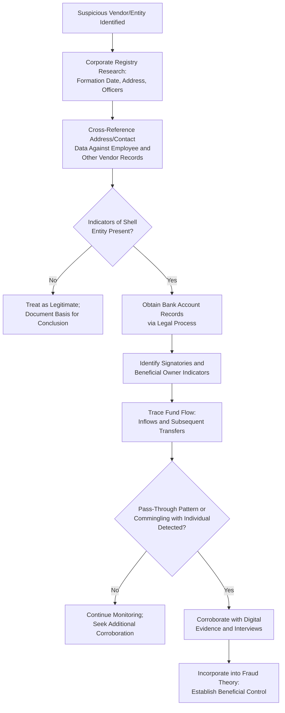

## Tracing Funds Through Shell Entities

### Overview

Tracing funds through shell entities involves identifying and following the movement of illicit proceeds as they pass through legally formed but often operationally hollow business structures — entities with little or no genuine business activity, employees, or physical presence — that are used to disguise the true origin, ownership, or destination of funds. This is a common technique in fraud schemes involving corruption, money laundering, procurement fraud, and asset misappropriation.

**Key Points**

- Shell entities are frequently layered (funds moved through multiple entities in sequence) specifically to obscure the audit trail and complicate tracing efforts.
- Identifying beneficial ownership — the real individual(s) who ultimately control or benefit from an entity — is central to tracing funds through shell structures.
- Tracing typically requires combining corporate registry research, financial record analysis, and digital/communications evidence to reconstruct the true flow of funds and control relationships.

### Characteristics of Shell Entities Used in Fraud Schemes

- Minimal or no genuine business operations, employees, or physical office presence beyond a registered address (which may be a residential address, mail drop, or shared registered-agent address).
- Generic or vague stated business purposes (e.g., "general consulting," "trading") without specific, verifiable services rendered.
- Recently formed, often shortly before receiving payments from the victim organization.
- Beneficial ownership obscured through nominee directors/shareholders, layered ownership structures, or registration in secrecy-favorable jurisdictions.
- Bank accounts opened shortly after formation, often at the same financial institution as related entities or individuals of interest.

### Methods for Identifying Shell Entities

**1. Corporate Registry Research**

- Review business registration filings for incorporation date, registered address, listed officers/directors, and any amendments to ownership or management.
- Compare registered addresses across multiple vendors/entities to identify shared addresses indicating common control.

**2. Vendor/Entity Master File Cross-Referencing**

- Compare vendor master file data (addresses, phone numbers, tax identification numbers, bank account details) against employee records and other vendor records to identify overlaps suggesting related-party or fictitious arrangements.

**3. Financial Institution Records**

- Bank account opening documentation often lists beneficial owners, signatories, and contact information that may not appear in public corporate filings.
- Identify signatories with authority over the account, who may reveal the true controlling party behind the shell entity.

**4. Digital and Communications Evidence**

- Email correspondence, browser history, or documents may reveal an individual's direct involvement in establishing or operating a purported independent entity.
- Metadata on documents purportedly created by the shell entity (e.g., invoices) may reveal authorship by an employee of the victim organization rather than an independent vendor.

**5. Beneficial Ownership Databases and Public Records**

- Where available, beneficial ownership registries, property records (to identify shared addresses with known individuals), and litigation/court records can help pierce through nominee arrangements.

### Fund Tracing Techniques Through Layered Entities

**1. Following the Money Trail**

- Trace each transaction from the point funds leave the victim organization, through each intermediate account or entity, to their ultimate destination or use (asset purchase, cash withdrawal, further transfer).

**2. Timing and Pattern Correlation**

- Identify patterns where funds are transferred out of a shell entity's account shortly after being received (a "pass-through" pattern), which is a strong indicator that the entity is not conducting genuine independent business activity.

**3. Commingling Analysis**

- Identify instances where shell entity funds are commingled with personal accounts or other entities' funds, which can help establish beneficial ownership and control despite formal separation.

**4. Percentage/Round-Number Transfer Analysis**

- In kickback schemes, transfers representing a consistent percentage of an underlying contract value moving from a shell entity to an individual can indicate a structured kickback arrangement.

### Fund Tracing Workflow Through Shell Entities

### Legal and Practical Challenges

- **Jurisdictional complexity**: Shell entities are sometimes formed in jurisdictions with limited beneficial ownership disclosure requirements, complicating identification of true owners.
- **Legal process requirements**: Obtaining bank records or corporate filings for entities not party to the examination typically requires formal legal process (subpoena, court order, or mutual legal assistance mechanisms for cross-border matters), requiring close coordination with legal counsel.
- **Nominee structures**: Some shell entities use nominee directors or shareholders who have no actual knowledge of or control over the entity's operations, requiring examiners to look beyond formal registration documents to establish actual beneficial control.
- **[Inference]** The availability of beneficial ownership information and the legal mechanisms for obtaining cross-border financial records vary significantly by jurisdiction; examiners handling matters involving multiple jurisdictions should engage legal counsel with relevant cross-border expertise early in the process.

### Red Flags Suggesting Shell Entity Involvement

| Red Flag | Explanation |
| --- | --- |
| Vendor address matches an employee's home address | Suggests employee control of the purported independent vendor |
| Newly formed entity immediately receiving large contracts | Lack of established track record inconsistent with contract award |
| Vague, non-specific invoice descriptions | Suggests fabricated billing rather than genuine services rendered |
| Rapid, near-total withdrawal of deposited funds | "Pass-through" account pattern inconsistent with ongoing legitimate operations |
| Multiple purportedly unrelated vendors sharing a registered agent or address | Suggests common control or coordinated fraudulent scheme |
| Payments to the entity correlate tightly with contracts approved by a specific individual | Suggests a kickback or self-dealing arrangement |

### Example

During an examination of suspected corruption in awarding IT service contracts at a local government unit, the examiner identifies that "TechServe Solutions," a vendor awarded three consecutive contracts, was registered only two months before its first contract award, using a registered address that corporate registry research reveals is a residential property. Cross-referencing this address against employee records shows it matches the home address of a relative of the IT department head who approved the contracts. Bank records obtained through appropriate legal process show that within days of receiving each contract payment, TechServe Solutions transferred approximately 40% of the funds to a personal account held by the IT department head, with the remainder largely withdrawn as cash shortly thereafter — a consistent percentage-based pass-through pattern that, combined with the shared address and lack of any independent business activity or staff at the registered location, supports a fraud theory of a kickback scheme facilitated through a shell vendor.

**Next Steps**

- Bank record reconstruction and analysis
- Net worth method
- Beneficial ownership investigation techniques
- Visualization techniques for forensic findings (link/flow of funds diagrams)
- Coordinating with legal counsel and stakeholders (cross-border legal process)