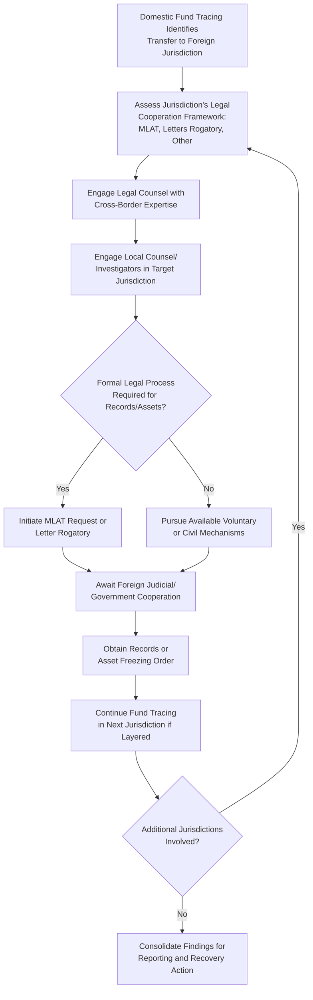

## Cross-Border Asset Tracing Challenges

### Overview

Cross-border asset tracing involves following illicit funds and assets as they move across national jurisdictions, a common feature of sophisticated fraud, corruption, and money laundering schemes designed specifically to exploit jurisdictional boundaries and complicate detection and recovery efforts. This area presents distinct legal, practical, and logistical challenges beyond those encountered in single-jurisdiction fraud examinations.

**Key Points**

- Perpetrators often deliberately route funds through multiple jurisdictions to exploit differences in banking secrecy, beneficial ownership disclosure, and legal cooperation frameworks.
- Effective cross-border tracing typically requires specialized legal mechanisms (mutual legal assistance, letters rogatory) and often local counsel or investigators in each relevant jurisdiction.
- The complexity and cost of cross-border tracing generally increase significantly with each additional jurisdiction and layering step involved.

### Common Cross-Border Fraud and Concealment Techniques

**1. Jurisdictional Layering**

- Funds are moved sequentially through accounts in multiple countries, each transfer adding complexity and jurisdictional legal barriers to tracing efforts.

**2. Use of Secrecy Jurisdictions**

- Funds are routed through jurisdictions with strict banking secrecy laws, limited beneficial ownership disclosure requirements, or minimal cooperation with foreign investigative requests.

**3. Trade-Based Money Laundering**

- Manipulation of international trade transactions (over/under-invoicing, multiple invoicing, misrepresentation of goods) to move value across borders while disguising its illicit origin.

**4. Use of Offshore Corporate Structures**

- Layered ownership through offshore holding companies, trusts, and foundations designed to obscure beneficial ownership.

**5. Cryptocurrency and Digital Asset Transfers**

- Use of virtual currencies and digital asset exchanges, which may offer additional layers of pseudonymity and can move value across borders outside traditional banking channels.
- **[Inference]** The specific regulatory treatment, exchange cooperation practices, and tracing methodologies for cryptocurrency vary considerably and continue to evolve; examiners should consult current specialist guidance and, where relevant, blockchain forensic specialists for up-to-date technical approaches.

### Legal Mechanisms for Cross-Border Evidence and Asset Recovery

**1. Mutual Legal Assistance Treaties (MLATs)**

- Formal government-to-government agreements enabling one country to request legal assistance (evidence gathering, asset freezing) from another in criminal matters.
- Typically slower than domestic legal process due to diplomatic and procedural formalities, but often the most reliable mechanism for compelling foreign evidence production.

**2. Letters Rogatory**

- Formal requests from a court in one country to a court in another, requesting judicial assistance (e.g., compelling testimony or document production), generally used where no MLAT exists between the relevant countries.

**3. International Asset Recovery Frameworks**

- Various multilateral frameworks and initiatives support cross-border cooperation on asset recovery, particularly in cases involving public corruption, though effectiveness varies by jurisdiction and the specific relationships involved.

**4. Private Civil Litigation and Freezing Orders**

- In some jurisdictions, civil remedies such as freezing injunctions (sometimes referred to as "Mareva injunctions" or equivalent) can be sought to prevent dissipation of assets pending resolution of underlying claims, operating independently of criminal process.

**[Inference]** The availability, terminology, and procedural requirements for these mechanisms vary substantially across jurisdictions and legal systems; examiners should engage legal counsel with specific cross-border and international asset recovery expertise before pursuing any of these avenues.

### Practical Challenges in Cross-Border Tracing

| Challenge | Description |
| --- | --- |
| Beneficial ownership opacity | Some jurisdictions do not require or publicly disclose beneficial ownership information |
| Banking secrecy laws | Certain jurisdictions restrict disclosure of account information absent formal legal process |
| Language and documentation barriers | Records may require translation and authentication for use in another jurisdiction |
| Timing and urgency mismatches | Formal legal cooperation mechanisms can take months, while assets may be moved quickly |
| Currency and valuation complexity | Multiple currencies and fluctuating exchange rates complicate consistent loss quantification |
| Inconsistent evidentiary standards | What qualifies as admissible or sufficient evidence may differ significantly between jurisdictions |
| Local investigator/counsel necessity | Effective tracing often requires engaging qualified local professionals familiar with domestic law and practice |

### Cross-Border Asset Tracing Workflow

### Coordination Considerations

- **Early legal engagement**: Given the time-sensitive nature of asset dissipation risk, legal counsel should assess cross-border strategy as early as possible once a foreign transfer is identified.
- **Local expertise**: Engaging local counsel and, where appropriate, local forensic accountants or investigators familiar with domestic legal requirements and business practices is often essential to effective tracing and evidence-gathering in the foreign jurisdiction.
- **Regulatory and law enforcement coordination**: Financial intelligence units, anti-corruption bodies, and law enforcement agencies in multiple countries may need to coordinate, particularly in significant public corruption or large-scale fraud matters.
- **Confidentiality across borders**: Data privacy laws in the foreign jurisdiction may restrict how information can be shared or transferred internationally, requiring careful legal analysis before evidence is transmitted across borders.

### Cost-Benefit and Proportionality Considerations

- Cross-border tracing efforts can be significantly more costly and time-consuming than domestic investigation, given legal process timelines, translation needs, and local professional fees.
- Organizations should weigh the estimated recoverable amount and the strength of available leads against the anticipated cost and duration of pursuing assets across multiple jurisdictions, particularly where formal government-to-government cooperation may take considerable time.
- Even where full asset recovery proves impractical, establishing the cross-border fund flow may still hold significant value for regulatory reporting, criminal referral, or reputational and governance purposes.

### Example

An examination into a local government infrastructure project reveals that a portion of contract payments made to a domestic "consulting" vendor were transferred shortly after receipt to an account held by a company registered in a foreign jurisdiction with limited beneficial ownership disclosure requirements. Domestic bank record analysis and corporate registry research establish the initial fund flow and shell entity characteristics, but further tracing into the foreign jurisdiction requires engaging local counsel there to assess what cooperation mechanisms are available, since no direct account access is possible without formal legal process. Given the government audit institution's interest in the matter, the examination team coordinates with legal counsel to evaluate whether a mutual legal assistance request or referral to an international anti-corruption cooperation channel is the more appropriate and timely avenue, while documenting the domestically established fund flow and shell entity indicators as the evidentiary basis supporting that request.

**Related Topics**

- Tracing funds through shell entities
- Bank record reconstruction and analysis
- Coordinating with legal counsel and stakeholders
- Money laundering typologies and detection
- Regulatory and law enforcement referral procedures