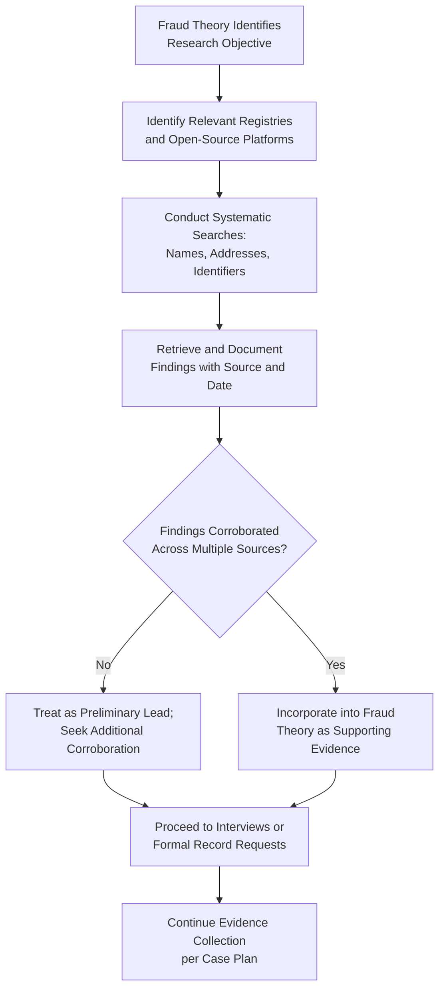

## Public Records and Open-Source Research

### Overview

Public records and open-source research (often referred to as open-source intelligence, or OSINT) involve gathering information from publicly accessible sources — government registries, court filings, property records, and online platforms — to support predication, corroborate fraud theories, identify relationships, and locate assets during a fraud examination. These sources are valuable because they are typically independent of the subject, low-cost to access, and often available early in an examination before more intrusive investigative steps are undertaken.

**Key Points**

- Public record and open-source research is generally among the earliest and least intrusive investigative steps, often conducted before interviews or more invasive evidence collection.
- These sources are independent third-party records, which tends to make them relatively reliable and difficult for a subject to alter after the fact.
- Findings from public records should be corroborated with other evidence rather than relied upon in isolation, since public records can occasionally contain outdated, incomplete, or ambiguous information.

### Categories of Public Records

**1. Business and Corporate Records**

- Business registration filings: incorporation date, registered agent, officers/directors, and registered address.
- Business licenses and permits, which may reveal the scope and legitimacy of a claimed business activity.
- Annual reports or filings required by corporate regulators, which may disclose ownership changes over time.

**2. Real Property Records**

- Property ownership records, transaction history, and recorded liens or mortgages.
- Property tax assessment records, useful for identifying asset value and ownership history relevant to net worth analysis.

**3. Court Records**

- Civil litigation filings, which may reveal prior disputes, judgments, or relevant business relationships.
- Criminal records, where legally accessible, relevant to background investigation of a subject.
- Bankruptcy filings, which can reveal financial distress consistent with a fraud motive (pressure) or disclose asset information.
- Divorce and family court filings, which sometimes include financial disclosures relevant to net worth or lifestyle analysis.

**4. Regulatory and Licensing Records**

- Professional licensing board records (verifying credentials or disclosing disciplinary history).
- Securities regulatory filings for publicly traded entities.
- Government procurement and contracting databases, useful for identifying a vendor's history of government contracts.

**5. Vital and Identity Records**

- Where legally accessible, records such as marriage records (useful for identifying related parties/spouses relevant to shell entity or beneficial ownership analysis).

### Open-Source Intelligence (OSINT) Sources

**1. Social Media Platforms**

- Publicly available posts, photos, and connections can provide lifestyle indicators (relevant to net worth/lifestyle analysis), relationship mapping, and location or timeline corroboration.

**2. News Media and Publications**

- Archived news articles, press releases, and industry publications can provide background information, corroborate timelines, or reveal reputational history.

**3. Websites and Business Directories**

- A vendor's or entity's website (or absence thereof) can be evaluated for consistency with claimed business scope and legitimacy — a claimed multi-million-dollar consulting firm with no functional website is a notable inconsistency.
- Business directory listings and customer/vendor review platforms may provide independent corroboration or contradiction of a business's claimed operations.

**4. Domain Registration Records**

- Website domain registration information (where publicly available) can sometimes reveal registrant details, registration dates, and hosting information relevant to establishing a shell entity's lack of genuine, longstanding operation.

**5. Academic, Professional, and Employment Records**

- Professional networking profiles and published credentials can be cross-referenced against claimed qualifications or employment history for verification purposes.

### Research Methodology

**Step 1: Define Research Objectives**

- Align research questions with the current fraud theory (e.g., verifying a vendor's legitimacy, identifying a subject's asset holdings, establishing relationships between parties).

**Step 2: Identify Relevant Sources**

- Determine which registries, court systems, and platforms are likely to hold relevant information based on the jurisdiction(s) and entities/individuals involved.

**Step 3: Conduct Systematic Searches**

- Search using multiple variations of names, addresses, and identifiers, since public records may contain inconsistent formatting or transcription.
- Document search terms, dates, and sources used to support reproducibility and evidentiary documentation.

**Step 4: Verify and Corroborate**

- Cross-reference findings across multiple independent sources before relying on any single public record as conclusive.
- Note the recency and currency of the information, since public records can be outdated.

**Step 5: Document Findings with Source Attribution**

- Retain screenshots, downloaded copies, or certified copies (where evidentiary weight requires it) of relevant public records, along with the retrieval date, since online content can change or be removed.

### Public Records and OSINT Research Workflow

### Common Applications in Fraud Examinations

| Application | Public Record / OSINT Source Used |
| --- | --- |
| Verifying vendor legitimacy | Business registration, website, licensing records |
| Identifying shell entity indicators | Registered address cross-referenced with property records |
| Establishing beneficial ownership links | Corporate filings, property records, marriage records |
| Supporting net worth/lifestyle analysis | Property records, vehicle registrations, social media |
| Assessing subject's financial pressure | Bankruptcy filings, civil judgments, liens |
| Background verification of a subject | Court records, professional licensing records |
| Locating assets for recovery | Property records, business ownership filings |

### Limitations and Cautions

- **Data currency**: Public records may not reflect the most recent ownership, address, or status changes, particularly where filing requirements have lag times.
- **Jurisdictional variability**: The scope, accessibility, and reliability of public records vary considerably across countries and even across sub-national jurisdictions.
- **Identity ambiguity**: Common names or similar identifying details can lead to misattribution; corroborating identifiers (date of birth, address, other unique details) should be used wherever possible.
- **Ethical and legal boundaries**: Research must remain within legally accessible public sources; examiners should not attempt to access private, password-protected, or otherwise restricted information without proper legal authority.
- **Not a substitute for formal evidence**: While useful for generating leads and corroboration, public record findings may need to be supplemented with certified copies or formal testimony to meet evidentiary standards in legal proceedings.

**[Inference]** The specific accessibility, format, and evidentiary weight afforded to particular categories of public records vary by jurisdiction; examiners should confirm current access rules and evidentiary requirements applicable to the relevant jurisdiction, ideally in consultation with legal counsel.

### Example

An examiner investigating a suspected fictitious vendor at a local government unit begins with open-source research before pursuing more intrusive steps. A search of business registration records shows the vendor was incorporated only three months before receiving its first government contract. The registered address, cross-referenced against property tax records, corresponds to a residential property rather than a commercial premises. The vendor's claimed website is found to be a single-page placeholder site registered anonymously just two weeks before the first contract was submitted for bidding. No professional licensing records exist for the specialized engineering services the vendor claims to provide. These independently corroborating open-source findings — none of which required contacting the subject or accessing restricted records — provide sufficient predication to justify escalating the matter to a formal fraud examination involving bank record requests and interviews.

**Related Topics**

- Predication and case initiation
- Tracing funds through shell entities
- Interviewing techniques (informational interviews)
- Net worth method
- Background investigation techniques