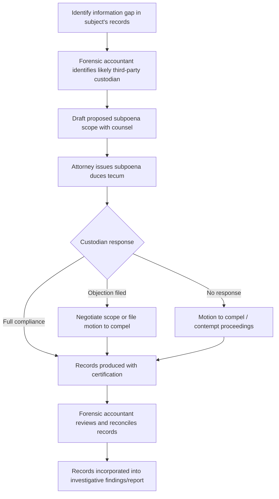

## Subpoenas and Third-Party Record Requests

### Overview

Subpoenas and third-party record requests are formal legal instruments used by forensic accountants, attorneys, and investigators to compel the production of documents, testimony, or both from parties who are not the primary subject of litigation or investigation but who possess information relevant to it. In forensic accounting engagements — fraud investigations, matrimonial disputes, shareholder litigation, bankruptcy proceedings, or regulatory enforcement — the target's own books and records are frequently incomplete, manipulated, or destroyed. Third-party records held by banks, vendors, customers, government agencies, and other independent custodians often provide the most reliable, unaltered evidentiary trail.

### Types of Subpoenas

**Subpoena ad testificandum**

Compels a witness to appear and give oral testimony, typically at a deposition, hearing, or trial.

**Subpoena duces tecum**

Compels the recipient to produce documents, records, or tangible evidence. This is the primary instrument forensic accountants rely on for obtaining third-party financial records. "Duces tecum" is Latin for "bring with you."

**Grand jury subpoena**

Issued in the context of a criminal investigation, typically by a prosecutor on behalf of a grand jury. These carry secrecy obligations (e.g., Rule 6(e) in U.S. federal practice) and are not subject to the same discovery rules as civil subpoenas.

**Administrative subpoena**

Issued by a regulatory or administrative agency (e.g., SEC, IRS, state attorney general) under statutory authority, often without prior judicial approval, though subject to later judicial enforcement if contested.

**Deposition subpoena**

Combines testimonial and document-production elements, commonly used in civil discovery to compel both a witness's appearance and the production of specified records at the deposition.

### Legal Framework and Authority

The specific procedural rules vary by jurisdiction, but the general framework in U.S. civil practice follows Federal Rule of Civil Procedure 45 (or state equivalents), which governs:

- Who may issue a subpoena (typically an attorney of record, acting as an officer of the court, or the clerk of court)
- Permissible scope (relevance to claims or defenses, proportionality to the needs of the case)
- Notice requirements to other parties before service on a nonparty
- Reasonable time for compliance
- Grounds for objection or motion to quash (undue burden, privilege, overbreadth, trade secret protection)
- Court's authority to enforce compliance via contempt

[Inference] Because subpoena practice is jurisdiction-specific and subject to frequent procedural amendment, forensic accountants should treat this section as a conceptual framework and defer to retained or supervising counsel for the applicable rules in any specific matter.

### The Forensic Accountant's Role

Forensic accountants generally do not issue subpoenas themselves — that authority rests with attorneys or the court — but they play a critical advisory and operational role:

- **Identifying targets**: Determining which third parties are likely to hold relevant records (banks, credit card processors, payroll providers, suppliers, customers, title companies, brokers, cloud storage providers)
- **Drafting requests**: Specifying the precise records needed, the relevant date ranges, and the format of production (native electronic files vs. PDF, metadata preservation)
- **Reviewing responses**: Assessing whether the production is complete, identifying gaps, and recommending follow-up or motions to compel
- **Chain of custody**: Documenting how records were received to preserve admissibility
- **Data reconciliation**: Cross-referencing subpoenaed records against the subject's internal books to identify discrepancies indicative of fraud

### Common Third-Party Record Sources in Forensic Engagements

**Key Points**

- **Financial institutions**: Bank statements, canceled checks, wire transfer records, signature cards, loan applications, safe deposit box access logs
- **Credit card processors**: Merchant statements, transaction detail, chargebacks
- **Payroll and HR providers**: Payroll registers, W-2/1099 filings, timekeeping records
- **Vendors and suppliers**: Invoices, purchase orders, shipping records — used to detect fictitious vendor schemes
- **Customers**: Accounts receivable confirmations, contracts, correspondence
- **Government agencies**: Tax filings (via IRS summons in criminal tax matters), property records, corporate filings, licensing records
- **Telecommunications and technology providers**: Call detail records, email metadata, cloud storage logs
- **Professional service providers**: Accountants' workpapers, attorneys' billing records (subject to privilege review), appraisers' reports

### Drafting Effective Document Requests

A well-drafted subpoena duces tecum in a financial investigation typically specifies:

1. **Precise identification of the custodian** — legal entity name, not just a trade name
2. **Defined terms** — clear definitions of "records," "documents," "communications," and any entity or individual names, including known aliases
3. **Date range** — bounded to the relevant period of the investigation, broad enough to capture pattern evidence but not so broad as to invite an overbreadth objection
4. **Specific record categories**, e.g.:
   - "All monthly bank statements for account number [XXX] from [date] to [date]"
   - "All canceled checks, front and back, drawn on account [XXX]"
   - "All wire transfer instructions, confirmations, and related correspondence"
5. **Format of production** — native format, searchable PDF, or requests for accompanying metadata (particularly important for electronically stored information, or ESI)
6. **Certification requirement** — a request that the custodian certify the records as true and accurate business records, which can support later admission under the business records exception to hearsay

### Business Records Exception and Admissibility

Records obtained via third-party subpoena are hearsay unless they fall within an exception. The most common basis for admission is the business records exception (e.g., Federal Rule of Evidence 803(6)), which requires that the records were:

- Made at or near the time of the event by someone with knowledge
- Kept in the course of regularly conducted business activity
- Made as a regular practice of that business
- Accompanied by testimony or certification of a qualified witness (often satisfied via a custodian's certification accompanying the subpoena response, avoiding the need for live testimony)

Forensic accountants should request a **certification of records** (sometimes called an affidavit or declaration of custodian) at the time records are produced, rather than attempting to obtain it after the fact, since custodians are often more responsive when the certification request accompanies the original subpoena.

### Objections and Challenges

Recipients of subpoenas commonly raise:

- **Undue burden or expense** — disproportionate cost or effort relative to the case's needs
- **Overbreadth** — requests not narrowly tailored to relevant time periods or subject matter
- **Privilege** — attorney-client privilege, work product, or statutory privileges (e.g., banking secrecy, medical privacy such as HIPAA in the U.S.)
- **Confidentiality/trade secrets** — commercially sensitive information, often resolved via a protective order limiting who may view the material
- **Improper service or jurisdiction** — technical defects in how or where the subpoena was served

When objections arise, the requesting party may need to negotiate a narrowed scope, seek a protective order, or file a **motion to compel** with the court.

### International and Cross-Border Considerations

Obtaining third-party records located outside the issuing court's jurisdiction is significantly more complex:

- **Hague Evidence Convention** — provides a mechanism for obtaining evidence abroad through Letters of Request (Letters Rogatory) between judicial authorities
- **Mutual Legal Assistance Treaties (MLATs)** — used in criminal matters to request assistance from foreign governments
- **Bank secrecy jurisdictions** — some jurisdictions impose strict statutory bars on disclosure of financial records absent a treaty mechanism or local court order
- **Data protection regimes** (e.g., GDPR in the EU) — may restrict transfer of personal data in response to a foreign subpoena, creating potential conflict-of-laws issues that require careful navigation with local counsel

[Inference] Cross-border evidence gathering timelines can extend from several months to over a year depending on the jurisdictions involved and the responsiveness of foreign central authorities; forensic accountants should factor this into engagement planning for international fraud matters.

### Practical Workflow Illustration

### Example

**Example**

In a suspected check-kiting investigation, the subject's internal accounting records show only net cash balances with no supporting detail. A subpoena duces tecum is issued to the subject's three banking institutions requesting:

- Signature cards for all accounts
- Monthly statements for a 24-month period
- Images of all deposited items and canceled checks
- Wire transfer logs

Reconciling the deposit and withdrawal patterns across the three banks reveals a circular pattern of inter-bank transfers timed to inflate available balances — a pattern invisible from the subject's internal general ledger alone.

### Practical Challenges

- **Record retention limits**: Many institutions purge records after a statutory retention period (often 5–7 years for banks), so timing of the request matters
- **Volume and format issues**: Large productions in inconsistent formats (paper scans, mismatched date ranges, redacted fields) require significant normalization before analysis
- **Cost-shifting disputes**: Nonparties may seek reimbursement for the cost of compliance, particularly for large ESI productions
- **Notification tipping off the subject**: In some jurisdictions, banks are required to notify account holders of a subpoena unless a court order seals it, risking evidence destruction or flight

### Conclusion

**Conclusion**

Subpoenas and third-party record requests are indispensable tools in forensic accounting because they reach evidence outside the subject's control and are less susceptible to manipulation than the subject's own books. Effective use requires close collaboration between the forensic accountant and legal counsel to properly scope requests, anticipate objections, secure admissible certifications, and integrate the resulting records into a coherent reconciliation and analysis of the underlying financial conduct.

**Related Topics**

- Chain of custody documentation for subpoenaed evidence
- The Hague Evidence Convention and Letters Rogatory in cross-border fraud investigations
- Business records exception and hearsay foundations in financial litigation
- Bank record analysis techniques (kiting, layering, structuring detection)
- Motions to compel and motions to quash in civil discovery
- Grand jury secrecy rules and their impact on parallel civil/criminal investigations
- Electronic discovery (e-discovery) protocols for financial data
- Protective orders and confidentiality designations in litigation