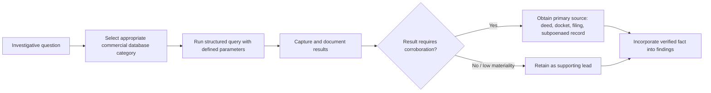

## Database and Commercial Information Sources

### Overview

Database and commercial information sources refer to the paid, subscription-based, and specialized proprietary platforms that forensic accountants and investigators use to supplement publicly available records and subpoenaed evidence. Unlike free public records or court-compelled third-party productions, these sources are typically licensed commercial products that aggregate, index, and cross-reference data from thousands of underlying public and private feeds — enabling faster, broader, and more structured searching than manually compiling the same information from原始 sources would allow.

### Rationale for Use in Forensic Engagements

- **Speed and aggregation**: A single query across a commercial database can replace dozens of manual searches across county recorders, state filing offices, and court dockets
- **Cross-referencing**: Many platforms link entities, individuals, addresses, and phone numbers to reveal relationships not obvious from any single source
- **Historical depth**: Commercial databases often retain historical snapshots (e.g., prior addresses, past corporate officers) no longer visible on current government websites
- **Audit trail**: Subscription platforms typically log search history, which can itself become discoverable and must be documented for engagement work papers

### Major Categories of Commercial/Database Sources

**Key Points**

- **Public records aggregators**: LexisNexis (Accurint), TransUnion TLO, Thomson Reuters CLEAR — compile property records, licenses, court filings, UCC filings, bankruptcy filings, and address histories into a single searchable interface
- **Business and corporate intelligence**: Dun & Bradstreet, S&P Capital IQ, Bloomberg Terminal, PitchBook — corporate structure, ownership, financials, credit ratings, and M&A activity
- **Legal research platforms**: Westlaw, LexisNexis — case law, dockets, litigation history, judgment and lien records
- **Media and news archives**: Factiva, NewsBank, ProQuest — historical news coverage useful for reputational and background research
- **Asset search and skip-tracing tools**: TLO, IRB Search, Tracers — vehicle registrations, watercraft/aircraft ownership, professional licenses
- **Sanctions and watchlist screening**: World-Check (Refinitiv), Dow Jones Risk & Compliance — OFAC, PEP (politically exposed persons), and adverse media screening for AML/KYC purposes
- **International corporate registries**: Orbis (Bureau van Dijk), OpenCorporates (aggregates many public registries) — cross-border ownership structures

### Selecting the Appropriate Source

The choice of database depends on the investigative objective:

| Objective | Typical Source Category |
| --- | --- |
| Locate an individual's current address | Public records aggregator (Accurint, TLO) |
| Verify corporate ownership structure | Business intelligence (D&B, Orbis, Capital IQ) |
| Screen a counterparty for sanctions exposure | Sanctions/watchlist screening (World-Check, Dow Jones) |
| Research litigation history of an individual or entity | Legal research (Westlaw, LexisNexis CourtLink) |
| Trace real property or vehicle ownership | Asset search tools (TLO, IRB Search) |
| Assess media coverage or reputational risk | News archives (Factiva, NewsBank) |

### Data Reliability and Verification

Commercial databases are compilations, not primary sources, and carry inherent limitations:

- **Latency**: Data may lag the underlying government filing by weeks or months
- **Match errors**: Common names or similar addresses can produce false positive linkages
- **Incomplete coverage**: Not all jurisdictions report to all aggregators; smaller counties or foreign jurisdictions may be underrepresented
- **Formatting inconsistency**: The same underlying fact (e.g., a corporate name) may appear differently across sources due to normalization differences

[Inference] Because of these limitations, findings from commercial databases are generally treated as investigative leads requiring corroboration from a primary source (the actual recorded deed, the actual court docket, the actual regulatory filing) before being relied upon in a report or testimony, rather than as conclusive evidence in themselves.

### Legal and Ethical Constraints

- **Permissible purpose requirements**: In the U.S., the Gramm-Leach-Bliley Act (GLBA) and the Fair Credit Reporting Act (FCRA) restrict access to certain financial and credit data to defined "permissible purposes" (e.g., fraud investigation, litigation, employment screening with consent); misuse can expose the investigator and firm to liability
- **Data privacy regimes**: GDPR (EU), and similar state-level privacy laws (e.g., CCPA/CPRA in California) impose restrictions on processing personal data obtained through these platforms, particularly for cross-border investigations
- **Licensing terms**: Commercial database subscriber agreements typically restrict redistribution of raw data outputs and may require disclosure of the source when data is used in a report or exhibit
- **Professional standards**: Forensic accounting standards (e.g., AICPA guidance, ACFE Code of Professional Ethics) generally require investigators to use only lawfully obtained information and to document the source and date of retrieval for any fact relied upon

### Documentation and Work Paper Standards

For any fact sourced from a commercial database, standard forensic work paper practice includes:

1. **Source identification** — exact platform and module used (e.g., "LexisNexis Accurint – Comprehensive Report")
2. **Query parameters** — search terms, filters, and date range used
3. **Date and time of retrieval** — since data can change or be updated
4. **Screenshot or export retention** — preserving the retrieved output as it appeared at the time, since live database content is not static
5. **Corroboration status** — noting whether the fact has been independently verified against a primary source

### Integration into the Investigative Workflow

### Example

**Example**

An investigator researching a suspected shell company network queries a business intelligence platform (e.g., Orbis) for the target entity's registered agent and officers. The platform reveals that three seemingly unrelated companies share the same registered agent address and one common officer. This linkage — invisible from any single company's public filing alone — becomes the basis for a targeted subpoena to the registered agent for the underlying incorporation documents, which then serve as the primary-source corroboration for the report.

### Cost and Access Considerations

- **Subscription vs. per-search pricing**: Some platforms (e.g., Westlaw, LexisNexis) charge flat subscription fees; others (e.g., certain skip-tracing tools) charge per-report fees, which affects engagement budgeting
- **Firm-level vs. individual licensing**: Larger forensic accounting firms typically maintain enterprise licenses across multiple platforms; sole practitioners may rely on pay-per-use services
- **Court and regulatory access**: Some databases (e.g., PACER for U.S. federal court dockets) are quasi-governmental and priced per page rather than subscription-based, occupying a middle ground between "public record" and "commercial database"

### Conclusion

**Conclusion**

Database and commercial information sources are a force multiplier in forensic investigations, enabling rapid aggregation and cross-referencing of data that would otherwise require weeks of manual record-gathering. Their proper use requires understanding each platform's coverage and limitations, complying with permissible-use and privacy laws governing the underlying data, and maintaining rigorous documentation so that database-derived leads can be traced back to, and corroborated by, primary source records before being relied upon in findings or testimony.

**Next Steps**

- Public records research techniques and primary-source verification
- Corporate structure tracing and beneficial ownership analysis
- OFAC/sanctions screening methodology in AML investigations
- PACER and court docket research for litigation history
- Permissible purpose documentation under FCRA/GLBA
- Cross-border data privacy considerations (GDPR) in international investigations
- Skip tracing and asset location techniques