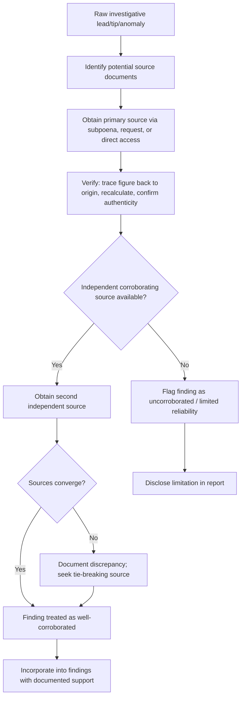

## Verifying and Corroborating Investigative Findings

### Overview

Verification and corroboration are the disciplines by which a forensic accountant converts raw investigative leads — tips, database hits, financial anomalies, witness statements — into reliable findings that can withstand adversarial scrutiny in litigation, regulatory proceedings, or criminal prosecution. A finding that has not been independently corroborated is, at best, a hypothesis; the credibility of a forensic accountant's entire report can be undermined if even one material fact is later shown to be unverified or incorrect.

### Distinguishing Verification from Corroboration

- **Verification**: Confirming that a specific fact is accurate, typically by tracing it back to its original, authoritative source (e.g., confirming a bank balance by obtaining the actual bank statement rather than relying on a summary schedule)
- **Corroboration**: Confirming a fact or conclusion through an independent second source that did not derive from the first (e.g., confirming an alleged cash payment through both a canceled check and a corroborating witness statement or vendor invoice)

[Inference] These terms are sometimes used interchangeably in practice, but the distinction matters conceptually: verification tests the internal accuracy of a single source, while corroboration tests convergence across independent sources — the latter is generally considered stronger evidence of reliability.

### The Hierarchy of Evidentiary Reliability

Forensic accountants generally apply an informal hierarchy when assessing the strength of a finding:

1. **Primary source, independently obtained** (e.g., a subpoenaed original bank record) — highest reliability
2. **Primary source, self-produced by subject** (e.g., the subject's own bank statement copy) — moderate reliability, subject to alteration risk
3. **Secondary compilation** (e.g., a commercial database summary, an internal management report) — lower reliability, requires further tracing
4. **Testimonial/anecdotal** (e.g., witness recollection, uncorroborated tip) — lowest standalone reliability, generally requires corroboration before being relied upon

### Core Verification Techniques

**Key Points**

- **Source tracing**: Following a number or assertion back to its origin document (e.g., tracing a general ledger entry back to the underlying invoice, purchase order, and proof of payment)
- **Independent confirmation requests**: Direct confirmation letters to third parties (banks, customers, vendors) — analogous to external audit confirmation procedures but often broader in scope in a forensic context
- **Cross-referencing multiple independent systems**: Comparing data that flows through separate systems that should reconcile (e.g., payroll system totals vs. general ledger payroll expense vs. tax filings)
- **Physical/on-site verification**: Site visits, inventory observation, or asset inspection to confirm existence and condition of assets referenced in records
- **Recalculation**: Independently recomputing figures (interest calculations, depreciation schedules, commission calculations) rather than accepting the subject's math
- **Metadata and forensic technical analysis**: Examining document metadata, file creation/modification timestamps, and digital forensic artifacts to assess authenticity of electronic records

### Corroboration Strategies

**Triangulation** — the practice of confirming a single fact through three or more independent, non-derivative sources — is the gold standard in forensic corroboration. For example, an allegation that an executive diverted company funds to a personal account might be corroborated through:

1. The company's bank records showing the outgoing wire (financial record)
2. The receiving bank's records showing deposit into the executive's personal account (independent third-party record via subpoena)
3. Email correspondence authorizing the transfer (documentary evidence)
4. A witness (e.g., a bookkeeper) who processed the transaction (testimonial evidence)

Each source is independent in origin; convergence across all four substantially increases confidence in the finding.

### Handling Contradictions and Inconsistencies

When sources conflict, forensic accountants should:

- Document the discrepancy explicitly rather than silently resolving it
- Assess the relative reliability of each conflicting source (primary vs. secondary, independent vs. subject-controlled)
- Seek an additional, tie-breaking source where possible
- Where the discrepancy cannot be resolved, disclose it transparently in the findings with appropriate qualification rather than asserting an unsupported conclusion

[Inference] Courts and triers of fact often scrutinize how an expert handled contradictory evidence; a report that acknowledges and reasons through inconsistencies is generally viewed as more credible than one that appears to have ignored them.

### Chain of Custody and Documentary Integrity

Verification is only as strong as the documented chain of custody behind it:

- Recording how, when, and from whom each document was obtained
- Preserving original files/native formats where possible, rather than working exclusively from copies
- Using hash values (e.g., MD5, SHA-256) to confirm that an electronic file has not been altered since collection
- Maintaining an evidence log that tracks custody transfers between investigators, counsel, and any third-party experts

### Interview and Witness Corroboration

- **Structured interview techniques**: Using open-ended questions before specific ones to avoid contaminating a witness's independent recollection
- **Statement consistency checks**: Comparing a witness's statement against contemporaneous documents (calendars, emails, expense reports) for consistency
- **Multiple witness comparison**: Interviewing multiple witnesses independently (without allowing them to compare accounts beforehand) to assess whether accounts converge or diverge
- **Documenting exactly what was said**: Contemporaneous notes or recorded statements (where legally permissible) to preserve an accurate record, since memory of interviews can be challenged

### Statistical and Analytical Corroboration Tools

- **Benford's Law analysis**: Testing whether the distribution of leading digits in a data set conforms to expected patterns, as a screening tool to flag potentially fabricated numbers for further investigation (a screening indicator, not standalone proof)
- **Ratio and trend analysis**: Comparing findings against industry benchmarks or the entity's own historical trends to assess plausibility
- **Data analytics and reconciliation software**: Using tools such as ACL, IDEA, or SQL-based queries to test 100% of a population for anomalies rather than relying on sampling alone, strengthening the corroborative weight of a conclusion drawn from large data sets

### Documentation Standards for the Work Paper File

For each material finding, a well-documented forensic work paper should reflect:

1. The original source(s) of the finding
2. The verification steps performed and their results
3. Any corroborating sources identified and their degree of independence
4. Any contradictions encountered and how they were addressed
5. The examiner's assessed confidence level in the finding, where appropriate

### Verification and Corroboration Workflow

### Example

**Example**

An investigator receives a tip that a controller inflated revenue by recording fictitious sales at period-end. Verification steps: (1) trace the disputed sales entries to underlying invoices and shipping documents; (2) confirm with the shipping carrier (independent third party) whether shipments actually occurred on the stated dates; (3) send accounts receivable confirmations directly to the named customers; (4) compare the pattern of disputed entries against Benford's Law expectations as a statistical screen. If the carrier confirms no shipment occurred and the named customers deny the invoices, the finding is corroborated by two independent third-party sources plus a statistical anomaly indicator — a substantially stronger evidentiary basis than the original tip alone.

### Common Pitfalls

- **Confirmation bias**: Selectively seeking corroboration for a preferred conclusion while discounting contradictory evidence
- **Over-reliance on subject-provided documents**: Treating the subject's own records as sufficient verification without independent confirmation
- **Single-source reliance**: Presenting a finding as established fact when only one source supports it
- **Inadequate documentation**: Failing to preserve the verification trail, making the finding difficult to defend under cross-examination

### Conclusion

**Conclusion**

Verification and corroboration transform investigative suspicion into defensible fact. A rigorous forensic accountant systematically traces findings to primary sources, seeks independent corroboration through triangulation, transparently documents contradictions, and maintains a clear evidentiary chain — ensuring that conclusions presented in a report or testimony can withstand challenge from opposing experts, counsel, and the trier of fact.

**Related Topics**

- Chain of custody documentation for investigative evidence
- Benford's Law and other data analytics screening techniques
- Witness interview methodology in forensic investigations
- Expert witness report writing and defensibility standards
- Subpoenas and third-party record requests
- Digital forensics and metadata analysis for document authenticity
- Confirmation bias and cognitive pitfalls in fraud examination