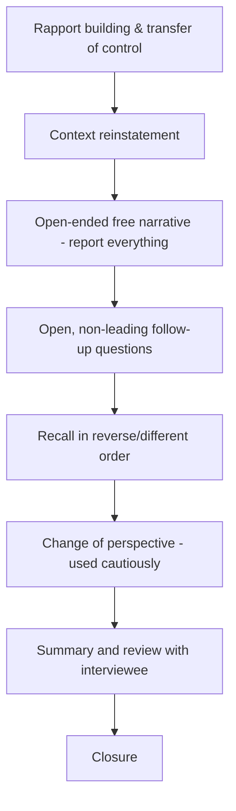

## Cognitive Interview Techniques

### Overview

The Cognitive Interview (CI) is a structured, evidence-based interviewing methodology developed by psychologists Ronald Fisher and Edward Geiselman in the 1980s, grounded in cognitive psychology principles about memory encoding and retrieval. Originally developed for law enforcement eyewitness interviews, the technique has been widely adopted in forensic accounting and fraud examination contexts because it maximizes the completeness and accuracy of information recalled by witnesses, victims, and — in modified form — cooperative interview subjects, without relying on suggestive or leading questioning that could taint testimony.

### Theoretical Foundations

The Cognitive Interview rests on two core memory principles:

- **Encoding specificity principle**: Memory retrieval is most effective when the retrieval context matches the context in which the memory was originally encoded. Mentally reinstating the environmental and emotional context of an event improves recall.
- **Multiple memory trace theory**: An event is stored in memory through multiple interconnected pathways or "traces." A single retrieval attempt (e.g., one direct question) may fail to access certain traces, whereas approaching the same memory from different angles or retrieval cues can surface additional, non-redundant details.

[Inference] Because these principles are drawn from general cognitive psychology research rather than accounting-specific literature, forensic accountants applying CI techniques typically do so in collaboration with, or under training from, forensic interview specialists rather than relying solely on self-study.

### The Four Core Mnemonic Components

**Key Points**

1. **Mental reinstatement of context**: Asking the interviewee to mentally recreate the physical environment, emotional state, and sequence of events surrounding the incident before recounting details (e.g., "Think back to that morning — where were you sitting, what could you see, how were you feeling?")
2. **Report everything (unrestricted reporting)**: Encouraging the interviewee to report all details, even those that seem trivial, unrelated, or uncertain, rather than self-censoring based on assumptions about relevance
3. **Recall in different orders**: Asking the interviewee to describe the sequence of events in reverse order, or starting from a different anchor point, to disrupt reliance on a rehearsed or scripted narrative and surface additional details
4. **Change perspective**: Asking the interviewee to describe the event from another vantage point (e.g., "What might someone standing near the door have seen?") to encourage a more comprehensive reconstruction — used cautiously, as this component carries higher risk of introducing speculation if not carefully framed

### The Enhanced Cognitive Interview (ECI)

The Enhanced Cognitive Interview, a later refinement, adds social-dynamics components to the original four cognitive components:

- **Rapport building**: Establishing trust and reducing anxiety before substantive questioning begins
- **Transfer of control**: Explicitly communicating to the interviewee that they are the source of information and should drive the pace and content of the narrative, with the interviewer facilitating rather than directing
- **Focused retrieval and concentration**: Minimizing external distractions and encouraging sustained concentration during recall
- **Witness-compatible questioning**: Tailoring question sequencing to follow the witness's own natural narrative structure rather than a rigid, interviewer-imposed checklist

### Structure of a Cognitive Interview

A typical CI/ECI session follows this general structure:

1. **Introduction and rapport building** — establishing a non-threatening environment and explaining the interview process
2. **Explanation of transfer of control** — informing the interviewee that they should provide as much detail as possible, including uncertain or seemingly minor information
3. **Open-ended narrative phase** — using context reinstatement, then allowing uninterrupted free recall
4. **Probing/follow-up questioning phase** — using open-ended, non-leading follow-up questions tied to details the interviewee has already raised, followed by the varied-retrieval techniques (reverse order, change of perspective) as appropriate
5. **Review phase** — summarizing back what was understood and inviting correction or additions
6. **Closure** — ending on a neutral or positive note, leaving the door open for follow-up

### Application in Forensic Accounting Interviews

Forensic accountants apply CI/ECI principles primarily when interviewing:

- **Victim witnesses** — e.g., employees who observed suspicious transactions or were pressured to participate in a scheme
- **Cooperative third parties** — e.g., vendors or customers who may have relevant recollections of unusual billing or payment arrangements
- **Whistleblowers** — where maximizing complete, accurate, spontaneous recall is critical, and where the interview itself may later be scrutinized for suggestiveness

[Inference] CI/ECI techniques are generally considered less suited, or require significant adaptation, for interviews of a hostile or deceptive subject — such interviews more often draw on structured admission-seeking frameworks (e.g., the Reid Technique or similarly structured models) rather than the memory-enhancement focus of the Cognitive Interview, since the objective shifts from maximizing honest recall to detecting deception and obtaining an admission.

### Question Formulation Principles

- **Open-ended over closed-ended**: "Tell me what happened next" rather than "Did you see him take the check?"
- **Avoiding leading questions**: Questions should not presuppose facts not yet stated by the interviewee (e.g., avoid "How much cash did he take?" before the interviewee has stated cash was taken)
- **Avoiding compound questions**: Asking one thing at a time to avoid confusing recall or allowing the interviewee to answer only part of a multi-part question
- **Pause tolerance**: Allowing silence after a question rather than filling it, since interviewees often provide additional detail after an initial pause

### Advantages Documented in the Research Literature

- Increased quantity of accurate details recalled compared to standard interview techniques
- [Unverified] The magnitude of improvement varies across studies and populations, and forensic accountants should not assume a fixed percentage improvement applies uniformly across all interview contexts
- Reduced susceptibility to interviewer-induced suggestion or contamination of memory
- Improved interviewee cooperation and rapport, which can improve willingness to provide sensitive information

### Limitations and Practical Constraints

- **Time-intensive**: CI/ECI interviews typically take considerably longer than structured, closed-question interviews, which can be a constraint in time-limited investigations
- **Training requirement**: Effective application requires specific training; improperly executed attempts (e.g., poorly framed perspective-change questions) can introduce the very suggestibility risks the technique is designed to avoid
- **Not suited to all subjects**: Less effective with reluctant, hostile, or actively deceptive interviewees, and requires adaptation for cognitively impaired or very young interviewees
- **Documentation burden**: The free-recall, non-linear nature of CI output requires careful interviewer note-taking or recording to later organize the information into a coherent chronological record for the investigative file

### Cognitive Interview Structure Illustration

### Example

**Example**

An accounts payable clerk reports feeling uneasy about a series of vendor payments approved by a manager. Rather than immediately asking "Did your manager tell you to approve fake invoices?" (a leading, closed question), the interviewer uses context reinstatement: "Walk me through a typical day when one of these invoices came across your desk — where were you sitting, what did the invoice look like, what did your manager say?" The clerk, prompted to reconstruct the full context, spontaneously recalls a specific instruction that was never directly asked about — an instruction to "process this one quickly without the usual PO match" — a detail that becomes a significant investigative lead precisely because it emerged unprompted.

### Interviewer Skill Requirements

- Active listening without interrupting the narrative flow
- Comfort with silence and patience during recall pauses
- Ability to formulate follow-up questions using the interviewee's own words and framework rather than imposing investigator assumptions
- Awareness of one's own potential to introduce bias through tone, body language, or question phrasing

### Conclusion

**Conclusion**

Cognitive interview techniques provide forensic accountants with a scientifically grounded methodology for maximizing accurate, spontaneous recall from cooperative witnesses while minimizing the risk of contaminating testimony through suggestive questioning. When properly applied — with adequate training, patience, and disciplined question formulation — CI/ECI methods can surface investigative details that standard interview approaches would miss, strengthening the overall evidentiary foundation of a forensic accounting engagement.

**Related Topics**

- Admission-seeking interview frameworks for hostile or deceptive subjects
- Interview documentation and note-taking standards
- Verifying and corroborating investigative findings
- Behavioral indicators of deception in interviews
- Interviewer bias and cognitive pitfalls in fraud examination
- Whistleblower interview protocols and protections
- Structuring interview plans in fraud investigations