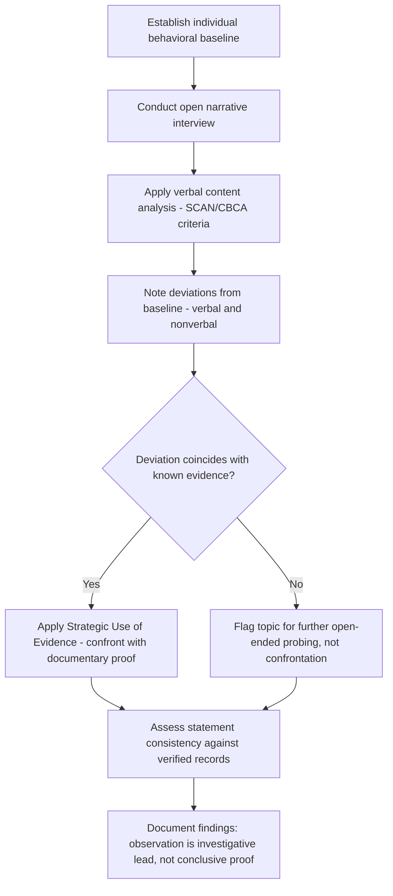

## Behavioral Analysis and Deception Detection

### Overview

Behavioral analysis and deception detection encompass the frameworks and techniques used by forensic interviewers to assess the credibility of statements made during interviews. In forensic accounting contexts, these techniques are applied when interviewing subjects suspected of fraud, witnesses whose candor is uncertain, or parties whose statements conflict with documentary evidence. It is important to state at the outset that behavioral deception detection is a contested and heavily critiqued field within psychological research, and forensic accountants should understand both its practical utility as an investigative tool and its significant scientific limitations.

### Scientific Context and Limitations

[Unverified] A substantial body of psychological research, including meta-analyses of deception-detection studies, has found that reliance on nonverbal behavioral cues (e.g., gaze aversion, fidgeting, crossed arms) to detect deception performs only marginally better than chance for most observers, and that many popularly cited "cues to deception" lack robust, consistent scientific support across studies and populations.

Because of this, contemporary forensic and law enforcement training has shifted emphasis toward:

- **Verbal content analysis** rather than nonverbal cues, as speech content has generally shown somewhat more reliable association with deception in the research literature than body language
- **Establishing a behavioral baseline** for the specific individual, rather than applying universal cue checklists
- **Structured interviewing frameworks** designed to increase the cognitive load on a deceptive subject, making deception harder to sustain, rather than relying on passive observation alone

[Inference] Given this research context, forensic accountants should treat behavioral observations as one input among several — never as standalone proof of deception or truthfulness — and should avoid asserting in a report or testimony that a specific gesture or behavior "proves" dishonesty.

### Baseline Behavior Assessment

Before assessing potentially deceptive responses, skilled interviewers first establish a subject's baseline behavior during neutral, low-stakes questioning (e.g., biographical questions the subject has no motive to falsify). Deviations from this individual baseline — rather than comparison to generic universal cues — form the basis for identifying moments warranting further probing.

- **Verbal baseline**: typical speech rate, word choice, level of detail, use of qualifiers
- **Nonverbal baseline**: typical posture, eye contact patterns, gesture frequency
- **Physiological baseline** (where observable): breathing rate, visible tension

### Verbal Content Analysis Techniques

**Key Points**

- **Statement Analysis / Scientific Content Analysis (SCAN)**: Examining the structure of a written or verbal statement for linguistic indicators such as pronoun usage (e.g., avoidance of "I"), verb tense shifts, unnecessary connectors, or missing information around key events
- **Criteria-Based Content Analysis (CBCA)**: Assessing statements for the presence of criteria associated with genuine, experienced memories (e.g., contextual embedding, unusual details, spontaneous corrections, admissions of lack of memory) versus fabricated accounts, which tend to lack such richness
- **Linguistic markers of deception researched in the literature include**: increased use of distancing language, fewer self-references, more negative emotion words, and reduced cognitive complexity — [Unverified] though findings vary across studies and contexts, and no single marker is considered diagnostic in isolation
- **Response latency and consistency checks**: Comparing the timing and consistency of responses to the same question asked in different ways or at different points in the interview

### Nonverbal and Paraverbal Observations (Used Cautiously)

While no longer treated as reliable standalone deception indicators in contemporary research-informed practice, deviation from an individual's established baseline in the following areas may still prompt further (not conclusive) inquiry:

- Changes in speech rate, pitch, or fluency (e.g., increased pauses, filler words) at specific points in the narrative
- Shifts in posture or gesture frequency correlated with specific topics
- Inconsistency between verbal content and displayed affect (e.g., describing a distressing event with incongruent emotional tone)

[Inference] Because these observations are context-dependent and subject to significant individual and cultural variation, they are best used to identify topics warranting additional follow-up questions rather than as conclusions in themselves.

### Structured Interview Frameworks

**Cognitive Load Approaches**

Rather than passively observing for cues, structured techniques deliberately increase the cognitive burden on a deceptive subject, on the theory that fabrication requires more cognitive effort than truthful recall:

- Asking the subject to recount events in reverse chronological order
- Asking for unexpected, highly specific details that a truthful account would readily supply but a fabricated one would not
- Maintaining eye contact requirements or dual-task conditions during recall (used in some research protocols)

**Strategic Use of Evidence (SUE) Technique**

A structured approach in which the interviewer withholds known evidence early in the interview, allows the subject to give a full free narrative, and only later confronts inconsistencies between the subject's statement and the evidence already in hand — testing whether the subject's account is consistent with facts they did not know the interviewer possessed.

**PEACE Model**

A widely referenced UK-originated interviewing framework (Preparation and Planning, Engage and Explain, Account, Closure, Evaluate) that emphasizes open, non-confrontational, evidence-based interviewing over accusatory or confrontational models, and integrates verbal-consistency checking as part of the "Account" and "Evaluate" phases.

### Statement Consistency and Documentary Cross-Checking

The most evidentially robust form of "deception detection" available to a forensic accountant is not behavioral observation at all, but the systematic comparison of a subject's statements against independently verified documentary and financial evidence:

- Comparing successive statements from the same interview (or across multiple interviews) for internal consistency
- Comparing the subject's account against email, calendar, and transaction records that predate the interview
- Identifying statements that are contradicted by evidence the subject was unaware the investigator possessed (leveraged via the SUE technique above)

### Deception Detection and Analysis Workflow

### Example

**Example**

During an interview, a procurement manager describes approving a vendor contract using confident, detailed, spontaneous language throughout most of the interview — matching their established baseline. When asked specifically about a particular contract renewal, however, the manager's response shows a marked shift: shorter answers, increased use of distancing language ("that process was handled," rather than "I handled that process"), and a noticeably longer pause before answering. This deviation, on its own, is not treated as proof of wrongdoing — but it prompts the interviewer to apply the Strategic Use of Evidence technique, later presenting an email showing the manager's direct involvement in that specific renewal, revealing a material inconsistency between the statement and documentary evidence.

### Practical Constraints and Ethical Considerations

- **No legal admissibility of behavioral opinion as deception proof**: Courts generally do not permit an expert to testify that a witness was lying based on behavioral observation alone; behavioral analysis functions as an investigative tool guiding further inquiry, not as evidence presented to a trier of fact
- **Risk of confirmation bias**: Investigators who suspect a subject risk interpreting ambiguous behavior as confirmatory, underscoring the need for structured, criteria-based methods over impressionistic judgment
- **Cultural and individual variation**: Norms around eye contact, emotional expression, and speech patterns vary significantly across cultures and individuals, and applying culturally-specific cue assumptions universally can produce unreliable or discriminatory conclusions
- **Neurological and situational confounds**: Anxiety from the interview setting itself, medical conditions, language barriers, or trauma responses can produce behaviors superficially similar to deception cues without any relationship to actual dishonesty

### Conclusion

**Conclusion**

Behavioral analysis and deception detection are best understood by the forensic accountant as investigative lead-generation tools rather than as reliable, standalone proof of dishonesty. Contemporary best practice emphasizes individualized baseline comparison, verbal content and consistency analysis, and structured techniques such as the Strategic Use of Evidence, always in conjunction with — and ultimately subordinate to — independent documentary corroboration. Findings from behavioral observation should inform further investigative questioning, not substitute for the verified financial and documentary evidence that ultimately supports a defensible forensic conclusion.

**Related Topics**

- Cognitive interview techniques
- The PEACE model and evidence-based interviewing frameworks
- Statement analysis and Criteria-Based Content Analysis (CBCA)
- Verifying and corroborating investigative findings
- Interviewer bias and cognitive pitfalls in fraud examination
- Admission-seeking interviews and confrontation strategies
- Cross-cultural considerations in investigative interviewing