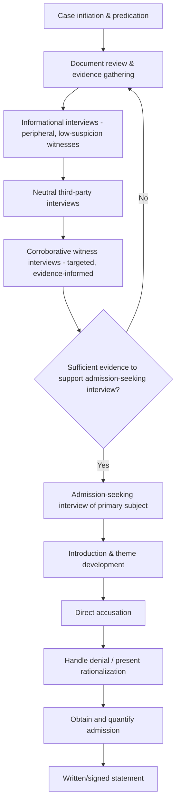

## Structuring the Fraud Examination Interview

### Overview

Structuring a fraud examination interview refers to the deliberate planning and sequencing of interview stages within a fraud investigation so that information is gathered systematically, non-confrontationally where possible, and in a manner that preserves both evidentiary value and legal defensibility. Unlike ad hoc questioning, a properly structured fraud examination interview follows established methodological sequences — most notably the framework popularized by the Association of Certified Fraud Examiners (ACFE) — that move interviews from broad, non-threatening inquiry toward more specific and, where warranted, confrontational questioning only at the appropriate stage.

### The Interview Sequencing Principle

A foundational principle of fraud examination methodology is interview sequencing: interviews are generally conducted in order from those least likely to be involved in the fraud to those most likely to be involved, and from the periphery of the organization toward the center of the suspected scheme. This sequencing:

- Allows the investigator to gather background and corroborating information before confronting a primary suspect
- Reduces the risk of a suspect being tipped off prematurely, which could result in evidence destruction or flight
- Builds a documentary and testimonial foundation that strengthens the investigator's position before any admission-seeking interview

### The Four Categories of Fraud Examination Interviews (ACFE Framework)

**Key Points**

1. **Informational interviews**: Conducted with individuals who have relevant knowledge but no suspected involvement (e.g., IT staff, accounting clerks, department heads) — purely fact-gathering in nature
2. **Interviews of neutral third parties**: Conducted with individuals outside the organization who may have relevant knowledge (e.g., vendors, customers, former employees) — also primarily fact-gathering, though may require greater rapport-building since the party has no organizational obligation to cooperate
3. **Interviews of corroborative witnesses**: Conducted with individuals believed to have information that supports or contradicts a specific hypothesis about the fraud — more targeted than informational interviews, often informed by findings from earlier interviews and document analysis
4. **Admission-seeking interviews**: Conducted with the subject(s) believed to be responsible for the fraud, structured specifically to obtain an admission or explanation — conducted last, after all other available evidence has been gathered

### Pre-Interview Planning

Before any fraud examination interview, effective planning typically includes:

- **Defining the interview objective**: What specific facts or admissions is this interview intended to establish?
- **Reviewing all available documentary evidence**: Ensuring the interviewer is fully versed in relevant financial records, emails, and prior statements before the interview
- **Selecting interview location and setting**: Neutral, private, and free from interruption; setting can affect both rapport and the perceived formality of the interview
- **Determining who should be present**: Considering legal requirements (e.g., union representation rights, right to counsel in certain jurisdictions or contexts) and whether a second interviewer/note-taker is appropriate
- **Anticipating legal and procedural constraints**: Employment law considerations (e.g., constructive discharge risk, discrimination claims), Miranda-type warnings if law enforcement involvement exists, and company policy on internal investigations
- **Preparing a flexible question outline** rather than a rigid script, allowing the interviewer to adapt to the interviewee's responses

### Structure of the Informational/Corroborative Interview

1. **Introduction** — establishing purpose (often described in general terms, e.g., "a routine review of certain transactions") and setting expectations for confidentiality
2. **Open, non-threatening background questions** — establishing rapport and a behavioral/verbal baseline
3. **Chronological or topical narrative questioning** — allowing the interviewee to describe processes, events, or observations in their own words
4. **Specific follow-up questions** — probing details raised in the narrative phase
5. **Closing** — summarizing key points, thanking the interviewee, and leaving the door open for follow-up contact

### Structure of the Admission-Seeking Interview

The admission-seeking interview is structurally distinct and is conducted only when the investigator has already assembled substantial supporting evidence. A widely referenced sequence (drawing on structured frameworks such as those taught by the ACFE) includes:

1. **Introduction** — the interviewer identifies themselves, states the general purpose without pre-committing to an accusation, and establishes the interview's voluntary nature (subject to applicable legal requirements)
2. **General/theme development question** — introducing the general subject matter and observing the subject's initial reaction
3. **Transition to a direct accusation** — a clear, direct statement that the subject is believed to be involved
4. **Observation of subject's response** — assessing initial denial, silence, or partial admission
5. **Handling of denials** — allowing the subject to deny, but not accepting the denial as final; redirecting back to the evidence rather than arguing
6. **Presentation of rationalization or "face-saving" alternatives** — offering the subject a way to explain their conduct that preserves some dignity (a technique intended to facilitate admission, not to minimize the seriousness of the conduct in the ultimate report)
7. **Obtaining the admission** — securing an initial acknowledgment, which is then developed into specific, detailed facts
8. **Reinforcing/quantifying the admission** — obtaining specifics: dates, amounts, methods, other parties involved
9. **Written/signed statement** — where appropriate and legally permissible, memorializing the admission in the subject's own words

[Inference] Because admission-seeking interviews carry significant legal risk (false confession risk, employment law exposure, potential violation of investigative protocols), most fraud examination training strongly emphasizes that these interviews should be conducted only by individuals with specific training, ideally in coordination with legal counsel, and that the specific script should be adapted to jurisdiction-specific legal requirements rather than applied mechanically.

### Legal and Procedural Safeguards

- **Right to counsel/representation**: Varies by jurisdiction, employment context (unionized vs. non-union), and whether law enforcement is involved
- **Voluntariness**: Interviews (outside formal law enforcement custody) are generally expected to be voluntary; coercive tactics can render any resulting statement inadmissible or expose the organization to liability
- **Documentation requirements**: Contemporaneous notes, and where legally permissible, audio/video recording, to preserve an accurate record of what was said and how the interview was conducted
- **Employment law considerations**: Interviews that lead to termination or discipline must be conducted in a manner consistent with applicable labor and employment law to avoid wrongful termination or defamation claims

### Interview Sequencing and Structure Illustration

### Example

**Example**

In a suspected accounts payable fraud, the investigation team first interviews the IT administrator (informational) to understand system access controls, then interviews two vendors (neutral third parties) to confirm invoice authenticity, then interviews the accounts payable supervisor (corroborative witness) whose account either supports or contradicts the documentary findings. Only after this sequence — and after confirming through subpoenaed bank records that funds were routed to an account linked to the AP clerk — does the team conduct an admission-seeking interview with the clerk, structured to present the accumulated evidence and offer a face-saving rationalization ("Sometimes people find themselves in a difficult financial situation and make a decision they wouldn't otherwise make") to facilitate a truthful account.

### Common Structural Pitfalls

- **Interviewing the primary suspect too early**, before sufficient corroborating evidence is gathered, which can tip off the subject and compromise the broader investigation
- **Failing to adapt the interview plan** when new information emerges mid-interview
- **Conflating informational and admission-seeking approaches**, introducing accusatory framing into what should be a neutral fact-gathering interview, which can compromise witness cooperation and later credibility
- **Inadequate documentation of interview structure and content**, weakening the defensibility of any resulting findings or admissions

### Conclusion

**Conclusion**

Structuring the fraud examination interview around a deliberate sequence — from informational and corroborative interviews through to a carefully planned admission-seeking interview — allows investigators to build a robust evidentiary foundation before confronting a suspect, while minimizing legal risk and preserving the credibility of any resulting findings. Adherence to established sequencing principles, combined with careful pre-interview planning and legal safeguards, is central to conducting a defensible and effective fraud examination.

**Next Steps**

- Admission-seeking interview techniques and legal safeguards
- Cognitive interview techniques
- Behavioral analysis and deception detection
- Verifying and corroborating investigative findings
- Employment law considerations in internal investigations
- Written statement and confession documentation standards
- The fraud examiner's role in coordinating with legal counsel and law enforcement