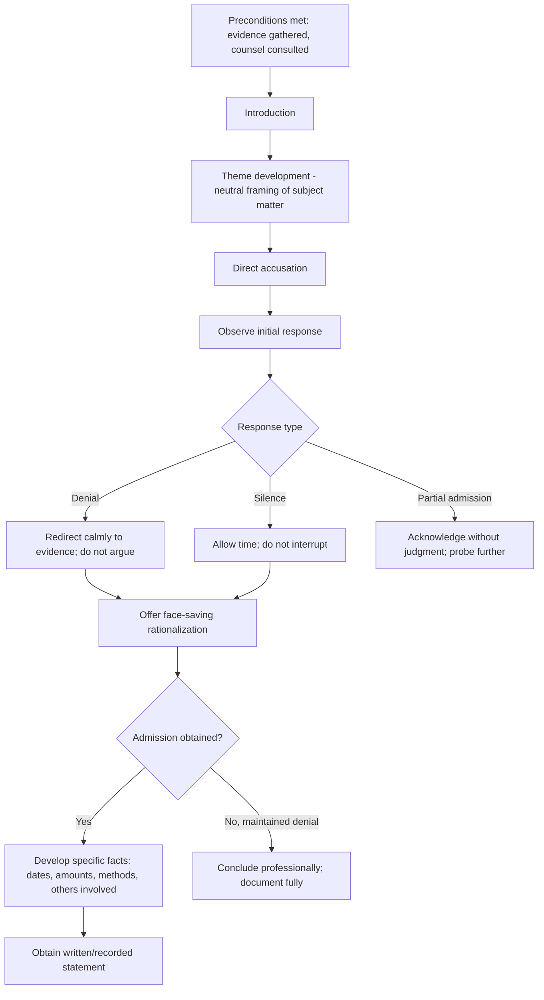

## Admission-Seeking Interview Techniques

### Overview

Admission-seeking interview techniques are structured methodologies used by fraud examiners in the final stage of an investigation, once sufficient corroborating evidence has been gathered, to obtain a truthful acknowledgment of wrongdoing from the individual believed responsible. Unlike informational or corroborative interviews, which are non-confrontational fact-gathering exercises, the admission-seeking interview is deliberately structured to move a subject from denial toward disclosure, while remaining within legal and ethical boundaries designed to prevent coercion and false confession.

### Preconditions for Conducting an Admission-Seeking Interview

Admission-seeking interviews are generally conducted only after:

- All other available evidence-gathering steps (document review, informational interviews, corroborative witness interviews) have been substantially completed
- The investigator has assembled sufficient documentary and testimonial evidence to support the belief that the specific subject is involved
- Legal counsel has been consulted regarding applicable employment law, evidentiary, and procedural requirements
- A determination has been made regarding whether law enforcement involvement changes the applicable legal framework (e.g., custodial interrogation warnings)

[Inference] Because these interviews carry substantial legal exposure if mishandled, most professional guidance (e.g., ACFE training materials) treats the decision of when and how to conduct an admission-seeking interview as one that should involve legal counsel rather than being made unilaterally by the accounting or investigative team.

### The Structured Sequence

**Key Points**

**1. Introduction**

The interviewer establishes their identity and the general purpose of the interview without immediately revealing the full extent of the evidence held, while complying with any applicable disclosure or representation-rights requirements.

**2. Statement of the Issue (Theme Development)**

The interviewer introduces the general subject matter under investigation in neutral terms, observing the subject's initial verbal and behavioral reaction without yet making a direct accusation.

**3. Direct Accusation**

A clear, unambiguous, declarative statement that the subject is believed to be involved in the matter under investigation. This step is deliberately direct — a technique intended to move past initial evasive or ambiguous responses and elicit a clear reaction (denial, silence, or admission).

**4. Observation of the Initial Response**

The interviewer observes and notes whether the subject offers a denial, remains silent, becomes defensive, or begins to make admissions — without interrupting prematurely.

**5. Managing Denials**

Denials are common and expected at this stage. Rather than arguing or repeating the accusation aggressively, the interviewer typically:

- Allows the subject to voice the denial
- Redirects the conversation back to the evidentiary basis for the accusation, calmly and factually
- Avoids escalating into confrontation or hostility, which research and professional guidance associate with increased risk of a subject shutting down entirely or, conversely, with unreliable statements

**6. Overcoming Resistance / Presenting Rationalizations**

A central technique in structured admission-seeking methodology is offering the subject a face-saving rationalization or "theme" that makes admission psychologically easier — without minimizing the legal seriousness of the underlying conduct in the investigator's own assessment or eventual report. Examples of rationalization themes include:

- Situational pressure ("Many people find themselves under significant financial pressure and make decisions they later regret")
- Diffusion of blame ("It sounds like this may have started as something small that grew over time")
- Comparison to others ("You're certainly not the only person who has ever found themselves in this position")

[Inference] These rationalization themes are a psychological facilitation technique, not a factual concession by the investigator; a well-drafted final report distinguishes between the language used to obtain the admission and the objective severity of the conduct as established by the evidence.

**7. Obtaining the Initial Admission**

The objective at this stage is simply to obtain any acknowledgment of involvement — even a minimal or qualified one — which can then be developed further. The interviewer avoids demanding full detail immediately, since a small initial admission is often easier to obtain than a complete confession.

**8. Reinforcing and Developing the Admission**

Once an initial admission is obtained, the interviewer moves to establish specific facts: dates, dollar amounts, methods used, duration of the scheme, and identification of any other individuals involved. This transforms a general acknowledgment into a detailed, corroborable account.

**9. Written or Recorded Statement**

Where legally permissible and appropriate, the interviewer seeks to have the subject provide a statement in their own words — handwritten, typed, or recorded — to memorialize the admission in a form that reduces the risk of later recantation or dispute about what was said.

### Handling Specific Interview Dynamics

- **Silence**: A subject's silence following a direct accusation is not itself an admission and should not be treated as such; the interviewer allows appropriate time before proceeding, since premature follow-up can interrupt an emerging admission
- **Anger or hostility**: Managed by remaining calm and non-confrontational, redirecting focus back to the facts rather than engaging emotionally
- **Partial admissions**: Common; the interviewer should acknowledge the partial admission without expressing judgment, and use it as a foundation to probe further detail
- **Complete denial maintained throughout**: If the subject maintains denial despite the evidence presented, the interview should be concluded professionally, with all responses documented; a maintained denial does not permit escalation into coercive tactics

### Legal and Ethical Boundaries

- **Prohibition on coercion**: Threats, promises of leniency beyond the interviewer's actual authority, extended isolation, or deceptive claims about evidence that does not exist raise significant legal and ethical concerns and can render a resulting admission unreliable or inadmissible
- **Voluntariness**: In non-custodial, non-law-enforcement contexts, the interview should be voluntary; the subject's right to leave, decline to answer, or seek representation should be respected as required by applicable law and organizational policy
- **Miranda-type warnings**: Where law enforcement is directly involved and the interview constitutes custodial interrogation, jurisdiction-specific constitutional/statutory warning requirements apply; this determination requires legal counsel input and is highly fact- and jurisdiction-specific
- **Employment law exposure**: Interviews connected to potential termination carry risk of wrongful termination, defamation, or constructive discharge claims if mishandled, underscoring the importance of HR and legal coordination
- **Risk of false confession**: The psychological literature on interrogation and false confessions documents that certain techniques, particularly when combined with prolonged questioning, can in some circumstances produce unreliable admissions; [Unverified] the specific risk factors and their magnitude are the subject of ongoing academic debate, and forensic accountants relying on these techniques should stay informed of evolving professional guidance and jurisdictional legal standards.

### Documentation Standards

- Contemporaneous notes recording the sequence of the interview, key statements, and the interviewer's observations
- Recording (audio/video) where legally permitted and organizationally appropriate, to create an objective record
- Prompt preparation of a written memorandum summarizing the interview if a recording was not made
- Preservation of any written statement obtained, including the circumstances under which it was prepared and signed

### Admission-Seeking Interview Structure

### Example

**Example**

Having established through subpoenaed bank records and corroborative witness interviews that a warehouse manager diverted proceeds from scrap-metal sales to a personal account, the investigator conducts an admission-seeking interview. After a direct accusation, the manager initially denies involvement. The interviewer calmly redirects: "The bank records show these deposits going into an account in your name — I'd like to understand the circumstances." When the manager remains silent, the interviewer offers a rationalization theme: "Sometimes these things start small, almost as an oversight, and then become harder to walk back." The manager then acknowledges "borrowing" funds with intent to repay — an initial admission that the interviewer develops into specific transaction dates and amounts, ultimately memorialized in a signed written statement.

### Common Pitfalls

- **Accusing before sufficient evidence is gathered**, risking a hardened denial with no evidentiary leverage to overcome it
- **Escalating into hostility or threats**, which raises legal risk and may harden resistance rather than facilitate disclosure
- **Accepting a vague admission without developing specifics**, leaving the finding insufficiently corroborated for reporting or legal purposes
- **Failing to involve legal counsel** at the appropriate stage, particularly where termination, law enforcement referral, or litigation is anticipated
- **Inadequate contemporaneous documentation**, undermining the reliability and defensibility of the interview record

### Conclusion

**Conclusion**

Admission-seeking interview techniques provide a structured, evidence-based framework for obtaining truthful acknowledgments of fraud once sufficient supporting evidence has been assembled. Proper application requires careful sequencing — theme development, direct accusation, managed handling of denial, face-saving rationalization, and systematic development of the admission into specific, corroborable facts — all conducted within firm legal and ethical boundaries designed to prevent coercion and preserve the reliability and admissibility of the resulting statement.

**Related Topics**

- Structuring the fraud examination interview
- Behavioral analysis and deception detection
- Legal safeguards in internal investigations (Miranda warnings, right to representation)
- Written statement and confession documentation standards
- False confession risk factors in interrogation research
- Coordinating fraud investigations with legal counsel and law enforcement
- Employment law considerations following an admission of misconduct