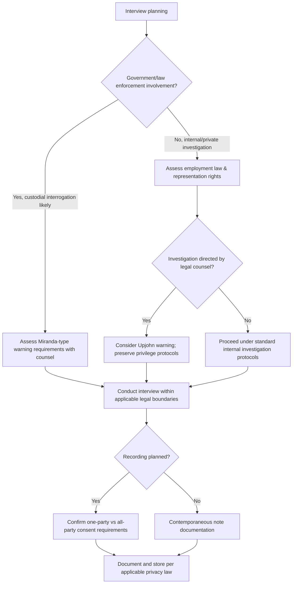

## Legal and Ethical Considerations in Interviewing

### Overview

Legal and ethical considerations in interviewing govern the boundaries within which fraud examiners and forensic accountants may conduct interviews of witnesses, victims, and suspects. These considerations arise from multiple, sometimes overlapping legal frameworks — constitutional protections, employment law, privacy law, and professional ethics codes — and their application varies substantially by jurisdiction, by whether the interview is connected to a criminal investigation or a purely internal/civil matter, and by the employment status and representation rights of the interviewee. Because a legally or ethically flawed interview can compromise an entire investigation — rendering statements inadmissible, exposing the organization to liability, or undermining the credibility of the fraud examiner as a witness — this area is treated as foundational to interview practice rather than a peripheral compliance concern.

### Constitutional and Due Process Considerations

**Miranda-type warnings and custodial interrogation**

In jurisdictions with constitutional protections analogous to the U.S. Fifth Amendment, warnings regarding the right to remain silent and the right to counsel are generally required only when an interview constitutes "custodial interrogation" by a government agent — meaning the interviewee is both in custody (not free to leave) and being questioned by, or at the direction of, law enforcement or another government actor.

[Inference] Private-sector fraud examiners conducting internal investigations are generally not considered government agents and are therefore typically not required to issue Miranda-type warnings; however, this determination can change if law enforcement is directing or closely coordinating with the internal investigation, and the specific threshold is fact-intensive and jurisdiction-dependent, warranting legal counsel review whenever law enforcement involvement exists or is anticipated.

**Voluntariness requirement**

Regardless of whether formal warnings are legally required, admissions obtained through interviews are generally more defensible — and less susceptible to later challenge — when the interview was conducted voluntarily, without coercion, threats, or promises the interviewer lacks authority to make.

### Employment Law Considerations

**Key Points**

- **Right to representation**: In some jurisdictions and under certain collective bargaining agreements, unionized employees have a recognized right to request representation during an investigatory interview that the employee reasonably believes could result in discipline (commonly referred to in U.S. labor law contexts as "Weingarten rights"); non-union employees generally do not have an equivalent statutory right in most U.S. jurisdictions, though this varies internationally
- **Wrongful termination and constructive discharge risk**: Interviews conducted in a manner that is unreasonably coercive, prolonged, or humiliating can support a subsequent wrongful termination or constructive discharge claim, independent of whether the underlying fraud allegation is substantiated
- **Defamation risk**: Statements made during or after an interview — particularly accusatory statements made in the presence of third parties, or premature disclosure of suspected wrongdoing before an investigation is complete — can expose the organization to defamation claims if the allegations are not ultimately substantiated
- **Discrimination and retaliation claims**: Interview selection, tone, and treatment must be applied consistently to avoid claims that the investigation targeted an individual based on a protected characteristic, or that the investigation was retaliatory (e.g., following a protected whistleblower disclosure)

### Privacy Law Considerations

- **Recording consent requirements**: Jurisdictions vary significantly between "one-party consent" (only one participant needs to consent to a recording) and "all-party consent" (every participant must consent); recording an interview without complying with applicable consent law can itself constitute a legal violation and may render the recording unusable
- **Data protection regulations**: Where interview notes, recordings, or transcripts contain personal data, regulations such as GDPR (EU) or similar state/national privacy statutes may govern how that information is stored, who may access it, and how long it may be retained
- **Cross-border interviews**: Interviews conducted with subjects or witnesses located in a different jurisdiction than the investigating entity may trigger the privacy and labor law requirements of the interviewee's home jurisdiction, not only the investigator's

### Whistleblower Protections

Many jurisdictions provide statutory protection against retaliation for individuals who report suspected fraud or misconduct (e.g., under U.S. federal statutes such as the Sarbanes-Oxley Act and Dodd-Frank Act for securities-related whistleblowing, or equivalent protections in other jurisdictions). When interviewing a whistleblower or an individual who may later be characterized as one:

- Confidentiality commitments should be clearly communicated and, to the extent legally possible, honored
- Interview conduct and any subsequent employment actions must be carefully documented to demonstrate they are unrelated to the protected disclosure, in the event of a later retaliation claim
- Some frameworks impose specific confidentiality or anti-retaliation obligations that begin as soon as a report is received, before any formal interview occurs

### Professional and Ethical Standards

Fraud examiners operating under professional certifications (e.g., the ACFE's Certified Fraud Examiner credential) and forensic accountants operating under professional accounting bodies' codes of conduct are generally bound by ethical standards that include:

- **Objectivity and independence**: Approaching each interview without a predetermined conclusion, and avoiding tactics designed to produce a desired answer rather than a truthful one
- **Confidentiality**: Maintaining the confidentiality of information obtained during interviews, subject to applicable legal disclosure obligations
- **Prohibition on illegal or unethical tactics**: Certified fraud examiner ethics codes typically prohibit interview practices that violate the law or that would be considered coercive, deceptive beyond generally accepted investigative technique, or discriminatory
- **Competence**: Conducting interviews only within the examiner's demonstrated competence, or engaging appropriately qualified specialists (e.g., licensed interrogators, legal counsel) for higher-risk admission-seeking interviews

### Attorney-Client Privilege and Work Product Considerations

- **Upjohn warnings**: In matters where an investigation is conducted at the direction of legal counsel (particularly in the U.S. corporate context, following the principles established in *Upjohn Co. v. United States*), interviewers often provide a warning clarifying that the attorney-client privilege covering the interview belongs to the company, not to the individual employee being interviewed, and that the company may choose to waive that privilege
- **Preserving privilege**: Interview notes and reports prepared at the direction of counsel, and for the purpose of providing legal advice, may be protected by attorney-client privilege or work product doctrine; involving non-legal personnel or disclosing findings outside the privileged group can risk waiving that protection
- [Inference] Because privilege rules are jurisdiction-specific and can be waived inadvertently through careless handling of interview materials, forensic accountants working alongside counsel typically follow specific protocols established by that counsel regarding distribution and labeling of interview memoranda.

### Cross-Cultural and International Considerations

- Norms regarding directness, hierarchy, and appropriate interview conduct vary significantly across cultures, and techniques developed in one legal/cultural context (e.g., North American admission-seeking frameworks) may require adaptation for interviews conducted internationally
- Local labor law protections for interviewees can differ substantially from the investigator's home jurisdiction, requiring local legal consultation for multinational investigations

### Legal and Ethical Framework Overview

### Example

**Example**

A multinational company's internal investigation into suspected procurement fraud involves interviewing an employee based in a jurisdiction with all-party consent recording laws and statutory works-council notification requirements. Legal counsel directs the investigation, and the interviewer opens with an Upjohn-style warning clarifying that privilege belongs to the company. Because the interviewee is a member of a labor union, the interviewer confirms in advance the employee's right to request representation, and given the all-party consent jurisdiction, the interviewer obtains explicit recorded consent from the employee before any audio recording begins — each of these steps required by a different overlapping legal framework applicable to the same interview.

### Common Pitfalls

- **Assuming a single jurisdiction's rules apply universally**, particularly in multinational investigations
- **Failing to distinguish informational interviews from custodial interrogation contexts** when law enforcement becomes involved partway through an internal investigation
- **Recording without confirming applicable consent law**, risking both an inadmissible recording and a separate legal violation
- **Premature disclosure of suspicions to third parties**, creating defamation exposure before findings are substantiated
- **Failing to coordinate with legal counsel early enough** to preserve privilege over investigative materials

### Conclusion

**Conclusion**

Legal and ethical considerations in interviewing form the boundary conditions within which all fraud examination interview techniques must operate. Because these considerations span constitutional, employment, privacy, whistleblower-protection, and professional-ethics domains — and vary significantly by jurisdiction and by the nature of law enforcement involvement — fraud examiners and forensic accountants must coordinate closely with legal counsel, particularly before conducting admission-seeking interviews, recording conversations, or reporting suspected wrongdoing that could implicate defamation, retaliation, or privilege concerns.

**Related Topics**

- Admission-seeking interview techniques
- Structuring the fraud examination interview
- Whistleblower protections and anti-retaliation statutes
- Attorney-client privilege and work product doctrine in internal investigations
- Cross-border investigation and data privacy compliance (GDPR)
- Professional ethics codes for certified fraud examiners
- Documentation standards for interview memoranda under privilege protocols