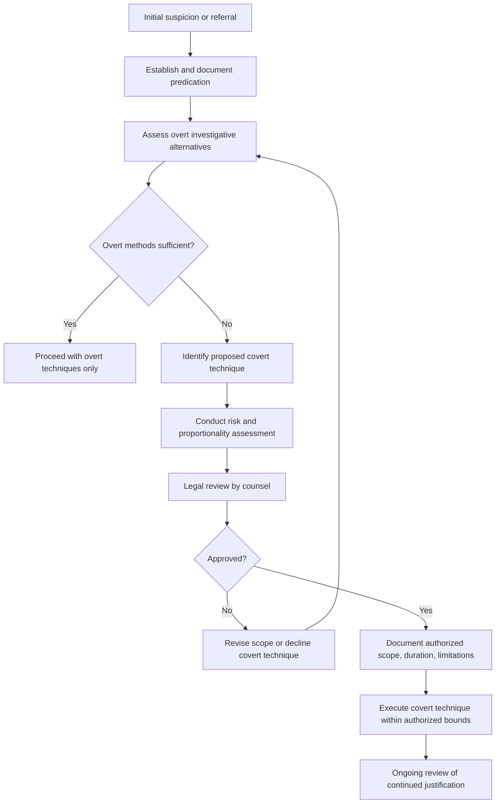

## Planning and Authorizing Covert Investigative Techniques

### Overview

Planning and authorizing covert investigative techniques concerns the governance framework, decision-making process, and legal review required before a forensic accounting or fraud examination team deploys covert methods — such as surveillance, undercover inquiry, pretext communications, or monitored data collection — as part of an investigation. Because covert techniques inherently involve concealment from the subject and carry heightened legal, ethical, and reputational risk compared to overt investigative methods, professional practice treats the authorization and planning stage as the primary risk-control point, generally more heavily scrutinized than the execution of the technique itself.

### Rationale for Formal Authorization Processes

Covert techniques are typically reserved for circumstances where overt methods (direct interviews, document requests, subpoenas) are assessed as insufficient or likely to compromise the investigation — for example, where advance notice would allow evidence destruction, where a scheme is ongoing and observation of continued conduct is evidentially valuable, or where a subject would not otherwise cooperate. Because of the elevated risk profile, most professional and organizational frameworks require:

- **Documented predication**: A reasoned, evidence-based justification for why covert methods are necessary and proportionate to the suspected conduct, rather than a default first resort
- **Tiered authorization**: Escalating approval requirements depending on the invasiveness of the technique (e.g., a supervisor may authorize routine open-source monitoring, while undercover operations or communications interception may require senior management, in-house counsel, outside counsel, or in some cases judicial authorization)
- **Proportionality assessment**: Weighing the investigative value of the technique against the potential harm to privacy, reputation, and legal exposure

### The Predication Standard

**Key Points**

- Fraud examination methodology (as articulated in ACFE guidance) emphasizes that any investigation — and especially one involving covert techniques — should be based on **predication**: a reasonable, articulable basis to believe that fraud has occurred, is occurring, or will occur, sufficient to justify a prudent, professional investigation
- Predication is distinguished from mere suspicion, rumor, or a "fishing expedition"; covert techniques deployed without adequate predication carry substantially elevated legal risk (e.g., invasion of privacy claims) and reputational risk if the investigation becomes known
- The predication basis should be documented **before** covert techniques are authorized, not reconstructed afterward, since contemporaneous documentation materially strengthens the defensibility of the investigation if later challenged

### Categories of Covert Techniques Requiring Authorization Planning

- **Physical surveillance**: Observation of a subject's movements, activities, or associations in public or publicly observable settings
- **Pretext interviews/communications**: Contacting a subject or third party under a false identity or pretense to elicit information
- **Undercover operations**: Placing an investigator (or cooperating source) into an ongoing relationship or environment (e.g., posing as a customer, vendor, or employee) to observe conduct directly
- **Electronic monitoring**: Covert review of email, computer activity, or communications systems, distinct from routine, disclosed IT monitoring policies
- **Trash retrieval ("trash covers")**: Collection and review of discarded materials, where legally permissible in the applicable jurisdiction
- **Use of confidential informants/cooperating witnesses**: Individuals providing ongoing information from within an organization or scheme, often without the knowledge of other participants

### Legal Framework Considerations

- **Wiretapping and electronic communications statutes**: Many jurisdictions impose strict criminal and civil liability for intercepting communications (calls, emails, messages) without appropriate consent or authorization; consent requirements (one-party vs. all-party) vary significantly by jurisdiction, as do exceptions for employer monitoring of company systems
- **Private investigator licensing requirements**: Many jurisdictions require covert surveillance to be conducted only by licensed private investigators, and unlicensed surveillance can expose the organization and individual investigator to civil and criminal liability
- **Trespass and privacy tort exposure**: Surveillance conducted from a location the investigator is not legally entitled to occupy, or that captures activity in a space with a reasonable expectation of privacy (e.g., inside a private residence), can give rise to trespass or invasion of privacy claims
- **Entrapment considerations**: In undercover operations, care must be taken not to induce conduct that would not otherwise have occurred, which can undermine both the legal and ethical basis of the resulting evidence
- **Employment and labor law**: Covert monitoring of employees may be subject to notice requirements, works council consultation (in certain jurisdictions), or collective bargaining agreement provisions

[Inference] Because the legal permissibility of specific covert techniques varies substantially by jurisdiction and by the nature of the relationship between investigator and subject (employee, third party, member of the public), the planning stage for any covert technique typically requires jurisdiction-specific legal review by counsel before authorization, rather than reliance on general industry practice alone.

### The Authorization Workflow

A defensible authorization process typically includes the following stages:

1. **Case assessment and predication documentation** — establishing the factual basis justifying investigation
2. **Evaluation of overt alternatives** — documenting why less invasive, overt methods are insufficient
3. **Technique selection and risk assessment** — identifying the specific covert method proposed and assessing its legal, ethical, and reputational risk
4. **Legal review** — in-house or outside counsel review of the proposed technique against applicable statutes and case law
5. **Management/governance approval** — sign-off from an appropriate level of authority (which may include audit committee or board-level approval for higher-risk or higher-profile matters)
6. **Documented scope and limitations** — defining the specific boundaries of the authorized technique (duration, geographic scope, permitted methods) to prevent scope creep during execution
7. **Ongoing review** — periodic reassessment of whether continued covert activity remains justified as the investigation develops

### Documentation Standards

- Written record of the predication basis and the specific facts supporting it
- Written record of the legal review performed and any conditions or limitations imposed by counsel
- Written authorization identifying who approved the technique, the scope authorized, and the effective duration
- Contemporaneous logs of covert activity actually conducted, to confirm it remained within authorized scope
- A clear point of contact and escalation procedure if unexpected developments arise during the covert phase (e.g., discovery of additional suspected wrongdoing, or evidence the subject has become aware of the investigation)

### Authorization and Planning Workflow

### Example

**Example**

A retail company suspects a warehouse supervisor is colluding with an external vendor to submit inflated invoices for undelivered goods. Overt document review confirms suspicious invoice patterns but cannot establish who is receiving the funds. The investigation team documents this predication and proposes covert physical surveillance of a scheduled delivery to observe whether goods are actually delivered. Before proceeding, in-house counsel reviews the proposal, confirms that public-area surveillance by a licensed investigator does not raise consent issues under applicable law, and authorizes a narrowly scoped surveillance operation limited to the specific delivery date and public loading dock area — with explicit instruction that the authorization does not extend to any monitoring of the supervisor's personal communications or off-site activities.

### Common Pitfalls

- **Proceeding to covert techniques without adequate predication**, exposing the organization to privacy and defamation claims disproportionate to the evidentiary need
- **Scope creep during execution**, where an authorized technique expands beyond its original limitations without renewed authorization
- **Using unlicensed personnel** for surveillance in jurisdictions requiring investigator licensure
- **Failing to reassess ongoing justification**, continuing covert activity well past the point where sufficient evidence has been obtained
- **Inadequate documentation of the authorization decision**, undermining the ability to later defend the investigation's legitimacy if challenged in litigation or regulatory proceedings

### Conclusion

**Conclusion**

Planning and authorizing covert investigative techniques requires a disciplined, documented governance process grounded in clearly established predication, careful legal review, and proportionality between the invasiveness of the proposed technique and the strength of the underlying suspicion. Because covert methods carry substantially elevated legal and reputational risk relative to overt investigative approaches, the authorization stage — rather than the execution stage — functions as the primary safeguard ensuring that covert techniques are deployed lawfully, ethically, and only when genuinely necessary.

**Related Topics**

- Surveillance methods and techniques in fraud investigations
- Undercover operations and confidential informant management
- Legal and ethical considerations in interviewing
- Electronic monitoring and workplace privacy law
- Predication standards in fraud examination methodology
- Private investigator licensing requirements
- Chain of custody for covertly obtained evidence