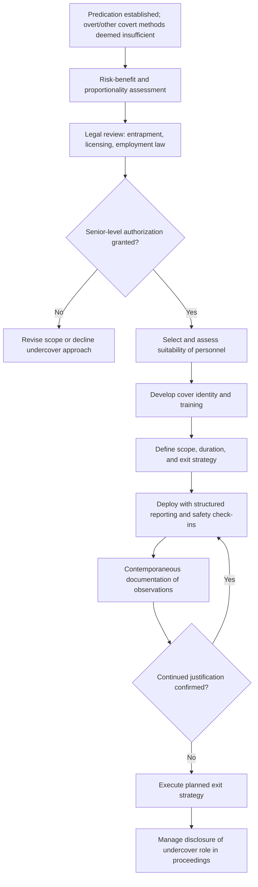

## Undercover Operations Considerations

### Overview

Undercover operations considerations address the governance, legal, ethical, and risk-management dimensions of deploying an investigator or cooperating source in a concealed role — such as posing as a customer, vendor representative, job applicant, or employee — to observe suspected fraudulent conduct directly. Because undercover work involves sustained deception rather than a single covert act, it presents a distinct and generally higher risk profile than other covert techniques, and professional fraud examination guidance treats it as a measure of last resort, reserved for circumstances where overt and other covert methods are assessed as inadequate.

### When Undercover Operations May Be Considered

Undercover deployment is typically considered only where:

- The suspected scheme is ongoing and direct observation of continued conduct would provide evidentiary value that historical document review cannot supply
- Other overt investigative techniques (interviews, subpoenas, document analysis) have been assessed as insufficient to establish the necessary facts, or would likely alert the subject and cause evidence destruction or scheme concealment
- The organization has the legal authority, resources, and risk tolerance to sustain a longer-duration covert deployment
- A documented predication basis exists that is proportionate to the risk and duration of the proposed operation

[Inference] Because of the elevated cost, risk, and duration typically involved, undercover operations in a forensic accounting/fraud examination context are less commonly used than in law enforcement contexts, and are generally reserved for high-value, ongoing schemes where the evidentiary benefit is assessed as clearly outweighing the risk.

### Governance and Authorization Requirements

**Key Points**

- **Elevated authorization threshold**: Given the sustained deception involved, undercover operations typically require higher-level authorization than shorter-duration covert techniques (e.g., senior management, audit committee, or board involvement for significant matters), together with legal counsel review
- **Defined scope and duration**: Clear authorization should specify the operation's objectives, permitted activities, geographic and temporal boundaries, and the point at which the operation will be reassessed or terminated
- **Exit strategy planning**: Establishing in advance how and when the undercover role will be concluded, including how the individual will be extracted from the environment without compromising safety or the investigation
- **Risk assessment for personnel safety**: Undercover roles can expose the individual involved to physical, legal, and psychological risk; a documented safety and support plan is a standard element of authorization

### Legal Considerations

- **Entrapment doctrine**: In jurisdictions recognizing an entrapment defense, care must be taken to ensure the undercover operative observes and documents conduct rather than inducing or encouraging conduct the subject would not otherwise have engaged in; inducement can undermine both the legal validity and ethical legitimacy of resulting evidence
- **Misrepresentation and fraud exposure**: Assuming a false identity or making false statements to gain access to information can, depending on jurisdiction and context, itself raise legal exposure for the investigating organization if not properly scoped and authorized; this is distinct from, and generally treated more cautiously than, simple non-disclosure of investigative purpose
- **Licensing requirements**: Many jurisdictions require that individuals conducting undercover investigative activity on behalf of a company be licensed private investigators, and unlicensed undercover activity can expose both the individual and the organization to civil and criminal liability
- **Employment law considerations**: Where an undercover operative is placed as an employee (e.g., a temporary hire or a repositioned existing employee), employment law obligations continue to apply, and the undercover nature of the assignment does not exempt the organization from standard workplace legal obligations
- **Consent and communications law**: If the undercover role involves recording conversations, the same one-party/all-party consent frameworks applicable to other covert recording apply

### Selection and Preparation of Undercover Personnel

- **Suitability assessment**: Evaluating whether a candidate for an undercover role has the judgment, discretion, and psychological resilience for sustained deception and potential exposure to hostile or unpredictable situations
- **Training**: Preparing the individual on the scope of authorized activity, documentation requirements, communication protocols with the oversight team, and how to respond if the cover is compromised or if they witness escalating or dangerous conduct
- **Cover identity development**: Establishing a plausible, well-supported cover story and background, with careful attention to consistency and to minimizing unnecessary fabrication beyond what is needed to preserve the operation

### Operational and Documentation Practices

- **Regular reporting and check-ins**: Establishing a structured schedule for the undercover operative to report observations to the oversight team, both to preserve evidentiary detail while memory is fresh and to monitor the operative's safety and wellbeing
- **Contemporaneous documentation**: Detailed, dated logs of observations, conversations, and events, prepared as close in time to the events as possible
- **Segregation of oversight and evidentiary roles**: Maintaining a clear reporting structure so that oversight personnel can assess whether the operation remains within authorized scope, independent of the operative's own perspective
- **Preservation of the cover's integrity during eventual disclosure**: Careful planning for how and when the undercover role will be revealed — to the subject, to other witnesses, and potentially in legal proceedings — since premature or mishandled disclosure can compromise both the investigation and the safety of the individual involved

### Risk Management Considerations

- **Physical safety risk**: Particularly relevant where the suspected conduct involves organized or potentially violent actors
- **Psychological impact**: Sustained undercover work can impose significant psychological strain on the individual involved, and organizational support structures (debriefing, counseling access) are a recognized element of responsible program design
- **Reputational risk to the organization**: If an undercover operation becomes public or is challenged in litigation, the organization's use of deception — even where legally permissible — can attract scrutiny and reputational consequences requiring careful communications planning
- **Evidentiary reliability risk**: Extended undercover deployment increases the volume of observational evidence but also increases the complexity of documenting and later corroborating that evidence to the standard required for litigation or prosecution

### Undercover Operation Planning Workflow

### Example

**Example**

A company suspects that a regional sales manager is directing a kickback scheme with a specific distributor, but document review alone cannot establish whether payments are solicited or voluntary. After other investigative avenues are exhausted, legal counsel and senior management authorize a limited undercover role: an investigator, posing as a prospective distributor representative at an industry event, engages the sales manager in a scoped conversation to observe whether solicitation occurs — with explicit instructions not to offer or suggest any payment (to avoid entrapment concerns), a defined single-event scope, and a pre-arranged safety check-in with the oversight team immediately following the interaction.

### Common Pitfalls

- **Inducing rather than observing conduct**, raising entrapment and ethical concerns
- **Insufficient scope definition**, allowing the operation to expand indefinitely without renewed authorization
- **Inadequate personnel suitability assessment**, placing an unprepared individual at physical or psychological risk
- **Poor documentation discipline**, undermining the evidentiary value of what is otherwise a resource-intensive technique
- **Failure to plan for disclosure**, creating avoidable complications when the undercover role must later be revealed in litigation, regulatory proceedings, or to the subject

### Conclusion

**Conclusion**

Undercover operations considerations require fraud examiners to weigh the elevated legal, ethical, safety, and reputational risks of sustained covert deployment against the specific evidentiary need the technique is intended to address. A defensible undercover operation rests on rigorous predication, senior-level authorization informed by legal counsel, careful personnel selection and preparation, disciplined scope management, and thorough contemporaneous documentation — treating undercover deployment as an exceptional measure rather than a routine investigative tool.

**Related Topics**

- Planning and authorizing covert investigative techniques
- Entrapment doctrine and inducement risk in undercover work
- Private investigator licensing requirements
- Confidential informant and cooperating witness management
- Chain of custody for covertly obtained evidence
- Legal and ethical considerations in interviewing
- Predication standards in fraud examination methodology