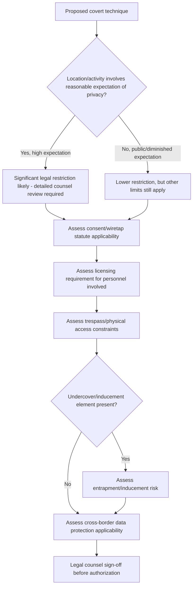

## Legal Limits on Covert Investigative Activity

### Overview

Legal limits on covert investigative activity define the statutory, constitutional, and common-law boundaries that constrain how forensic accountants, fraud examiners, and the investigators they engage may lawfully conduct surveillance, undercover work, pretext communications, and covert information-gathering. These limits exist to balance the legitimate investigative need to detect and prove fraud against individual privacy, due process, and public-safety interests. Understanding these limits is a prerequisite to responsible use of any covert technique, since conduct exceeding them can expose the organization and the individual investigator to civil liability, criminal liability, licensing sanctions, suppression of evidence, and reputational harm.

### Privacy Tort Framework

Most common-law jurisdictions recognize some variation of privacy-based civil claims relevant to covert investigation:

- **Intrusion upon seclusion**: Liability may arise where an investigator intentionally intrudes, physically or otherwise, upon the solitude or private affairs of another in a manner that would be highly offensive to a reasonable person — this is the tort most directly implicated by covert surveillance conducted in spaces where the subject has a reasonable expectation of privacy
- **Public disclosure of private facts**: Liability may arise from publicizing private information obtained during an investigation, even if lawfully collected, if its disclosure would be highly offensive and is not of legitimate public concern
- **False light**: Liability may arise from disseminating information that places a person in a false light, relevant where investigative findings are shared prematurely or inaccurately
- [Inference] The precise elements, defenses, and availability of these torts vary significantly by jurisdiction, and some jurisdictions do not recognize all four categories; jurisdiction-specific legal review is therefore standard practice before relying on the general framework above.

### The "Reasonable Expectation of Privacy" Standard

A central concept limiting covert surveillance is whether the subject had a reasonable expectation of privacy in the location or activity observed:

- **Public spaces**: Generally, individuals have a diminished expectation of privacy in public areas (streets, parking lots, publicly accessible business premises), and observation in such areas is more likely to be lawful
- **Private residences and enclosed spaces**: Surveillance capturing activity inside a private residence, through methods such as long-range optical or electronic means directed at private property, is generally subject to significantly greater legal restriction
- **Workplace considerations**: Employers generally have greater latitude to monitor company premises and systems, particularly where employees have received clear notice of monitoring policies, though this latitude is not unlimited and varies by jurisdiction and by the specific location monitored (e.g., restrooms and changing areas are typically treated as protected regardless of employer ownership of the premises)

### Statutory Wiretap and Electronic Communications Limits

- **Interception statutes**: Most jurisdictions criminalize the interception of wire, oral, or electronic communications without appropriate consent or legal authorization; the specific consent threshold (one-party consent, where only one participant to the communication must consent, versus all-party/two-party consent, where every participant must consent) varies by jurisdiction and materially affects whether a given recording is lawful
- **Stored communications protections**: Separate statutory frameworks in many jurisdictions govern access to stored electronic communications (e.g., email held by a service provider), often requiring different authorization than real-time interception
- **Employer monitoring exceptions**: Many jurisdictions provide exceptions or reduced restrictions for employer monitoring of company-owned systems and accounts, particularly where employees have been given clear advance notice, though the scope of these exceptions varies and does not necessarily extend to personal devices or personal accounts accessed incidentally through company systems

### Private Investigator Licensing Limits

- Many jurisdictions require that surveillance, undercover activity, or skip-tracing conducted on behalf of a third party (as opposed to purely internal employer monitoring of its own workforce) be performed only by a licensed private investigator
- Conducting licensed-category activity without the required license can result in criminal penalties, civil liability, and — significantly for litigation purposes — potential exclusion or diminished weight of the resulting evidence
- [Inference] Because licensing definitions and thresholds (what activity triggers the licensing requirement, and whether in-house employees are exempt) vary considerably by jurisdiction, organizations engaging outside investigators for covert work typically confirm licensing compliance as a standard due-diligence step before engagement.

### Trespass and Physical Access Limits

- Surveillance or evidence-gathering that requires the investigator to enter property without legal right to be there (e.g., climbing onto private land, entering a building without authorization) can give rise to trespass liability independent of any privacy tort
- "Trash covers" (retrieval of discarded materials) are treated differently across jurisdictions; some jurisdictions hold that discarded trash placed for collection in a publicly accessible area carries a diminished expectation of privacy, while others impose greater restriction, particularly where retrieval requires entering private property to access the material

### Entrapment and Inducement Limits

- In undercover operations, evidence obtained through inducement — encouraging or causing a subject to engage in conduct they would not otherwise have undertaken — can be challenged on entrapment grounds in criminal proceedings, and analogous concerns about investigative legitimacy can arise even in purely civil or internal contexts
- The core distinction generally drawn is between providing a subject the *opportunity* to engage in already-intended conduct (generally permissible) versus actively inducing conduct the subject was not already predisposed toward (generally impermissible)

### Cross-Border and International Limits

- Data protection regimes (e.g., GDPR in the EU) impose specific restrictions on covert collection and processing of personal data, including heightened requirements around the legal basis for processing and, in some cases, notification obligations that can be in tension with the covert nature of an investigation
- Some jurisdictions impose specific statutory restrictions on private surveillance activity that are stricter than analogous U.S. state law frameworks, and covert techniques lawful in one jurisdiction may be unlawful if conducted against a subject located in another

### Consequences of Exceeding Legal Limits

- **Civil liability**: Damages awards for privacy torts, trespass, or statutory violations
- **Criminal liability**: Wiretap statute violations and unlicensed investigative activity can carry criminal penalties in many jurisdictions
- **Evidentiary exclusion or diminished weight**: Evidence obtained unlawfully may be excluded from legal proceedings or given reduced evidentiary weight, undermining the investigation's core purpose
- **Regulatory and licensing sanctions**: Professional licensing bodies (for both private investigators and, in some cases, accounting professional bodies) may impose sanctions for unlawful investigative conduct
- **Reputational harm**: Disclosure of unlawful covert investigative methods can cause significant reputational damage to the investigating organization, independent of the legal outcome

### Legal Limits Assessment Workflow

### Example

**Example**

An investigator proposes photographing a subject's activity from a public sidewalk outside the subject's home to corroborate suspected undisclosed income (e.g., observing an expensive vehicle inconsistent with reported earnings). Because the observation occurs from a public vantage point of activity visible without technological enhancement, this is generally treated as lower legal risk than, for example, using a long-range listening device directed at conversations occurring inside the home, which would implicate both reasonable-expectation-of-privacy doctrine and potentially wiretap statutes — illustrating how the same general investigative objective can present sharply different legal risk profiles depending on the specific method and location involved.

### Common Pitfalls

- **Assuming public-space observation is automatically unrestricted**, without considering technological enhancement, duration, or pattern-of-life tracking concerns that some jurisdictions treat differently from momentary observation
- **Overlooking stored-communications-specific rules** distinct from real-time interception statutes
- **Failing to confirm investigator licensing status** before engaging outside covert investigative resources
- **Treating U.S.-style one-party consent assumptions as universal**, when operating in all-party consent or non-U.S. jurisdictions
- **Underestimating cross-border data protection exposure** when covert investigative activity involves subjects or data outside the investigating organization's home jurisdiction

### Conclusion

**Conclusion**

Legal limits on covert investigative activity arise from an overlapping set of privacy torts, wiretap and electronic communications statutes, licensing regimes, trespass law, entrapment doctrine, and cross-border data protection frameworks. Because these limits vary substantially by jurisdiction, by the nature of the location or communication involved, and by whether the activity is directed at employees, third parties, or the general public, forensic accountants and fraud examiners should treat jurisdiction-specific legal review as a mandatory precondition — not an optional formality — before authorizing or conducting any covert investigative technique.

**Related Topics**

- Planning and authorizing covert investigative techniques
- Undercover operations considerations
- Wiretap and electronic communications consent frameworks
- Private investigator licensing requirements
- Privacy torts: intrusion upon seclusion and public disclosure of private facts
- Cross-border data protection compliance (GDPR) in investigations
- Chain of custody and admissibility of covertly obtained evidence