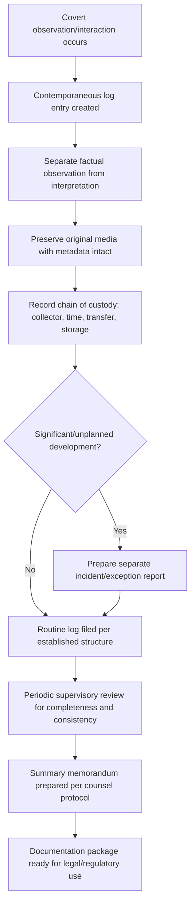

## Documenting Covert Investigation Findings

### Overview

Documenting covert investigation findings concerns the standards and practices for recording, preserving, and organizing information gathered through surveillance, undercover operations, pretext contacts, and other covert techniques so that the resulting evidence is accurate, defensible, and usable in litigation, regulatory proceedings, or internal decision-making. Because covert techniques inherently involve information gathered outside the subject's awareness — and often without the subject's opportunity to respond contemporaneously — documentation quality is the primary safeguard ensuring that covertly obtained findings can withstand later scrutiny, cross-examination, and challenges to authenticity or reliability.

### Why Documentation Standards Are Elevated for Covert Findings

Compared to overtly obtained evidence (e.g., a subpoenaed bank record with an inherent institutional paper trail), covert investigative findings often originate from a single investigator's direct observation or a single recording device, without independent institutional verification at the point of collection. This makes documentation quality — rather than the inherent reliability of the source — the primary factor determining whether the finding will be accepted as credible. Deficient documentation can result in:

- Evidence being excluded or given reduced weight in legal proceedings
- Successful challenges to authenticity (e.g., claims of selective editing, staged observation, or fabrication)
- Difficulty establishing an unbroken chain of custody
- Diminished credibility of the investigator as a witness

### Core Documentation Elements

**Key Points**

- **Contemporaneous logs**: Detailed, timestamped records created at or immediately following the observed activity, rather than reconstructed later from memory
- **Objective, factual language**: Descriptions of what was directly observed (actions, statements, physical conditions) clearly separated from the investigator's interpretations, inferences, or conclusions
- **Precise timing and location data**: Exact times, dates, and locations for each observation, supporting later reconstruction of the sequence of events
- **Identification of all participants and witnesses**: Full identification (where known) of individuals observed or involved, including physical descriptions where identity is not yet confirmed
- **Media preservation**: Original, unedited photographs, video, or audio recordings preserved in their native format, with any copies or excerpts clearly labeled as such and traceable back to the original
- **Equipment and methodology records**: Documentation of the equipment used, its settings, and the methodology applied, supporting later authentication if challenged

### Chain of Custody for Covertly Obtained Evidence

A defensible chain of custody record for covert findings typically includes:

1. Identification of who collected the evidence (name, role, licensing status if applicable)
2. The exact date, time, and method of collection
3. A description of the original condition and format of the evidence at the point of collection
4. Every subsequent transfer of custody, including who received the evidence, when, and for what purpose
5. Storage conditions and access controls throughout the chain
6. Any processing performed (e.g., transcription, image enhancement, format conversion) and by whom, with the original preserved unaltered alongside any processed version

[Inference] Because covert evidence is particularly susceptible to challenges regarding authenticity and potential tampering, maintaining an unbroken, well-documented chain of custody is generally treated as at least as important as the substantive content of the finding itself when the evidence is intended for use in litigation or regulatory proceedings.

### Separating Observation from Interpretation

A recurring documentation discipline is the clear separation of:

- **Direct observation** ("At 2:14 PM, the subject exited the building carrying a cardboard box and placed it in the trunk of a blue sedan bearing license plate [XXX]")
- **Investigator inference** ("This is consistent with the removal of company inventory," clearly labeled as an inference)
- **Subject statements** (verbatim or closely paraphrased, clearly attributed and distinguished from investigator narrative)

Blurring these categories in a single narrative account weakens the documentation's evidentiary value and invites challenge on cross-examination regarding what was actually observed versus what was assumed.

### Documentation Formats

- **Surveillance logs**: Structured, chronological entries recording time, location, observed activity, and any media captured during each observation period
- **Undercover operative reports**: Regular, structured reports prepared by the undercover individual, ideally shortly after each significant interaction, capturing observations, conversations, and context
- **Incident/exception reports**: Separate documentation for any unplanned or significant developments (e.g., the operative's cover being questioned, unexpected encounters, safety concerns) distinct from routine logs
- **Media logs**: Indexed records of all photographs, video, and audio files collected, cross-referenced to the corresponding narrative log entries
- **Summary memoranda**: Periodic synthesis documents prepared by supervising investigators or counsel summarizing findings to date, generally treated as work product distinct from the underlying raw documentation

### Authentication Considerations for Recordings and Media

- **Metadata preservation**: Retaining original file metadata (creation date, device information, GPS data where available) supports later authentication and should not be altered or stripped during handling
- **Unedited originals**: Maintaining an unedited master copy of any recording, separate from any excerpted or edited version prepared for presentation purposes
- **Witness authentication**: Where the recording device operator is available, their testimony regarding how, when, and under what conditions the recording was made supports authentication; where a device operated automatically, documentation of the device's installation, calibration, and functioning supports the same purpose
- **Consistency with other evidence**: Cross-referencing recorded content against other independently obtained evidence (e.g., confirming that a subject's stated location in a recording is consistent with independently verified access logs) strengthens the overall evidentiary package

### Legal Privilege and Confidentiality in Documentation

- Where covert investigations are conducted at the direction of legal counsel, documentation practices should follow counsel's specific protocols regarding labeling, distribution, and storage to help preserve attorney-client privilege and work product protections
- Access to covert investigation files should generally be restricted to those with a legitimate need, both to preserve privilege where applicable and to reduce the risk of inadvertent disclosure that could compromise an ongoing investigation or safety of personnel involved

### Documentation Workflow for Covert Findings

### Example

**Example**

An investigator conducting authorized public-space surveillance of a subject suspected of undisclosed outside employment records the following log entry immediately after the observation period: "10:32 AM – Subject observed entering [business name] wearing a uniform bearing the business's logo. 10:34 AM – Subject observed at the counter interacting with a customer. Photograph taken (file: SURV_0847.jpg, timestamped 10:34:12, device GPS coordinates recorded). 11:15 AM – Subject observed exiting the premises." This entry is later supplemented with a clearly separated interpretive note: "[Investigator note: Consistent with active employment at this location; not independently confirmed through payroll records at this stage]" — preserving the clear boundary between what was directly observed and what remains to be corroborated through other means.

### Common Pitfalls

- **Reconstructing logs after the fact from memory** rather than contemporaneously, weakening reliability and inviting challenge
- **Mixing interpretation with observation** in narrative logs, creating ambiguity about what was actually witnessed
- **Editing or excerpting media without preserving the original**, raising authenticity concerns
- **Incomplete chain-of-custody records**, particularly at points of transfer between the field investigator and the case file
- **Inconsistent documentation formats across investigators**, complicating later review and increasing the risk of gaps or contradictions

### Conclusion

**Conclusion**

Documenting covert investigation findings requires disciplined, contemporaneous, and clearly structured record-keeping that separates factual observation from interpretation, preserves original media and metadata, and maintains an unbroken chain of custody. Because covert findings typically lack the institutional corroboration inherent in overtly obtained records, the rigor of the documentation process is often the single greatest determinant of whether covertly gathered evidence will withstand legal scrutiny and support the investigation's ultimate conclusions.

**Related Topics**

- Legal limits on covert investigative activity
- Chain of custody principles in forensic accounting evidence
- Verifying and corroborating investigative findings
- Attorney-client privilege and work product protection for investigation files
- Authentication standards for digital and recorded evidence
- Planning and authorizing covert investigative techniques
- Expert witness report writing and defensibility standards