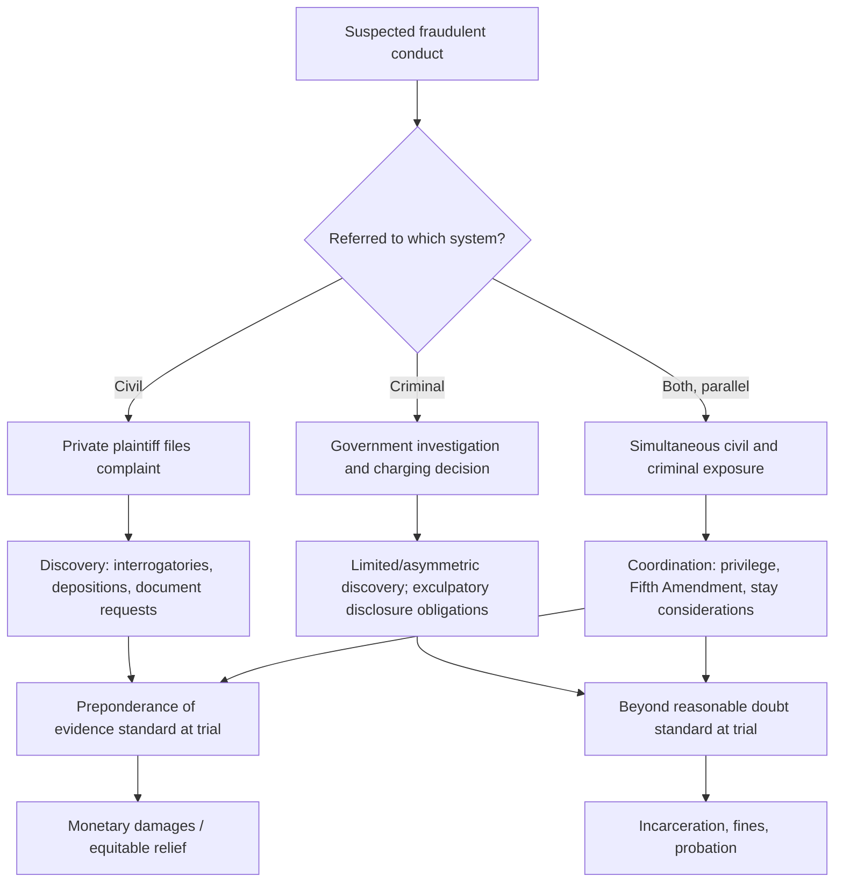

## Overview of Civil and Criminal Legal Systems

### Overview

Understanding the distinction between civil and criminal legal systems is foundational for forensic accountants and fraud examiners, since the applicable system determines the standard of proof, the parties involved, the available remedies, and the procedural rules governing how evidence — including forensic accounting work product — may be gathered, presented, and challenged. Fraud conduct frequently gives rise to parallel civil and criminal proceedings, and forensic accountants must understand how these systems differ and interact.

### Fundamental Distinctions

**Key Points**

- **Purpose**: Criminal law is primarily concerned with punishing conduct that violates public order and protecting society, prosecuted by the state (or equivalent government authority) on behalf of the public. Civil law is primarily concerned with resolving disputes between private parties (or between a party and the government in certain contexts) and compensating the wronged party
- **Parties**: In a criminal case, the prosecution (representing the state/government) proceeds against the defendant; the victim is not a formal party, though may participate as a witness or through victim impact statements. In a civil case, the plaintiff (the injured party) proceeds directly against the defendant
- **Standard of proof**: Criminal cases generally require proof "beyond a reasonable doubt," the highest standard of proof in most legal systems. Civil cases generally require proof by a "preponderance of the evidence" (more likely than not) or, in some jurisdictions and case types, an intermediate standard such as "clear and convincing evidence"
- **Outcome/remedy**: Criminal proceedings can result in incarceration, fines payable to the state, probation, or other penal sanctions. Civil proceedings typically result in monetary damages, injunctive relief, or other equitable remedies payable to or benefiting the private plaintiff
- **Rights of the accused**: Criminal defendants generally benefit from heightened constitutional or statutory protections (e.g., right to counsel, protection against self-incrimination, right to a jury trial in many jurisdictions) that do not universally apply, or apply differently, in civil proceedings

### Civil Legal System Overview

**Structure and Process**

Civil litigation generally proceeds through pleading (complaint and answer), discovery (exchange of evidence, including depositions and document requests), pre-trial motions, trial (before a judge or jury depending on jurisdiction and case type), and, if applicable, appeal.

**Relevant Civil Causes of Action in Fraud Contexts**

- **Common law fraud/deceit**: Requires proof of a false representation of material fact, knowledge of falsity (or reckless disregard for the truth), intent to induce reliance, justifiable reliance by the plaintiff, and resulting damages
- **Breach of fiduciary duty**: Applicable where the defendant owed a duty of loyalty or care (e.g., a corporate officer, trustee, or partner) and breached that duty to the plaintiff's detriment
- **Unjust enrichment**: A remedy allowing recovery where the defendant has been unjustly enriched at the plaintiff's expense, even absent a formal contract
- **Breach of contract**: Applicable where fraudulent conduct also constitutes a violation of contractual obligations
- **Statutory civil claims**: Many jurisdictions provide specific statutory civil remedies for fraud-related conduct (e.g., securities fraud civil liability provisions, state deceptive trade practices statutes)

**Civil Discovery Tools Relevant to Forensic Accountants**

- Interrogatories, requests for production of documents, depositions, and requests for admission — all of which forensic accountants may help draft, respond to, or analyze

### Criminal Legal System Overview

**Structure and Process**

Criminal proceedings generally follow investigation (often involving law enforcement and/or regulatory agencies), charging (via indictment, information, or complaint depending on jurisdiction), arraignment, pre-trial proceedings, trial, sentencing (if convicted), and appeal.

**Relevant Criminal Offenses in Fraud Contexts**

- **Fraud statutes**: Wire fraud, mail fraud, securities fraud, bank fraud, healthcare fraud, and similar statutes vary by jurisdiction but generally require proof of a scheme to defraud and use of a specified means (e.g., wires, mail) to further the scheme
- **Embezzlement and theft statutes**: Applicable to misappropriation of funds or property entrusted to the defendant
- **Money laundering statutes**: Applicable to the concealment or disguising of the proceeds of criminal activity
- **Tax evasion and related offenses**: Applicable where fraudulent conduct involves misrepresentation to tax authorities
- **Conspiracy**: Applicable where two or more parties agree to commit a fraud offense, often charged alongside the underlying substantive offense

**Criminal Discovery**

Criminal discovery is generally more limited and asymmetric than civil discovery, with specific rules (varying by jurisdiction) governing the prosecution's obligation to disclose exculpatory evidence to the defense (e.g., under principles analogous to the U.S. *Brady v. Maryland* doctrine) and more limited reciprocal disclosure obligations on the defense.

### Parallel Civil and Criminal Proceedings

Fraud conduct frequently gives rise to simultaneous civil and criminal exposure — for example, a fraudulent scheme may support both a criminal prosecution by government authorities and a civil lawsuit by victims seeking compensation. Key considerations include:

- **Different timelines**: Criminal proceedings often move on a different schedule than related civil proceedings, and courts may stay civil proceedings pending resolution of criminal matters to protect a defendant's Fifth Amendment (or equivalent) rights
- **Fifth Amendment/self-incrimination considerations**: A defendant facing parallel criminal exposure may invoke privilege against self-incrimination in the civil case, complicating civil discovery and potentially resulting in adverse inference in the civil proceeding (though not in the criminal proceeding, where such an inference is generally prohibited)
- **Collateral estoppel/issue preclusion**: In some circumstances, findings in one proceeding may have preclusive effect in the other, subject to jurisdiction-specific rules regarding the applicable standard of proof and identity of issues
- **Coordination challenges for forensic accountants**: Work product prepared for one proceeding may become relevant to, or discoverable in, the other, requiring careful attention to privilege and work product protections from the outset

### The Forensic Accountant's Role Across Both Systems

- **Civil litigation support**: Damages quantification, tracing of assets, expert witness testimony on financial matters, and assistance with discovery of financial records
- **Criminal investigation support**: Assisting law enforcement or prosecutors with financial analysis, tracing proceeds of crime, and providing expert testimony on complex financial schemes
- **Regulatory proceedings**: A hybrid category — administrative and regulatory enforcement actions (e.g., by securities regulators) often incorporate elements of both systems, with civil-style procedures but penalties that can include significant fines and, in some cases, referral for criminal prosecution

[Inference] Because standards of proof, discovery rules, and privilege considerations differ substantially between civil and criminal contexts, forensic accountants engaged in matters with potential parallel exposure typically coordinate closely with counsel to ensure that analysis and documentation prepared for one proceeding does not inadvertently compromise the client's position in the other.

### Comparative Framework Illustration

### Example

**Example**

An executive is suspected of embezzling company funds through a fictitious vendor scheme. The company's board authorizes a forensic accounting investigation and subsequently files a civil lawsuit against the executive for breach of fiduciary duty and fraud, seeking monetary damages. Simultaneously, the matter is referred to a prosecutor's office, which pursues criminal wire fraud charges. The forensic accountant's damages calculation prepared for the civil case must be carefully coordinated with counsel to ensure it does not inadvertently disclose privileged investigative strategy relevant to the pending criminal matter, while the executive's Fifth Amendment invocation in the civil deposition — permissible in that context — does not carry the same weight or implication in the criminal proceeding.

### Common Points of Confusion

- **Conflating standards of proof**: Assuming the same evidentiary threshold applies in both systems, when a finding sufficient for civil liability (preponderance of the evidence) may fall well short of the higher criminal standard (beyond a reasonable doubt)
- **Assuming a criminal acquittal precludes civil liability**: Because of the differing standards of proof, an individual acquitted criminally can still be found liable in a related civil proceeding
- **Overlooking privilege complications** when the same forensic accountant or firm is engaged across both civil and criminal aspects of the same underlying conduct
- **Misunderstanding discovery asymmetry**, particularly the more limited scope of criminal discovery compared to the broad civil discovery framework

### Conclusion

**Conclusion**

Civil and criminal legal systems serve distinct purposes, apply different standards of proof, and offer different remedies, yet frequently intersect in fraud matters through parallel proceedings. Forensic accountants operating across both systems must understand these structural differences — particularly regarding discovery scope, privilege, and the interaction between civil and criminal timelines — to provide effective, properly coordinated support to counsel and to avoid inadvertently compromising a client's position in either proceeding.

**Related Topics**

- Standards of proof and evidentiary burdens in fraud litigation
- Parallel proceedings and Fifth Amendment considerations
- Common law fraud elements and civil causes of action
- Criminal fraud statutes (wire fraud, mail fraud, securities fraud)
- Expert witness roles in civil versus criminal proceedings
- Discovery rules and privilege in civil litigation
- Regulatory and administrative enforcement proceedings