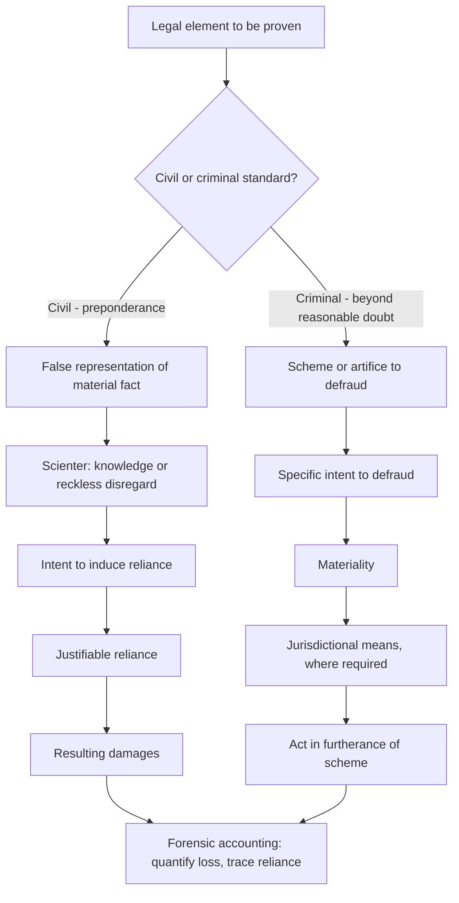

## Elements of Fraud Under Civil and Criminal Law

### Overview

Understanding the specific legal elements that must be established to prove fraud — both civil and criminal — is essential for forensic accountants, since investigative work and financial analysis are ultimately directed at supplying the evidentiary building blocks for these elements. While formulations vary across jurisdictions, most legal systems require proof of a defined set of elements before fraud liability (civil) or fraud conviction (criminal) can be established, and the forensic accountant's analytical work product is most useful when it is explicitly mapped to these elements.

### Elements of Common Law Civil Fraud (Fraudulent Misrepresentation)

**Key Points**

Most common law jurisdictions require proof of the following elements, generally by a preponderance of the evidence:

1. **A false representation of a material fact**: A statement (or, in some circumstances, an omission where a duty to disclose exists) that is factually untrue and concerns a matter significant enough to influence a reasonable person's decision
2. **Knowledge of falsity (scienter)**: The defendant knew the representation was false, or made it with reckless disregard for its truth or falsity (sometimes described as "knew or should have known")
3. **Intent to induce reliance**: The defendant made the representation with the intent that the plaintiff would rely on it
4. **Justifiable/reasonable reliance**: The plaintiff actually relied on the representation, and that reliance was reasonable under the circumstances
5. **Resulting damages**: The plaintiff suffered actual, quantifiable harm as a result of the reliance

[Inference] Because the exact phrasing and emphasis of these elements varies by jurisdiction — and some jurisdictions recognize additional or modified elements, such as a distinct requirement for actual versus constructive knowledge — forensic accountants should confirm the precise elements applicable in the relevant jurisdiction with retained counsel before structuring an analysis around them.

### Elements of Constructive Fraud

Some jurisdictions recognize "constructive fraud," which does not require proof of intentional deception but instead arises from:

- A breach of a legal or equitable duty (often a fiduciary duty)
- That breach, regardless of actual dishonest intent, being treated by the law as fraudulent because of its tendency to deceive or violate confidence
- Resulting damage to the party to whom the duty was owed

This is a materially different standard from intentional fraud because it focuses on the breach of duty rather than proof of a knowing false statement.

### Elements of Fraudulent Concealment (Omission-Based Fraud)

Where fraud is based on silence or omission rather than an affirmative false statement, most jurisdictions require proof of:

1. A duty to disclose the omitted information (arising from a fiduciary relationship, a partial disclosure that becomes misleading without the full picture, or specific statutory disclosure obligations)
2. Concealment or non-disclosure of a material fact
3. Intent to deceive
4. Reliance by the plaintiff on the resulting incomplete or misleading picture
5. Resulting damages

### Common Elements Across Criminal Fraud Statutes

While specific statutory language varies considerably by jurisdiction and by the particular offense (wire fraud, mail fraud, securities fraud, bank fraud, healthcare fraud, tax fraud), most criminal fraud statutes require proof, generally beyond a reasonable doubt, of:

1. **A scheme or artifice to defraud**: A plan or course of conduct designed to deceive and deprive another of money, property, or a legally protected right (such as the intangible right to honest services, in jurisdictions recognizing that concept)
2. **Intent to defraud**: A specific intent to deceive and to cause a resulting loss or deprivation — distinguishing fraud from mere negligence, mistake, or poor business judgment
3. **Materiality**: The false statement or scheme must relate to a fact capable of influencing a reasonable decision-maker
4. **Use of a jurisdictional means** (for statutes requiring it): Use of interstate wires (wire fraud), the mail system (mail fraud), a federally insured financial institution (bank fraud), or similar jurisdictional hooks, depending on the specific statute
5. **Execution/furtherance of the scheme**: An act taken in furtherance of the fraudulent scheme, which in many statutory schemes need not itself be false, so long as it furthers the overall fraudulent scheme

[Inference] Because criminal fraud statutes are numerous and vary by jurisdiction and by the specific type of fraud involved (securities, healthcare, tax, etc.), each carrying its own precise statutory elements and interpretive case law, this overview should be understood as a generalized conceptual framework rather than a substitute for statute-specific legal analysis in any particular matter.

### The Fraud Triangle as an Analytical (Not Legal) Framework

While not itself a legal element, the criminological "Fraud Triangle" concept (pressure, opportunity, rationalization) is frequently used by forensic accountants to structure investigative analysis and is sometimes referenced in expert testimony to explain the behavioral context of a fraud scheme — though it is important to distinguish this analytical framework from the formal legal elements that must actually be proven to establish liability or guilt.

### Materiality Standards

Materiality is a recurring element across both civil and criminal fraud, generally assessed by whether the misrepresented or omitted fact would have been significant to a reasonable person's decision-making — an objective standard, though some frameworks also consider whether the specific defendant knew the fact was significant to the specific plaintiff (a more subjective inquiry relevant to certain fraud theories).

### Scienter and Intent Standards

- **Actual knowledge**: The defendant knew the statement was false at the time it was made
- **Reckless disregard**: The defendant made the statement without genuine belief in its truth and without adequate basis for the statement, disregarding an obvious risk of falsity
- **Willful blindness**: In some frameworks, deliberately avoiding knowledge of facts that would confirm falsity can satisfy the scienter requirement, on the theory that willful ignorance is treated similarly to actual knowledge
- [Unverified] The precise boundary between reckless disregard, willful blindness, and mere negligence is an area of ongoing legal interpretation and varies across jurisdictions and specific statutory contexts; this distinction is often central to contested fraud litigation

### Mapping Forensic Accounting Work to Legal Elements

| Legal Element | Forensic Accounting Contribution |
| --- | --- |
| False representation of material fact | Tracing financial statement misstatements, fictitious transactions, or altered records |
| Scienter/intent | Analysis of internal communications, timing of transactions relative to knowledge, pattern of concealment |
| Reliance | Tracing how financial decisions (loans, investments, payments) were made in connection with the misrepresented information |
| Damages | Quantification of financial loss, lost value, or unjust enrichment |
| Use of jurisdictional means (criminal) | Tracing wire transfers, mailed documents, or use of interstate financial systems |

### Elements-to-Evidence Framework

### Example

**Example**

A company's CFO knowingly overstates inventory values in financial statements provided to a lender to secure a loan. In a subsequent civil fraud suit by the lender, the forensic accountant's analysis addresses each element: tracing the specific inventory misstatements (false representation of material fact), analyzing internal emails showing the CFO was aware of the actual inventory levels (scienter), documenting that the financial statements were provided specifically to support the loan application (intent to induce reliance), confirming the lender's loan committee relied on the stated inventory values in its underwriting decision (justifiable reliance), and quantifying the loss the lender suffered upon default (damages). If the same conduct also supports a parallel criminal bank fraud charge, the same underlying facts are analyzed additionally through the lens of scheme/intent to defraud and the specific statutory jurisdictional element (e.g., use of a federally insured institution).

### Common Pitfalls

- **Failing to distinguish civil and criminal elements** when structuring investigative work, resulting in analysis that supports one standard of proof but not the other
- **Overlooking the reliance element** in civil fraud analysis, focusing solely on the falsity of the statement without connecting it to how the plaintiff's decision was actually influenced
- **Conflating negligence with fraud**, given that ordinary business errors or poor judgment, absent the required scienter, do not satisfy fraud's intent element
- **Assuming the Fraud Triangle is a legal standard**, when it is an analytical/criminological framework rather than a set of elements that must be formally proven

### Conclusion

**Conclusion**

The elements of fraud — whether pursued civilly or criminally — provide the analytical framework that forensic accounting work should be structured around: establishing a false or misleading representation, proving the requisite knowledge or intent, connecting that misrepresentation to reliance or a completed scheme, and quantifying resulting harm. Because civil and criminal fraud claims differ in their precise elements, applicable standard of proof, and (for criminal statutes) jurisdictional requirements, forensic accountants must tailor their analysis to the specific legal framework and specific statute or cause of action at issue in each matter, in close coordination with legal counsel.

**Related Topics**

- Overview of civil and criminal legal systems
- The Fraud Triangle and behavioral theories of fraud
- Materiality standards in financial misrepresentation
- Scienter, recklessness, and willful blindness standards
- Damages quantification methodologies in fraud litigation
- Criminal fraud statutes (wire fraud, mail fraud, securities fraud, bank fraud)
- Expert witness testimony mapping evidence to legal elements