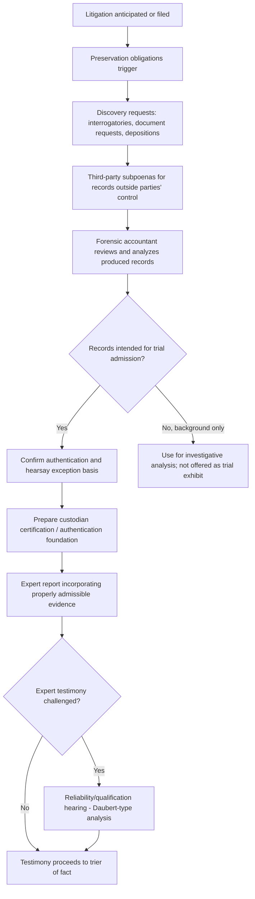

## Rules of Evidence and Discovery

### Overview

Rules of evidence and discovery govern how information is gathered before trial and how that information may ultimately be presented and admitted in legal proceedings. For forensic accountants, these rules directly shape how investigative work must be conducted, documented, and communicated — since analysis that is technically sound but procedurally non-compliant with evidentiary or discovery rules can be excluded, limited, or stripped of persuasive weight regardless of its underlying accuracy.

### Discovery: Purpose and Scope

Discovery is the pre-trial process by which parties to litigation obtain information and evidence from each other (and, through subpoena, from third parties) in advance of trial. Its purposes include narrowing disputed issues, preventing trial by ambush, and enabling informed settlement decisions.

**Key Points — Common Discovery Tools**

- **Interrogatories**: Written questions requiring written answers under oath, generally used to obtain basic factual information and identify relevant documents, witnesses, and positions
- **Requests for production of documents**: Formal requests compelling a party to produce specified categories of documents, including electronically stored information (ESI)
- **Depositions**: Sworn, recorded out-of-court testimony, allowing questioning of a party or witness under oath, often with a forensic accountant's assistance in formulating financial questions
- **Requests for admission**: Formal requests asking a party to admit or deny specific factual statements, narrowing issues genuinely in dispute
- **Subpoenas to non-parties**: Compelling document production or testimony from third parties not directly involved in the litigation (see related topic)
- **Expert disclosure requirements**: Many jurisdictions require disclosure of expert witnesses, their opinions, and the basis for those opinions, often including a formal written report, well before trial

### Civil vs. Criminal Discovery Asymmetry

- **Civil discovery** is generally broad, reciprocal, and extensive, permitting each party to obtain material "reasonably calculated to lead to the discovery of admissible evidence" (or an analogous relevance-based standard), even if the material itself would not be admissible at trial
- **Criminal discovery** is generally narrower and more asymmetric: the prosecution typically has a constitutional or statutory obligation to disclose exculpatory evidence to the defense (an obligation analogous to the U.S. *Brady v. Maryland* doctrine), but the defense's reciprocal disclosure obligations are typically more limited, reflecting the heightened protections afforded criminal defendants

[Inference] Because discovery rules differ so significantly between civil and criminal contexts — and because the same underlying facts may be relevant to parallel proceedings in both systems — forensic accountants working on matters with potential criminal exposure typically coordinate closely with counsel regarding what analysis is prepared, how it is labeled, and how it is shared, to avoid inadvertent disclosure obligations attaching in the "wrong" proceeding.

### Rules of Evidence: Core Concepts

**Relevance**

Evidence is generally admissible only if it is relevant — that is, it has a tendency to make a fact of consequence more or less probable than it would be without the evidence. Courts retain discretion to exclude even relevant evidence if its probative value is substantially outweighed by risks such as unfair prejudice, confusion of the issues, or undue delay.

**Hearsay**

An out-of-court statement offered to prove the truth of the matter asserted is generally inadmissible unless it falls within a recognized exception. This is a critical concept for forensic accountants, since financial records themselves are technically hearsay and require an applicable exception (most commonly the business records exception) to be admitted.

**Business Records Exception**

Records are generally admissible under this exception if they were made at or near the time of the event by someone with knowledge, kept in the course of regularly conducted business activity, made as a regular practice, and properly authenticated (often via custodian certification). This exception is foundational to admitting the financial and accounting records that underpin most forensic accounting analysis.

**Authentication**

Before evidence can be admitted, its proponent must generally establish that it is what it purports to be — for example, that a bank statement is genuinely from the named bank, or that an email was genuinely sent by the purported sender. Authentication methods include witness testimony, distinctive characteristics of the document, metadata analysis, and custodian certification.

**Best Evidence Rule**

Generally requires that the original of a document be produced to prove its contents, subject to numerous exceptions (e.g., for duplicates, or where the original has been lost or destroyed without bad faith) — relevant to forensic accountants working with copies, scans, or reconstructed records.

**Privilege**

Certain categories of communication are protected from compelled disclosure regardless of relevance, most notably attorney-client privilege and work product protection. Forensic accountants engaged by counsel must understand how their communications and work product may be protected — and how that protection can be inadvertently waived through careless handling or distribution.

### Expert Witness Evidentiary Standards

Because forensic accountants frequently testify as expert witnesses, understanding the standards governing expert evidence admissibility is essential:

- **Qualification requirements**: The proposed expert must be shown to possess relevant knowledge, skill, experience, training, or education
- **Reliability standards**: Many jurisdictions apply a reliability-focused framework (in the U.S., generally derived from the *Daubert* standard and its state-law analogs, though some jurisdictions retain the older *Frye* "general acceptance" standard) requiring that expert methodology be sufficiently reliable — considering factors such as whether the methodology has been tested, subjected to peer review, has a known error rate, and is generally accepted in the relevant field
- **Fit**: The expert testimony must be sufficiently tied to the facts of the case to assist the trier of fact, not merely a generalized or abstract discussion of methodology
- [Inference] Because admissibility standards for expert testimony vary meaningfully between jurisdictions (and even between state and federal courts within the same country in some legal systems), forensic accountants should confirm the applicable standard with retained counsel early in an engagement, since it can shape how the analysis and eventual report should be structured and supported.

### Electronic Discovery (e-Discovery) Considerations

- **Preservation obligations**: Once litigation is reasonably anticipated, parties generally have a duty to preserve potentially relevant electronic information, including emails, financial system data, and metadata — failure to do so can result in sanctions
- **Proportionality**: Many modern discovery frameworks incorporate a proportionality standard, balancing the scope of requested ESI against the burden and expense of production relative to the needs of the case
- **Native format and metadata**: Forensic accountants often request production of financial data in native, searchable formats (rather than static PDFs or printouts) to preserve the ability to perform independent analysis, sorting, and recalculation
- **Search and review protocols**: Large-scale document productions often involve agreed-upon search term protocols or technology-assisted review methodologies to manage volume while preserving relevant material

### Discovery and Evidentiary Workflow in a Forensic Engagement

### Example

**Example**

In a shareholder fraud lawsuit, the forensic accountant's damages analysis relies on internal financial projections obtained through document production. Before relying on these projections in an expert report, the accountant confirms with counsel that the documents were produced with an accompanying custodian certification satisfying the business records exception, and that the specific spreadsheet files were produced in native format (preserving underlying formulas) rather than as static printouts — both steps necessary to ensure the analysis can withstand an evidentiary challenge and a potential *Daubert*-type motion challenging the reliability of the methodology if the underlying data's authenticity or completeness were contested.

### Common Pitfalls

- **Relying on evidence without confirming an applicable hearsay exception**, resulting in analysis built on a foundation that cannot ultimately be admitted
- **Failing to preserve or request native-format data**, limiting the ability to independently verify calculations or formulas
- **Overlooking privilege implications** when forensic accounting work product is shared broadly within an organization
- **Assuming civil discovery scope applies equally in a parallel criminal matter**, given the significant asymmetry between the two systems
- **Underestimating expert admissibility standards**, resulting in a report or methodology vulnerable to a reliability challenge before the substantive testimony is ever heard

### Conclusion

**Conclusion**

Rules of evidence and discovery determine not only what information can be obtained before trial, but also what can ultimately be presented to and relied upon by a trier of fact. Forensic accountants must understand core evidentiary concepts — relevance, hearsay and its exceptions, authentication, privilege, and expert admissibility standards — alongside the practical mechanics of civil and criminal discovery, to ensure that investigative findings are gathered, documented, and presented in a manner that will withstand evidentiary scrutiny rather than being excluded or discounted on procedural grounds.

**Related Topics**

- Overview of civil and criminal legal systems
- Subpoenas and third-party record requests
- Expert witness qualification and Daubert/Frye standards
- Attorney-client privilege and work product doctrine
- Electronic discovery (e-discovery) protocols for financial data
- Business records exception and hearsay foundations
- Chain of custody and authentication of financial evidence