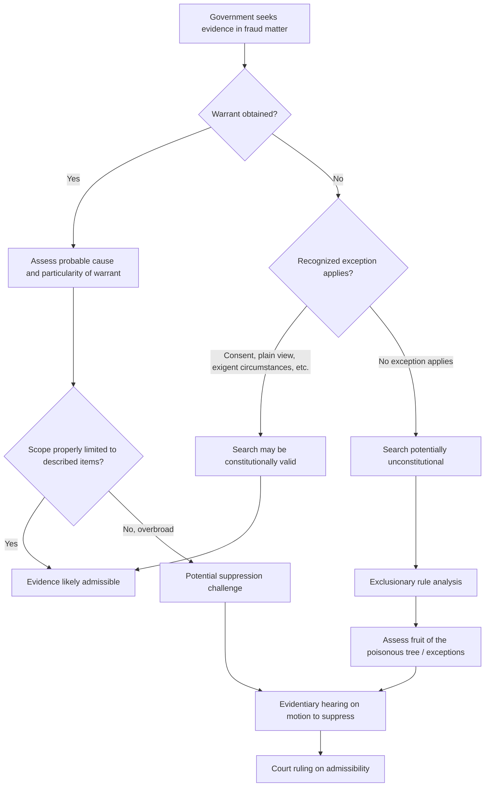

## Search and Seizure and Constitutional Considerations

### Overview

Search and seizure and constitutional considerations govern the boundaries within which government authorities may lawfully obtain evidence in fraud investigations, and the corresponding rights afforded to individuals and organizations subject to investigation. While forensic accountants engaged by private parties are not themselves bound by constitutional search-and-seizure restrictions (which generally apply to government action), understanding this framework is essential because forensic accountants routinely work alongside law enforcement, respond to government-issued process, and must understand how constitutionally obtained (or improperly obtained) evidence affects the broader fraud matter.

### The Fourth Amendment Framework (U.S. Context)

In the U.S. legal system, the Fourth Amendment protects against unreasonable searches and seizures by government actors and generally requires that searches be conducted pursuant to a warrant supported by probable cause, subject to established exceptions.

**Key Points**

- **Warrant requirement**: Generally, government agents must obtain a warrant, issued by a neutral magistrate upon a showing of probable cause, describing with particularity the place to be searched and the items to be seized, before conducting a search
- **Probable cause**: A reasonable basis, grounded in specific and articulable facts, to believe that evidence of a crime will be found in the place to be searched
- **Particularity requirement**: Warrants must specifically describe the scope of the search and the items sought, preventing generalized "fishing expedition" searches — particularly relevant in financial fraud cases involving voluminous business records, where overly broad warrants have been subject to legal challenge

### Exceptions to the Warrant Requirement

Several recognized exceptions permit warrantless searches under specific circumstances, including:

- **Consent**: A search conducted with the voluntary, informed consent of a person with authority over the premises or property
- **Plain view**: Evidence in plain view of an officer lawfully present in a location may be seized without a separate warrant
- **Exigent circumstances**: Emergency situations (e.g., imminent destruction of evidence) may justify a warrantless search
- **Administrative/regulatory inspections**: Certain regulated industries are subject to reduced expectations of privacy and streamlined inspection authority under specific regulatory schemes
- **Border searches**: Generally subject to reduced Fourth Amendment protection at international borders

[Inference] Because the application of these exceptions is highly fact-specific and subject to extensive case law development, forensic accountants involved in matters where a warrantless search occurred should treat the legality of that search as a question for counsel to assess, rather than assuming any particular exception automatically applies.

### Search Warrants in Financial Fraud Investigations

Financial fraud investigations present distinct search-and-seizure challenges because relevant evidence is often commingled with large volumes of legitimate business records:

- **Scope limitations**: Courts have scrutinized warrants authorizing seizure of entire business record systems or computer servers where more narrowly tailored search protocols were feasible, given the risk of sweeping in privileged or irrelevant material
- **Electronic evidence search protocols**: Many jurisdictions require or encourage specific search methodologies for digital evidence (e.g., imaging a hard drive off-site and applying agreed search terms) to balance thorough evidence collection against overbreadth concerns
- **Segregation of privileged material**: Where a search may capture attorney-client privileged communications (e.g., a business's email server), specific procedures (such as the use of independent "taint teams" or special masters) are often employed to review and segregate privileged material before it reaches the investigative team

### The Exclusionary Rule and Its Fruits

- **Exclusionary rule**: Evidence obtained through an unconstitutional search or seizure is generally inadmissible in a criminal prosecution against the person whose rights were violated
- **Fruit of the poisonous tree doctrine**: Evidence derived from an initial unconstitutional search (even if the derivative evidence was independently, lawfully obtained in form) may also be excluded, subject to exceptions such as independent source, inevitable discovery, and attenuation
- [Inference] Because the exclusionary rule generally applies to constrain government action in criminal proceedings, its applicability to purely private civil fraud investigations (where no government search occurred) is generally more limited; however, where a criminal investigation and a related civil matter share overlapping evidence, exclusion in the criminal context can still have significant strategic implications for the parallel civil matter.

### Fifth Amendment Considerations

- **Privilege against self-incrimination**: Individuals generally cannot be compelled to provide testimonial evidence against themselves in a criminal matter; this privilege can be invoked in response to certain document requests or testimony where the act of production itself would be testimonial (e.g., implicitly acknowledging the existence, possession, or authenticity of documents)
- **Act of production doctrine**: In some frameworks, the physical act of producing documents in response to a subpoena can itself carry testimonial significance protected by the privilege, distinct from the contents of the documents themselves, which are generally not protected merely because they are incriminating
- **Corporate records exception**: Business records held by an entity (as opposed to a natural person in a personal capacity) are generally not protected by the individual's personal Fifth Amendment privilege, though the specific application varies by jurisdiction and by whether the individual is acting in a personal or representative capacity

### Constitutional Considerations in Regulatory and Administrative Contexts

- **Administrative subpoenas**: Government regulatory agencies (e.g., securities or tax authorities) often possess independent statutory authority to issue administrative subpoenas without the same warrant/probable cause requirements applicable to criminal search warrants, though such subpoenas remain subject to judicial enforcement review if challenged
- **Civil investigative demands**: Similar administrative tools used by certain regulatory or enforcement bodies to compel document production and testimony in advance of formal litigation

### Application to the Forensic Accountant's Role

- Forensic accountants engaged by private counsel or companies are generally not themselves subject to Fourth Amendment restrictions, since those restrictions apply to government action — however, if a forensic accountant is acting at the direction of, or in close coordination with, law enforcement, the analysis of whether the accountant's activity constitutes "state action" subject to constitutional restriction becomes more complex and fact-specific
- Forensic accountants should be alert to the provenance of records they are asked to analyze — records obtained through a government search may carry different constitutional baggage than records obtained through private civil discovery or voluntary production, potentially affecting downstream admissibility
- In matters involving simultaneous private investigation and law enforcement referral, careful coordination with counsel is essential to avoid inadvertently converting a private investigation into "state action" that could trigger constitutional scrutiny of the private investigative methods themselves

### Search and Seizure Analytical Workflow

### Example

**Example**

Law enforcement obtains a search warrant authorizing seizure of "all financial records" from a company's headquarters based on probable cause tied to a specific suspected kickback scheme. During execution, agents also seize an entire email server containing unrelated attorney-client privileged communications about pending litigation matters. Defense counsel challenges the search as overbroad given the lack of particularity regarding the email seizure, and a taint team review is subsequently ordered to segregate any privileged material before the remaining evidence is made available to the investigative and prosecution team — illustrating how scope and particularity concerns specific to financial fraud investigations can shape both the conduct of the search and the eventual admissibility of the evidence obtained.

### Common Pitfalls

- **Assuming private forensic accountants are bound by Fourth Amendment restrictions**, when those restrictions generally apply only to government action
- **Overlooking act-of-production privilege issues** when responding to a subpoena on behalf of an individual (as opposed to solely a corporate entity)
- **Failing to distinguish administrative subpoena authority from criminal search warrant requirements**, which involve materially different legal standards
- **Underestimating the strategic significance of suppression rulings** in a parallel criminal matter for the associated civil case
- **Inadequate coordination with counsel** regarding whether private investigative activity could be characterized as government-directed "state action"

### Conclusion

**Conclusion**

Search and seizure and constitutional considerations define the boundaries within which government authorities may lawfully obtain evidence in fraud investigations, encompassing Fourth Amendment warrant and probable cause requirements, recognized exceptions, the exclusionary rule, and Fifth Amendment self-incrimination protections including the act of production doctrine. While these restrictions generally apply to government rather than private action, forensic accountants must understand this framework to properly assess the provenance and admissibility of evidence, coordinate appropriately when private investigations intersect with law enforcement, and avoid actions that could inadvertently implicate constitutional scrutiny of an otherwise private investigative process.

**Related Topics**

- Rules of evidence and discovery
- Subpoenas and third-party record requests
- Overview of civil and criminal legal systems
- Fifth Amendment privilege and the act of production doctrine
- Attorney-client privilege and taint team procedures
- Legal limits on covert investigative activity
- Parallel civil and criminal proceedings coordination